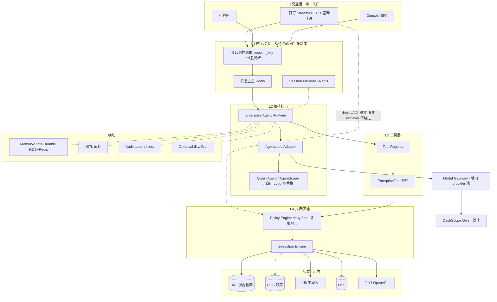
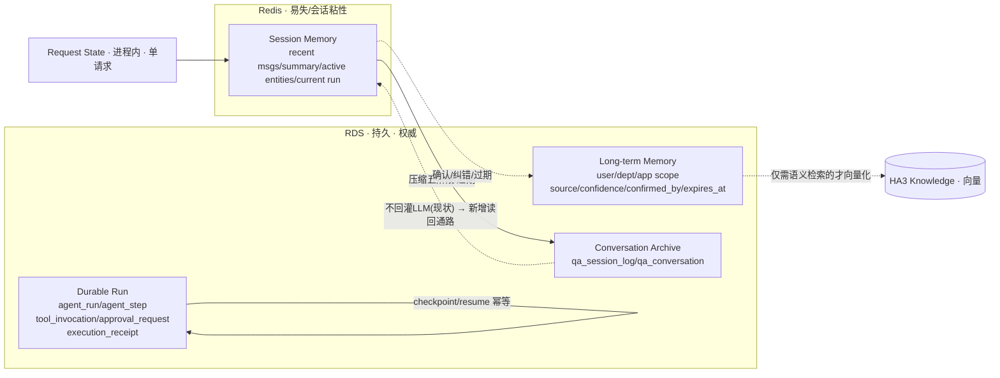
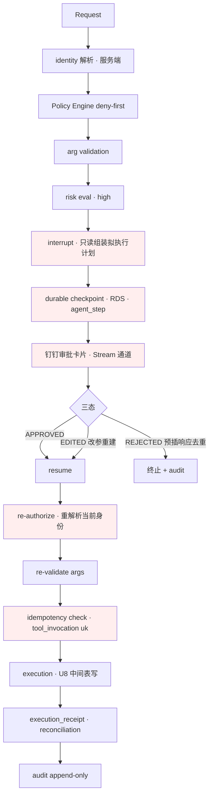

# 富岭企业级 Agent 底座架构设计报告 · V2（证据重建版）

> 本报告以富岭真实 Repo 为事实基线,结合 11 个开源框架真实源码,**由证据重建架构结论**(不预设保留第一版 PDF 任何结论)。每个模块结论标注证据支撑与相对 PDF 的变更类型。
> 证据分级:✅ 源码已验证(`[代码存在]`/`[线上在跑]`)· 🟡 官方文档 · ⚪ 工程推断 · ❌ 缺失 · ⚠️ 风险。
> 配套证据文件:`repo-architecture-map.md` / `report-gap-analysis.md` / `open-source-code-review.md` / `borrowing-matrix.md` / `report-v2-changelog.md`。

---

## 0. 执行摘要（五点核心判断，由证据重建）

1. **富岭不缺 RAG,缺的是 Runtime 边界。** 现有系统是成熟企业级 RAG(HA3 混合检索 + 钉钉双通道 + 11 条 fail-closed ACL 路径 + 摄取 DAG),但**零 Agent 骨架**(无 registry/function-calling/agent loop/运行时 MCP,Redis 0 接入)。首要产出是**架构接口边界**,不是再选一个框架。
2. **横切件齐全,纵向抽象缺位——EnterpriseTool 从现有模式生长,不从零发明。** ACL 透传、固定键幂等、outbox+reconcile 补偿、审批状态机、限流熔断、请求级 trace、append-only 审计**全部已成熟**(散落),应收编为 tool 级契约。
3. **记忆/持久化是唯一 P0 接缝,且 PDF 在此最薄且有错。** 会话是进程内 LRU(`--workers 1` 单点),durable 状态机仅服务摄取。⚠️**PDF"检查点存 Redis"错误**:跨天审批 + Redis 易失 + LangGraph 生产 checkpointer 仅 Postgres → **durable checkpoint 必须落 RDS**;临时会话/缓存/锁才用 Redis。
4. **Qwen-Agent 接在 AgentLoop Adapter 这一层,且只此一层。** 工具协议/权限/记忆/审批/持久化状态/审计**不得依赖任何 AgentLoop 实现**。Qwen-Agent 零适配命中 DashScope(✅),但"并行调用"失实(执行层串行);业务工具经 EnterpriseTool→BaseTool Adapter 接入(成本极低)。
5. **模型层 provider 无关但仅境内。** 业务代码不得硬编码任一 provider(含 DashScope),一律经 ModelProvider 接口;境内 provider 池(DashScope 多档默认 + 可配境内厂商/自托管)。当前裸 HTTP 直调 DashScope 是须消除的耦合。

**PDF 被推翻/重写的关键结论**(详见 changelog):Redis 存 checkpoint(推翻)、Qwen"并行调用"(重写)、LangGraph threading.Lock(推翻机制)、Spring 三态 MODIFIED(重写为 EDITED)、ADK Sequential/Parallel/Loop(重写为已 deprecated)、AgentScope ReAct 描述(重写为 v2 可挂起状态机)、审批+沙箱叠加(重写为仅 docker-带宿主挂载)、CVE-2026-28466 措辞(重写)、OmO 可移植(重写为 LICENSE 硬否决)、XiYan-SQL 框架可借鉴(重写为仅论文零代码)。

---

## 1. 架构边界总览（图一见 §13）

分七层,横切五面。核心原则:**下面换 AgentLoop、换 checkpointer、换 model provider,都不应伤主结构。**

```
L0 交互层    钉钉 Stream/HTTP · 小程序 · Console      ← 复用现有,补多副本粘性
L1 网关/会话 SAE·FastAPI · 会话粘性路由 · 去重(Redis) ← 新建多副本层
L2 编排核心  Enterprise Agent Runtime               ← 新建
             └ AgentLoop Adapter(Qwen-Agent 等可替换)
L3 工具层    Tool Registry + EnterpriseTool 契约      ← 新建(从现有模式生长)
L4 执行/安全 Policy Engine · Execution Engine         ← Policy 扩展现有 ACL
横切: Memory/State/Durable(RDS+Redis) · HITL 审批 · Audit · Observability · Model Gateway
```

---

## 2. 模块 A — Runtime 边界【P0 · 新建】

**①Repo 现状** ❌ 无任何 Runtime/Adapter 分层;LLM 裸 HTTP 单轮 RAG(`llm_generator.py`)。
**②报告覆盖** PDF 选 Qwen-Agent 为核心(P1),但未画接口边界。
**③架构缺口** 缺 ExecutionContext/EnterpriseTool/AgentLoop Adapter/Policy/StateStore/ModelProvider/ApprovalProvider/Audit 的解耦接口。
**④目标架构** 七类接口边界,AgentLoop 是可替换实现之一(Qwen-Agent / AgentScope v2 / 自研轻量 Loop 均只经 Adapter 接入)。
**⑤核心接口(草案)**

```python
@dataclass(frozen=True)
class ExecutionContext:
    """服务端生成,模型不得提供/修改任何字段。"""
    request_id: str
    identity: Identity            # 复用 current_identity 产物:user_id + acl_groups(非 primary_dept)
    session_id: str
    agent_run_id: str
    tenant: str                   # 部门/应用作用域
    model_profile: str            # task category → profile,由 Policy 决定
    # 只读快照;每次 resume 必须重解析身份重新授权(评审原则 5)

class EnterpriseTool(Protocol):
    name: str; version: str
    input_schema: dict; output_schema: dict
    risk_level: RiskLevel                 # low/medium/high(high→强制 HITL)
    permission_scope: list[str]
    side_effect: bool; idempotent: bool
    approval_policy: ApprovalPolicy
    async def invoke(self, args: dict, ctx: ExecutionContext) -> ToolResult: ...

class AgentLoopAdapter(Protocol):
    """把 EnterpriseTool + ExecutionContext 适配给具体 loop(Qwen-Agent 等)。"""
    async def run(self, ctx: ExecutionContext, tools: list[EnterpriseTool],
                  messages: list[Msg], model: ModelProvider) -> AsyncIterator[LoopEvent]: ...
```

**⑥集成点** ExecutionContext 由 L1 从 `current_identity`(`api.py:321`)产出;工具经 Registry 注入;model 经 ModelProvider。
**⑦安全权限** identity/acl_groups/role/approval_policy 一律服务端生成,模型不可写(评审原则 4)。
**⑧故障恢复** run 级状态落 RDS(见 B);resume 重解析身份(评审原则 5)。
**⑨迁移步骤** P0 先落 ExecutionContext + EnterpriseTool + Registry + AgentLoop Adapter(Qwen-Agent 首个实现)+ feature flag。
**⑩测试验收** contract test:同一 EnterpriseTool 经 Adapter 在 Qwen-Agent 与 mock loop 下行为一致;ExecutionContext 不可被工具入参污染。
**⑪优先级** P0。 **⑫证据** ✅`[代码存在]` Repo 无 Runtime(`r05`);Qwen-Agent Adapter 面 ✅(`base.py:109` §borrowing)。

---

## 3. 模块 B — Memory / State / Durable【P0 · 新建 · PDF 最薄接缝】

**①Repo 现状** 会话=进程内 LRU(`session_store.py:44`,500上限/30minTTL/单点);durable 仅摄取侧 RDS 状态机(`dataworks_orchestrator.py:181`);❌无 summary/长期记忆,Redis 0 接入。
**②报告覆盖** ⚠️PDF 仅"Redis 会话 + state 前缀"一句,且主张检查点存 Redis(**推翻**)。
**③架构缺口** 无分层记忆模型、无 agent_run/step/tool_invocation/approval_request 表、跨天审批与易失存储矛盾未解。
**④目标架构 · 分层记忆模型**(图二见 §13)

| 层 | 内容 | 存储 | 生命周期 | 借鉴 |
|---|---|---|---|---|
| Request State | 单请求 ctx/临时变量 | 进程内 | 单请求 | ADK temp: |
| Session Memory | recent msgs、summary、active entities、current run | **Redis**(会话粘性) | 会话/TTL | Hermes 五阶段压缩 |
| Long-term Memory | user/**dept**/app scope 偏好/画像 | **RDS**(结构化)+ 可选向量(仅需语义检索的) | 持久,带确认/过期/纠错 | ADK user:/app: 三落点 + 新增 dept: |
| Durable Run | agent_run/step/tool_invocation/approval_request/execution_receipt | **RDS** | 持久,幂等恢复 | 富岭 work-queue + LangGraph checkpoint 数据模型 |
| Conversation Archive | qa_session_log/qa_conversation | RDS(现有) | 审计/展示 | 复用现有 |
| Knowledge | HA3 向量 | HA3(现有) | — | 复用现有 |

**不得默认所有记忆写向量库**:结构化偏好落 RDS(可 KV/JSON),仅"需语义召回"的才向量化(借 ADK state≠MemoryService 之分)。

**⑤核心数据模型(草案,落 RDS `fuling_operation` 或新库)**

```sql
-- durable run 骨架(移植摄取侧 SKIP LOCKED 认领 + 2h stale + retry≤3 幂等重入)
CREATE TABLE agent_run (
  run_id CHAR(26) PRIMARY KEY,          -- ULID
  session_id VARCHAR(128), user_id VARCHAR(64), tenant VARCHAR(64),
  status ENUM('running','interrupted','succeeded','failed','compensating'),
  model_profile VARCHAR(64), prompt_version VARCHAR(64), git_commit VARCHAR(40),
  created_at DATETIME(3), updated_at DATETIME(3), retry_count INT DEFAULT 0,
  INDEX idx_session(session_id), INDEX idx_status_updated(status, updated_at));
CREATE TABLE agent_step (
  step_id CHAR(26) PRIMARY KEY, run_id CHAR(26), seq INT,
  kind ENUM('reason','tool_call','approval','final'),
  state ENUM('pending','running','succeeded','failed','skipped'),
  checkpoint_json JSON,                 -- interrupt 前状态快照(LangGraph 语义)
  UNIQUE uk_run_seq(run_id, seq), INDEX idx_run_state(run_id, state));
CREATE TABLE tool_invocation (
  inv_id CHAR(26) PRIMARY KEY, run_id CHAR(26), step_id CHAR(26),
  tool_name VARCHAR(64), tool_version VARCHAR(32),
  idempotency_key VARCHAR(128),         -- 后端钦定固定键(仿 kb_console register)
  input_json JSON, output_json JSON, risk_level VARCHAR(16),
  status ENUM('pending','executed','rejected','compensated'), attempts INT DEFAULT 0,
  UNIQUE uk_idem(tool_name, idempotency_key), INDEX idx_run(run_id));
CREATE TABLE approval_request (
  appr_id CHAR(26) PRIMARY KEY, run_id CHAR(26), tool_invocation_id CHAR(26),
  status ENUM('pending','approved','rejected','edited'),   -- 三态(EDITED 非 MODIFIED)
  proposed_args_json JSON, edited_args_json JSON, reason TEXT,
  requested_at DATETIME(3), decided_at DATETIME(3), decided_by VARCHAR(64),
  dingtalk_card_id VARCHAR(128), INDEX idx_status(status));
CREATE TABLE execution_receipt (
  receipt_id CHAR(26) PRIMARY KEY, tool_invocation_id CHAR(26),
  external_ref VARCHAR(256),            -- U8 中间表回执/单号
  reconciled TINYINT DEFAULT 0, created_at DATETIME(3));
-- 长期记忆(仿 ADK user:/app: + 新增 dept:;带治理列)
CREATE TABLE agent_memory (
  mem_id CHAR(26) PRIMARY KEY, scope ENUM('user','dept','app'), scope_key VARCHAR(128),
  namespace VARCHAR(128), key_name VARCHAR(128), value_json JSON,
  source VARCHAR(64), confidence FLOAT, confirmed_by VARCHAR(64),
  expires_at DATETIME(3), created_at DATETIME(3), updated_at DATETIME(3),
  UNIQUE uk_scope(scope, scope_key, namespace, key_name));
```

**⑤核心接口**
```python
class StateStore(Protocol):        # durable run,落 RDS
    async def create_run(ctx) -> str
    async def checkpoint(run_id, step) -> None          # interrupt 前状态快照
    async def resume(run_id) -> RunState                # 幂等恢复(重解析身份)
    async def claim(status, ttl) -> RunState | None     # SKIP LOCKED,移植摄取侧
class MemoryService(Protocol):     # 分层记忆
    async def session_get(session_id) -> SessionMemory  # Redis
    async def session_compact(session_id) -> None       # 五阶段压缩(Hermes)
    async def ltm_get(scope, scope_key, ns) -> dict     # RDS,dept/user/app
    async def ltm_put(scope, scope_key, ns, kv, *, source, confidence, expires_at) -> None
```
**⑥集成点** Session Memory 落 Redis(与 L1 会话粘性同键);durable/审批/audit 落 RDS(复用 `db.py` 池 + outbox 事务模式)。
**⑦安全权限** 长期记忆按 scope+ACL 读写;调岗重算(dept 变更失效相关 dept-scope 记忆);脱敏(复用 qa_logger PII 掩码)。
**⑧故障恢复** 重启从 RDS agent_run 恢复;interrupt 前副作用须幂等(LangGraph 铁律,写进 EnterpriseTool 契约)。
**⑨迁移步骤** P0 建 agent_run/step + StateStore + Redis 会话;P2 建 approval_request + checkpoint;P4 建 agent_memory 长期记忆。
**⑩测试验收** kill -9 后 resume 不重复外部写(幂等);跨天审批 24h 后 resume 成功;dept 调岗后旧 dept 记忆失效。
**⑪优先级** P0(骨架 P0 接缝)。 **⑫证据** ✅`[代码存在]` 现状(`r03`);LangGraph checkpoint 数据模型 ✅(`aio.py:43`);ADK 作用域 ✅(`state.py:64`);Hermes 压缩 ✅(`context_compressor.py:2670`)。**Redis 存 checkpoint 推翻:P26/P4**。

---

## 4. 模块 C — Tool Contract / Registry【P0 · 从现有模式生长】

**①Repo 现状** ❌无 registry;但 `extraction/unified_extractor`(按 key 分发)+ `DAGNode`(status/duration/error/result)+ `answer_flow.build_qa_log_kwargs`(全字段单点+状态词表)是现成生长点。
**②报告覆盖** PDF C 模块要求 name/version/schema/risk/approval 等字段,方向对。
**③缺口** 无声明式 Registry、无 tool 版本/owner/deprecation 治理。
**④目标架构** Tool Registry(声明式注册,替代 extraction 的 if/elif)+ EnterpriseTool 契约(§2)。业务工具经 Adapter 转 Qwen-Agent BaseTool,**不直接依赖 BaseTool**。
**⑤核心接口**
```python
class ToolRegistry:
    def register(self, tool: EnterpriseTool, *, owner_team: str, deprecation: str|None): ...
    def resolve(self, name: str, version: str|None, ctx: ExecutionContext) -> EnterpriseTool: ...
    # 契约字段:name/version/input_output_schema/risk_level/permission_scope/timeout/
    #          retry/idempotency/side_effect/approval_policy/data_classification/owner_team/deprecation
class QwenAgentToolAdapter(BaseTool):  # EnterpriseTool → Qwen-Agent BaseTool
    # 覆写 name/description/parameters/call;call 内做 schema 校验 + ctx 注入 + 硬失败抛 ToolServiceError
```
**⑥集成点** 首个工具=现有 RAG 封装(P0,P24 支持);I/O 契约从 `extraction/schema.py` + `answer_flow` 生长。
**⑦安全** tool 强制携带 ExecutionContext 且默认 fail-closed;写类工具走独立写授权(照抄 kb_authz H1 三分)。
**⑧故障恢复** 幂等键(`idempotency_key` + `idempotent` 响应位,`contribution.py:177` 已有此模式)。
**⑨迁移** P0 Registry + RAG 工具 + Qwen Adapter;P1 加只读 SQL/包装测算/KIE。
**⑩测试** 任意新工具通过统一契约接入(评价标尺:"下一个还没想到的工具能不能照样接进来")。
**⑪优先级** P0。 **⑫证据** ✅`[代码存在]`(`r05` §8);Qwen BaseTool 面 ✅;AgentScope ToolBase 超集设计参照 ✅。

---

## 5. 模块 D — Policy Engine【P1 · 小幅扩展现有】

**①现状** ✅ACL 成熟:11 条 fail-closed 路径、读写分离(`kb_authz.py:5`)、deny-first 语义已在 retriever。 **③缺口** 未收敛为统一决策点,工具权限/风险维度缺。 **④目标** 封装现有授权入口为 deny-first Policy Engine(身份/部门 ACL/工具权限/数据权限/风险等级/是否需审批/是否允许改参/输出审查),**不重建 ACL**。 **⑤接口**
```python
class PolicyEngine(Protocol):
    def decide(self, tool, args, ctx) -> PolicyDecision  # allow/deny/require_approval/edit_allowed
    # deny-first:先 deny 规则(OpenClaw 教训:安全基线 deny 不可被下层 allow 覆盖)
```
**⑥集成** 复用 `current_identity`→`acl_groups`→`_build_permission_filter`;审批策略读写**带外隔离**(独立控制面 + 高一档权限,OpenClaw 教训,不与工具调用同信道)。 **⑨迁移** P1。 **⑫证据** ✅ ACL(`r02`§7);OpenClaw 带外隔离 ✅(`nodes.ts:1319`)。**边界**:Policy 与 Tool/AgentLoop/审批服务三者解耦,审批仅记录决策、放行单独物化(照抄 kb_access 两段式)。

---

## 6. 模块 E — Durable Workflow【P1 · 复用现有】

**①现状** ✅RDS 行级状态机(SKIP LOCKED/2h stale/retry≤3/drain)现成,服务摄取。 **④目标** 确定性流程(包装测算/BOM/库存/多级审批/U8写回/对账/补偿)由**状态机控制,LLM 只负责意图与异常解释**;移植摄取侧 work-queue 为 agent_run 执行语义。**不引 Temporal**(过度),**不为框架完整过度引依赖**。 **⑨迁移** P1 只读流程 → P3 写回。 **⑫证据** ✅`[代码存在]`(`r03`§4.3)。**写型/审批/U8 写回保持单一决策上下文**(评审原则 2)。

---

## 7. 模块 F — Model Gateway【P0 · 新建】

**①现状** ❌裸 HTTP 直调 DashScope(`llm_generator.py`),无 provider 抽象。 **③缺口** 违反"provider 无关"硬约束。 **④目标** ModelProvider 接口(境内 provider 池:DashScope 默认 + 可配境内厂商 API/自托管 endpoint,二者皆 ModelProvider 实现,骨架不预判);task category→model profile 路由(借 OmO 数据结构设计,不引依赖);fallback/timeout/retry/circuit breaker/token budget/model pinning。 **⑤接口**
```python
class ModelProvider(Protocol):
    async def chat(self, messages, *, profile, tools=None) -> ChatResult
    # 业务代码不得直接调任一 provider SDK(含 DashScope),一律经此接口
# 结构化输出:DashScope 仅 json_object 无 json_schema → prompt + 后置 AST/字段校验兜底(P7)
```
**⑥集成** 替换 `llm_generator` 裸 HTTP;allowlist 内容是配置/运维决策,非骨架决策。 **⑨迁移** P0(与 A 同期)。 **⑫证据** ✅`[代码存在]` 裸调(`r05`);OmO 路由数据结构 ✅(⚠️LICENSE 硬否决,仅借设计);DashScope json_object 限制(P7 已复核)。

---

## 8. 模块 HITL 审批【P1 设计 · P2 实施 · 卡片底座已存在】

**①现状** ✅钉钉互动卡片回调框架齐备(`dingtalk_bot.py:1012`,双通道+归属校验+ACK-only),但 dispatch 仅反馈域。 **④目标** interrupt→durable checkpoint→钉钉审批卡片→resume 三态(**APPROVED/REJECTED/EDITED**,借 Spring 数据流,EDITED 改参重建 tool_call 保 id/name、REJECTED 预插拒绝响应去重跳过)。API 形状借 OpenAI SDK(needsApproval + interruptions + 粘性批准)。协议契约借 Gajae action_needed/reply(token+幂等)。 **⑤铁律**(图三见 §13):**外部写(U8写回)必须置于 interrupt 之后;interrupt 前只读组装;resume 重解析身份重新授权 + re-validate + 幂等检查 → 执行 → receipt → audit**。 **⑦安全** 归属校验改 **fail-closed**(现 fail-open);审批写走 Stream 通道或补签名(HTTP 通道 apiSecret 未验证);审批信道与工具信道带外隔离(OpenClaw)。 **⑨迁移** P2(模拟执行,不接真实 U8)。 **⑫证据** ✅卡片底座(`r04`§3);Spring 三态 ✅(`HumanInTheLoopHook.java:67`,EDITED 非 MODIFIED);OpenAI API ✅;Gajae 协议 ✅。**审批+沙箱**:U8 写回既要幂等/事务护栏又要人审,是**叠加**(反 Hermes 隔离沙箱替代语义,该语义仅 docker-带宿主挂载成立)。

---

## 9. 模块 K — 数据契约/语义层 Text-to-SQL【P1 · 新建】

**①现状** ❌无 T2SQL;ACL 注入模式成熟可复用为 WHERE 注入。 **④目标** 业务语义层(指标定义/字段别名/口径)+ 只读视图 + join allowlist + row-level security + sensitive columns + query budget + EXPLAIN + result validation。**不简化为"模型生成 SQL+AST 校验"**(P34)。 **可拿走**:M-Schema 生成器(补列级脱敏)+ QwenCoder 权重(SQL 环节优先专项模型)。**必须自建**:只读/SELECT-only 守卫(去 `engine.begin()` 自动提交、只读账号)、ACL 注入、**语义层**、HITL 闸门——XiYan 四仓全缺。 **⑨迁移** P1(PMC 只读库首发,只读守卫)。 **⑫证据** M-Schema ✅(`schema_engine.py:10`);XiYan-MCP 无只读守卫 ✅(`db_source.py:73`,安全关键);富岭 ACL 注入模式 ✅。

---

## 10. 模块 H — Observability / Eval【P1 · 扩展现有】

**①现状** ✅trace(X-Request-Id)/audit(kb_audit_log)/metrics(qa_daily_metrics)/eval(golden set)/feedback 均在。 **④目标** 扩:run/model/tool/retrieval/approval trace;token/cost/latency/error/retry/rejection/no_result;**评测分离**(RAG质量/工具选择/参数正确性/权限正确性/SQL正确性/写回正确性/HITL正确性/E2E完成率)。 **⑨迁移** P1(结合现有 eval_harness/feedback/qa_session_log)。 **⑫证据** ✅`[代码存在]`(`r07`/`r08`)。

---

## 11. 模块 J/L/M/G/N — 安全/部署/DevEx/配置/治理

- **J 安全**【P1 扩展】:env_guard 写守卫已有;补审批信道带外(OpenClaw)、SQL allowlist、tool result injection、MCP trust、审计不可变。管理面与执行面隔离。
- **L 部署/扩缩容**【P0 约束】:⚠️当前 `--workers 1` 单活由部署约定强制。SAE 多副本须解:钉钉 Stream 分发/会话粘性(session_key 一致性哈希,借 Hermes 设计但 Hermes 无此层)/去重迁 Redis/分布式锁/graceful shutdown。"逻辑单入口"≠物理单实例。**⑫证据** ✅无锁无粘性(`r04`§5);Hermes D1–D9 单机假设 ✅。
- **M DevEx/CI-CD**【P1】:⚠️**无自动迁移执行器**(人肉 gitignored scratch 脚本),须补 schema migration 自动化 + contract test + mock model/tool + feature flag。结合真实 CI 现状(不假设 CI 已健康)。**⑫证据** ✅(`r06`§3)。
- **G Prompt/配置版本**【P2】:prompt 为手写常量,建 prompt version + rollout/rollback + 与 tool version 关联 + 运行记录版本重现。
- **N 治理/责任边界**【P2/P4】:谁能注册工具/改风险/发布 prompt/调 ACL/审批写回/看审计;管理面修改须与工具调用信道分离(OpenClaw)。延后至平台化。

---

## 12. 单 Agent vs 多 Agent 判定

**主链路走单编排 Agent + 工具优先**(P2 支持)。多 Agent 仅当满足"需上下文隔离/子任务可真并行/独立结果可验证/主 Agent 只收摘要"之一才用。**写型、审批、U8 写回原则上保持单一决策上下文。** 场景判定:知识问答/KIE=单 agent 调工具;Text-to-SQL=可选子 agent(候选生成隔离);单据/U8写回=强制单 agent+HITL;长报告=可选子 agent 并行分节+主 agent 汇总(仅回摘要)。

---

## 13. 目标架构图（三张 Mermaid）

### 图一 · 总体 Runtime



### 图二 · Memory 与 State



### 图三 · 高风险工具执行（U8 写回）


**铁律**:F(interrupt)之前只读;外部写(O)必在 interrupt 之后;每次 resume 重解析身份(L)+ 重校验(M)+ 幂等检查(N)。

---

## 14. 渐进式实施路线（禁止大爆炸）

| 阶段 | 目标 | 改动模块 | DB 迁移 | API 变化 | 测试 | 风险 | 回滚 | 验收 |
|---|---|---|---|---|---|---|---|---|
| **P0 架构边界** | 编排壳+会话 | A/C/F/L,ExecutionContext/EnterpriseTool/Registry/AgentLoop Adapter/ModelProvider | agent_run/agent_step | 新增 /agent/* endpoint(flag 门控) | contract test + ExecutionContext 防污染 | 中(不加任何写操作) | feature flag off | RAG 封装为首个 BaseTool 跑通,钉钉多副本会话粘性 |
| **P1 只读 Agent** | 问数+抽取 | RAG tool/包装测算/只读 SQL/KIE/session memory/trace/eval,Model Gateway 路由 | agent_memory(session) | 只读工具接入 | Text-to-SQL/KIE 精度 PoC,只读守卫 | 中(结构化输出无 schema,靠 prompt+校验) | flag off | 只读工具经统一契约接入,ACL 透传不绕过 |
| **P2 HITL 模拟执行** | 高风险闭环(不接真实 U8) | approval_request/durable checkpoint/钉钉审批卡片三态/安全层 | approval_request | /approval/* | 写在中断后、端到端等待、跨天恢复 | 高(状态机复杂度) | flag off + 卡片 dispatch 回退 | APPROVED/REJECTED/EDITED 三态跑通,不接真实写回 |
| **P3 真实写回** | U8 写回 | U8 中间表/idempotency/reconciliation/compensation/kill switch/canary | execution_receipt | — | 幂等/对账/补偿/canary | 最高 | kill switch + canary 回退 | U8 中间表写回幂等,对账一致 |
| **P4 平台化** | 自我改进 | tool governance/model routing/prompt version/long-term memory/self-service 注册/多部门扩展 | agent_memory(ltm)/prompt_version | 治理面 API(与工具信道隔离) | 复用现有 golden set + release gate | 中 | 分部门灰度 | 工具自助注册 + 长期记忆 + 多部门扩展 |

**关键排序**:先读后写、先工具后 agent、先单后多。P0–P1 全程无高风险写,把编排壳/工具契约/钉钉/Redis 会话跑稳,P2 引入唯一真危险的 U8 写回并配齐 HITL 四件套。

---

## 15. 现在不该建的模块（避免过度设计）

- ❌ 重型多 Agent / 复杂 DAG(不满足上下文隔离/真并行/独立可验证条件)。
- ❌ Temporal / 整套 LangGraph 引擎(富岭 RDS work-queue 已够;借数据模型即可)。
- ❌ 向量化所有记忆(结构化偏好落 RDS)。
- ❌ 第二套 ACL / RAG / 审计 / 会话(复用现有)。
- ❌ 整库引入任一第三方 Agent 框架作宿主(长期能力须独立于框架)。
- ❌ OmO 依赖(LICENSE 硬否决);百炼替代主链路(约束冲突)。
- ⏳ 延后:N 治理面、G prompt 版本(P4);多 Agent(仅确有需求时)。

---

## 16. 未确认问题 · PoC 清单

**待确认(线上状态,需连生产/运维确认)**:见 `repo-architecture-map.md` §7(flag 生产值、schema apply 状态、SAE 副本数、HA3 allowed_depts 字段、钉钉推送模式)。
**需 PoC 实测**:① Text-to-SQL(PMC 只读库)/ KIE(报关单)在 DashScope 全栈下真实精度(XiYan 公开分数是基准集);② durable checkpoint 落 RDS 的 SKIP LOCKED 认领在问答并发下的吞吐;③ 钉钉 Stream + SAE 多副本 + Redis 会话粘性的协同分发方案;④ 模型多档路由(Max/Plus/Turbo)对各任务类别的成本/精度平衡点;⑤ 三态审批(EDITED 改参)钉钉卡片交互的端到端时延与跨天恢复。
