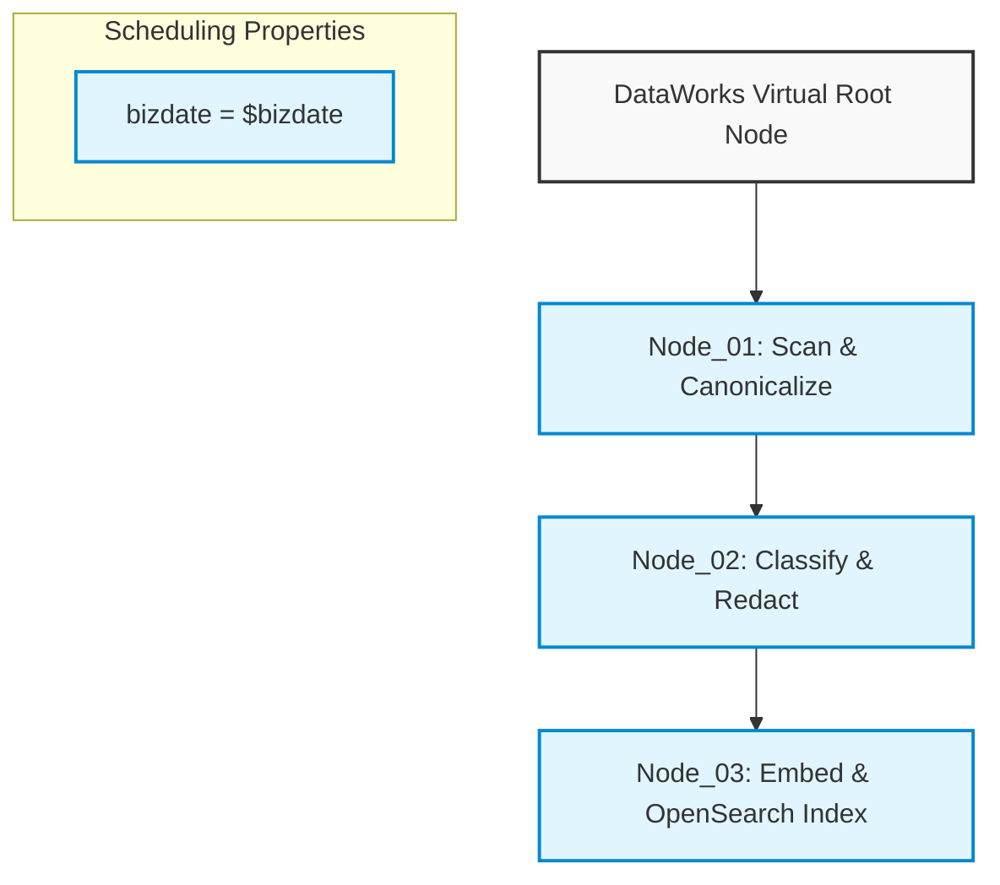

# Alibaba Cloud DataWorks Scheduling & Integration Guide for Hosted OpenSearch

This guide outlines the deployment, package installation, environment configurations, and visual workflow scheduling setup inside **Alibaba Cloud DataWorks** for the OpenSearch data pipeline.

---

## 1. 独享调度资源组 Pip Dependencies Setup

To run standard Python pipeline nodes, a **DataWorks Exclusive Resource Group for Scheduling (独享调度资源组)** must be used. Standard shared resource groups do NOT allow pip package installations or customized Python interpreter configurations.

### Requirements:
Add the following packages under the "Resource Group Python Environment Packages" configuration in the DataWorks Console:

```text
opensearch-py>=2.0.0
pymysql>=1.0.0
cryptography>=41.0.0
python-dotenv>=1.0.0
requests>=2.31.0
```

> [!IMPORTANT]
> Ensure the Python version on the exclusive resource group is **Python 3.8+**. Standard 2.7 interpreters are obsolete and will fail to execute standard type-hinted code blocks.

---

## 2. Visual Scheduling Workflow (DAG) Architecture in DataWorks

To achieve highly resilient, zero-downtime, and consistent data updates, we split the execution flow into three visual nodes using **Shell / PyODPS / Python** node types in DataWorks:



### Visual Node Link Properties:

1. **`opensearch_stage1_canonicalize` (Stage 1 Node)**
   - **Type**: Shell or Python Node
   - **Script Execution**:
     ```bash
     python3 opensearch_pipeline/dataworks_orchestrator.py --stage 1 --bizdate ${bizdate}
     ```
   - **Input Dependencies**: Virtual Root Node of the Workspace.

2. **`opensearch_stage2_safe_chunk` (Stage 2 Node)**
   - **Type**: Shell or Python Node
   - **Script Execution**:
     ```bash
     python3 opensearch_pipeline/dataworks_orchestrator.py --stage 2 --bizdate ${bizdate}
     ```
   - **Input Dependencies**: `opensearch_stage1_canonicalize` (Success).

3. **`opensearch_stage3_push_index` (Stage 3 Node)**
   - **Type**: Shell or Python Node
   - **Script Execution**:
     ```bash
     python3 opensearch_pipeline/dataworks_orchestrator.py --stage 3 --bizdate ${bizdate}
     ```
   - **Input Dependencies**: `opensearch_stage2_safe_chunk` (Success).

---

## 3. Scheduling Properties & Parameter Configurations

In the **Scheduling Properties (调度配置)** sidebar of each node, configure the following settings:

### 3.1 Parameter Injection
Configure the runtime environment variables as node parameters:

| Parameter Key | Parameter Value | Description |
| :--- | :--- | :--- |
| `bizdate` | `$bizdate` | Injects the scheduling date in YYYYMMDD format (automatically resolved by DataWorks engine) |
| `environment` | `"production"` | Set pipeline target database environments |

### 3.2 Time & Retry Configurations
- **Scheduling Cycle (调度周期)**: Daily (天调度). Run at `01:00 AM` every day.
- **Rerun Policy (出错重试)**: Enable auto rerun on failure.
  - **Max Retries (重试次数)**: `3` times.
  - **Retry Interval (重试间隔)**: `10` minutes.

---

## 4. Production Security & Fail-Safe Invariants

- **SSL Connection**: Hosted OpenSearch General-Purpose Edition requires SSL/TLS. Ensure `RAG_OPENSEARCH_USE_SSL=true` and `RAG_OPENSEARCH_VERIFY_CERTS=true` are configured in production environment variables.
- **Retry Mechanism**: The orchestrator utilizes a built-in exponential backoff and timeout handler (up to 3 times with a 60s request timeout per bulk push), mitigating transient TCP/SSL network connection resets.
- **Fail-Safe Quarantine**: Document versions failing LLM classification confidence (score `< 0.85`) or incurring API timeout timeouts will be automatically isolated in `quarantine/` and set to `PENDING_AUDIT` in RDS `review_task`, shielding the production OpenSearch index from high-risk or corrupted payloads.
