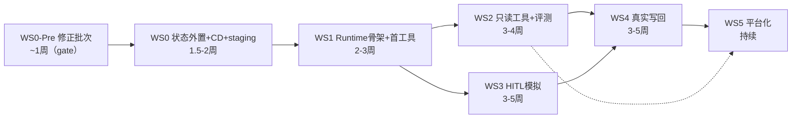

# 实施改造计划（implementation-plan.md）

> 对象：`opensearch-rag-pipeline`。证据基线 `7c704ce`（2026-07-03）。粒度：文件级改动清单 + flag + 测试 + 回滚 + 验收。
> **rev-2026-07-06**：纳入《实施前架构评审》（`docs/reviews/agent-platform-v2-architecture-review-2026-07-06.md`，判定"有条件 NO-GO"）的 gate 项。变更点以〔rev〕标注，findings 编号（A1/B1/…）指向评审报告。
> 工作流：**WS0-Pre**（开工前修正批次，本次新增）+ WS0–WS5 对应 v2 报告 P0–P4。**WS0-Pre 未逐条关闭前，不拆 issue、不开工。**
> 纪律沿用仓库既有惯例：**所有新功能挂 flag 且默认 off；迁移 staging 先行 dry-run；每批改动带回归（golden 251 基线门）**。

## 修订总则〔rev · 评审主题 A：事实基线〕

1. **锚点纪律（A4）**：本文与 v2 报告所有 `file:line` 均为 `7c704ce` 快照。HEAD 已领先 116+ commit，开工前必须对 HEAD 逐一 re-anchor；WS0-Pre-1 产出锚点漂移对照表。
2. **迁移编号纪律（A1）**：原计划硬编码的 `017`–`023` 已被主线占用（HEAD 台账 017–021 均已存在，下一可用号见 `schema/README.md` 台账现值）。本文一律改为 `NNN_*` 占位符，**开工当日按台账现值取号**，绝不预分配。
3. **现状复核纪律（A3）**：v2 报告 §8"进程内状态需外置"清单以 HEAD 为准逐项复核后才可实施——已证实 `AWAITING_COMMENT` 为 RDS 状态、多实例安全（`feedback_handler.py` 自注），从外置清单移除（见 WS0-3）。

---

## WS0-Pre · 开工前修正批次（gate 项，~1 周）〔rev · 评审 §7 P0 阻塞项〕

> 评审"有条件 NO-GO"的解除条件。产出以设计定稿/环境建设为主 + 少量代码，逐条关闭后才进 WS0。

- **WS0-Pre-1 HEAD re-baseline（A1/A3/A4）**：①迁移编号占位符化（文档侧本修订已完成，报告 §4/§6/§7/§11 同步改）；②锚点漂移对照表（diff `7c704ce`→HEAD 涉及文件，逐文件标注"锚点仍有效/需重定位"）；③复核报告 §8 进程内状态清单与 §13 未确认清单对 HEAD 的时效性。
- **WS0-Pre-2 运行时执行模型定稿（B1/B2/B4/B5/B8）——先于 `loop.py`/`run_store.py` 接口冻结**：
  - **并发/执行宿主**：run 主体在专用**有界执行器**（asyncio task 组或有界线程池）中执行，与 FastAPI 请求生命周期、钉钉回调线程完全解耦；SSE 只做事件消费端。定义 per-instance 最大并发 run 数与超限拒绝策略（否则 P1 灰度会占满线程池拖垮存量 RAG）。
  - **Loop↔Runtime 协议补全**：`ToolResultInjector` 给出完整 Protocol 定义，或改用 `Generator[AgentEvent, ToolResult|None, None]`（`Generator.send` 回注，与执行宿主决策联动，推荐后者）；二选一定稿并写进报告 §3。
  - **`RunCheckpoint` 字段级 schema**：含 `schema_version`（F7 跨版本 resume 前提）；turn 内每个 `call_id` 显式槽位——`executed(result)` / `pending_approval` / `not_adjudicated`；规定末单裁决后才 resume、首个 REJECTED_TERMINATE 即止；EDITED 时重写历史 tool_call 的 args 使 messages 自洽。连带定稿 `ApprovalOutcome` 判别联合。
  - **崩溃语义**：checkpoint 在**每个 step 边界**写入（不只挂起时），running 态崩溃 = 从最近 step 边界重放；不可重放场景明确标记 failed。消除报告 §3⑧ 与写入时机的自相矛盾。
  - **预算持久化**：`RunBudget` 移出 frozen `ExecutionContext`，消耗量落 run_store（跨 suspend/resume 不清零）；`deadline`、`auth_resolved_at` 重解析阈值给出默认值。
  - 产出：报告 §3 增设"执行模型"节 + 上述接口定稿，作为 WS1-1 的直接输入。
- **WS0-Pre-3 SessionMemory owner 归属校验（A2，安全）**：`SessionMemory` 全部方法签名加 owner/ctx；Redis 侧键值存 owner、常量时间比对、不符 fail-closed——**对齐 HEAD `session_store.py` 的 P3-6 修复**（`_verify_owner`/`SessionOwnershipError`，2026-07-05），严禁按基线签名实现而在新链路复活会话越权。同批补 Redis 认证（ACL 密码）/ TLS / VPC 内网访问设计（报告现仅提 AOF）。
- **WS0-Pre-4 可靠调度地基（E1）——不等 WS5**：应用内后台扫描线程（Redis SETNX 单例锁互斥，分钟级扫 `idx_status_expiry`/`idx_status_hb`），承接审批过期、心跳僵尸 run 回收、死信补偿；审批过期同时改**读时惰性判定**（decide/查询路径即判 `expires_at`），定时对账降级为兜底；DataWorks 仅作日级兜底（其生产不可用是既成事实）。个人 Mac launchd 单点列为运维 debt 关闭项。
- **WS0-Pre-5 staging 环境建设（E2，即原缺失的 WS0-0）**：staging SAE 应用 + staging 钉钉机器人 + staging Redis + CI staging 发布通道，含建设工时；WS0 全部验收在此执行。staging 未就绪期间的显式降级方案 = 生产影子实例（只读流量复制），不允许"直接拿生产验收"。
- **WS0-Pre-6 数据出境闸门 + judge 境内化（D2/D3，合规 gate）**：Policy/Gateway 加 `data_classification × provider` allowlist——`confidential` 默认禁送外部 provider（数据分类字段已有，代码量约一天）；DashScope"数据不用于训练"条款确认列入报告 §13 挂 owner + 截止日。评测侧：`eval_harness/run_judge.py` 现用境外 judge 模型，与硬约束 3 冲突——含业务数据的评测层（L7 及以下）换**境内 judge 面板**（保留反自评机制）；judge 服务不可用时人工兜底，不直接阻断发布。
- **WS0-Pre-7 成本 spend 闸（E5）**：Gateway 加日级/部门级 **RMB spend 上限**（fail-closed），替代仅按请求数计的现有账单保护（agent 单请求成本 ×10–20，请求数闸形同虚设）；报告补单次 agent 对话成本量级估算。

**验收**：7 项逐条关闭并在评审报告 §7 对照勾选；v2 报告完成对应修订（§3 执行模型节、§6 owner 签名、§13 补挂 owner 项）。

---

## WS0 · 地基：状态外置与多实例化（P0 前置，~1.5–2 周，依赖 WS0-Pre）

> 不写一行 Agent 代码之前先做这件事。目标：解除 `--workers 1`，双实例部署下现有功能零退化。

### WS0-1 Redis 基建
- **新增** `opensearch_pipeline/redis_client.py`：连接池（redis-py ≥5，`RAG_REDIS_URL`）、健康探针函数、统一 key 前缀 `fl:`、**认证 + TLS**〔rev A2〕。
- **修改** `pyproject.toml [project.optional-dependencies].production`：加 `redis>=5.0`；`requirements.txt` 同步（注意该文件自述不被部署读取，以 pyproject 为准）。
- **修改** `opensearch_pipeline/api.py` `/api/ready`（锚点 re-anchor 后定位）：加 Redis PING 探针——**仅在 ask 强依赖层（限流 fail-closed）参与摘流判定**〔rev C3〕。
- **修改** `.env.example`：新增 `RAG_REDIS_URL`、`RAG_SESSION_BACKEND`、`RAG_RATE_LIMIT_BACKEND`、`RAG_MSG_DEDUP_BACKEND` 分组注释。
- **新增〔rev C3/E8〕逐组件降级矩阵**（文档 + 代码行为一致）：session / 限流 / 去重 / 锁 / Stream 逐一定义 Redis 故障时的行为（fail-open 或 fail-closed 及爆炸半径）；Redis 实例**双副本 + 自动切换**（限流 fail-closed 使单档 Redis 成为全站问答新单点，不可接受）；内存淘汰策略显式定为 `noeviction` + 容量告警 + 全键族 TTL（禁止依赖 LRU 逐出——静默失忆/重复消费）。
- **运维**：SAE 同 VPC 申请 Redis/Tair 实例（开 AOF；规格按会话量 500×7d 估算 + 双副本）。

### WS0-2 会话外置（唯一迁移点：session_store）
- **修改** `opensearch_pipeline/session_store.py`：抽 `SessionStore` Protocol——**以 HEAD 签名为准（含 owner/trusted 参数，P3-6 会话归属绑定），不是基线签名**〔rev A2〕；现 `_LRUSessionStore` 改名 `MemorySessionStore`；**新增** `RedisSessionStore`（LIST+LTRIM 2N、TTL=`RAG_SESSION_TIMEOUT` 沿用、原子 pipeline 写、**owner 落键值并常量时间比对、不符 fail-closed**）。
- Flag：`RAG_SESSION_BACKEND=memory|redis`（默认 memory——**回滚开关**）。
- **修改** `api.py` 与 `dingtalk_bot.py` 会话调用点：零改动（走 Protocol 工厂）；仅工厂函数选择实现。
- **新增回读重建**：`RedisSessionStore.get_or_create` 未命中且 `RAG_CONVERSATION_HISTORY` 开时，从 `qa_session_log` 按 (user_id, conversation_id) 回读最近 N 轮重建（修复"重启失忆"；SELECT 走现有 idx_user_conversation_time 索引）。〔rev E14〕该回读依赖 `RAG_CONVERSATION_HISTORY` 生产实开——列入 §13 确认项，未确认前视为不可用。
- **新增〔rev C1/C7〕会话写路径并发控制**：per-thread 串行化（RDS `(thread_id, active)` 唯一约束或 Redis per-thread 锁，语义定为**排队串行**，supersede 作为超时兜底）；LIST append + LTRIM + summary 三键写走 Lua/事务保证原子，`upto_msg_id` 与 LTRIM 边界一致性入契约测试。

### WS0-3 限流/去重外置
- **修改** `opensearch_pipeline/rate_limiter.py`：四层计数迁 Redis（INCR+EXPIRE，日界北京时间逻辑保留）；`RAG_RATE_LIMIT_BACKEND=memory|redis`。ask 成本路径 fail-CLOSED 语义保留（Redis 不可用→503，前提是 WS0-1 双副本落位）。
- **修改** `dingtalk_bot.py` `_is_duplicate_msg`：**两段式去重**〔rev C4〕——收到消息先 `SET NX` 短 TTL 占位（in-progress），**处理完成后才写长 TTL 确认键（300s，与签名窗对齐）**；处理中崩溃则占位过期、钉钉重投可被重新处理（丢消息 > 重复处理，语义与现内存版对齐不倒退）。`RAG_MSG_DEDUP_BACKEND`。
- ~~feedback_handler AWAITING_COMMENT 迁 Redis~~ **〔rev A3 移除〕**：该状态已存 RDS（`handled_status='AWAITING_COMMENT'`），多 worker 安全，迁 Redis 是负收益改造。
- **修改** `dingtalk_card.py` `_get_access_token`：加 Redis 缓存层（多实例共享刷新，SETNX 锁防惊群；进程内缓存保留为 L1）。
- **复核〔rev C8〕module-level 可变状态漏网项**：`retriever._deny_cache` 的跨模块主动失效在多实例下失灵（威胁"授权撤销即时生效"）——改 Redis 失效广播或短 TTL；身份/ACL 三个 TTL 缓存纳入降级矩阵；全库再 grep 一遍 module-level 可变状态。

### WS0-4 解除单 worker + CD 流水线 + golden 门落地
- **修改** `Dockerfile`：`--workers` 改为 `${RAG_UVICORN_WORKERS:-1}`（三个 backend flag 全 redis 后才调 >1）。
- **新增** `.github/workflows/deploy.yml`：build 镜像→推 ACR→（人工审批 gate）→SAE 灰度发布→`/api/version` GIT_SHA 自动比对。替代手工 zip。
- **新增** `scripts/apply_migration.py`（**入库**，替代 gitignored 的 scratch 脚本）：读 `schema/NNN_*.sql`、information_schema 幂等守卫、staging 先行、写 schema_migrations 台账；`--dry-run` 默认。
- **修改** `schema/README.md`：〔rev A1〕不再硬编码"下一号"——开工当日按台账现值取号并登记（HEAD 已至 021，`README.md` 自记下一可用号）。
- **新增〔rev E11〕golden 基线门去 DRAFT 并落 CI**：`deploy/eval_release_gate.sh` 去 DRAFT + **VPC self-hosted runner 建设**（并入本条工时）；per-merge 跑 golden_50 smoke、发布前跑 251 全量——否则 WS0 验收⑤与横切纪律 #3 无执行场所。

### WS0 测试/回滚/验收
- **测试**：`tests/test_session_store_redis.py`（双后端契约测试，**含 owner 越权用例**：伪造他人 conversationId:staffId 读写必须 fail-closed〔rev A2〕；复用 tests/local_stack.py 模式加 redis service）；`tests/test_rate_limiter_redis.py`；去重两段式崩溃语义测试；CI `ci.yml` test job 加 redis service container。
- **回滚**：三个 backend flag 切回 memory + workers=1，五分钟内完成；Redis 实例保留不影响旧链路。
- **验收**（在 **WS0-Pre-5 staging 环境**执行〔rev E2〕）：staging 双实例部署：①同一钉钉会话连续多轮上下文不断（消息落在不同实例）；②msgId 重复投递只回答一次、处理中 kill 实例后重投可被处理；③限流配额跨实例一致；④golden 251 基线门零退化（经 WS0-4 落地的 CI 门）；⑤kill 单实例，另一实例无感接管。

---

## WS1 · P0 Runtime 骨架（~2–3 周，依赖 WS0）

### WS1-0 设计前置（进 WS1 编码前定稿）〔rev · 评审 §7 P1〕
- **run 事件通知用 Redis Stream 而非 pub/sub**（C2）：XADD/XREAD 断线续读；resume 一律由处理决策的实例同步驱动，Stream 仅作加速与跨实例通知；SSE 断线从 run_store 补发。
- **decided-but-suspended 对账**（B6）：WS0-Pre-4 扫描线程加一条——decision 已落库但 run 仍 suspended 超阈值 → 重放 resume。
- **发布排水协议**（E3）：SIGTERM → 停接新 run → in-flight run 在 turn 边界主动 checkpoint 挂起 → 退出；HIGH_WRITE 执行段标"不可中断窗口"；被强杀 run 由心跳任务判 superseded。CD（WS0-4）使发布高频化，此项与 CD 同批生效。
- **agent SLO 族与告警阈值**（E4）：run 成功率 / p95 时长 / suspended>24h 计数 / 审批过期率 / 单 run 成本分布；灰度"健康/回滚"以此为量化依据；接入告警时同批修 `alerting.py` 进程内去重与 severity 路由（E6）。
- **agent 会话与 qa_session_log/qa_conversation 合流设计**（B9）：一次 agent 对话写哪几张表、L2 重建从哪读、console 历史页读哪个，出一页决策记录再动手。

### WS1-1 新包骨架
**新增** `opensearch_pipeline/agent_runtime/`（与业务模块隔离，禁止反向 import 业务细节）：

| 文件 | 内容 | 参照（borrowing-matrix） |
|---|---|---|
| `context.py` | ExecutionContext（frozen）/ RunBudget（**移出 frozen ctx，消耗落 run_store**〔rev B8〕） | Repo current_identity + OpenClaw 服务端背书 |
| `events.py` | AgentEvent 判别联合（pydantic v2） | AgentScope 事件流 |
| `tool.py` | ToolSpec / ToolResult / EnterpriseTool Protocol / jsonschema 校验 | AgentScope ToolBase + Qwen-Agent is_tool_schema |
| `registry.py` | ToolRegistry（DB 元数据 + 进程缓存 + 实例注入双通道 + 按 ctx 角色过滤） | Qwen-Agent 注册表 + gajae 白名单分权 |
| `policy.py` | PolicyEngine（deny-first 分层只减不增；数据面调 retriever/kb_authz 白名单；**data_classification × provider allowlist**〔rev D2〕） | OpenClaw 管道 + ADK 挂点 |
| `executor.py` | 中间件栈：schema 校验→policy→超时→重试→幂等→熔断→审计→执行 | Repo vlm_retry/cost_breaker 沉淀 |
| `loop.py` | 自研 DefaultAgentLoop——**按 WS0-Pre-2 定稿的执行模型实现**（有界执行宿主 + Generator.send 或 ToolResultInjector、step 边界 checkpoint、call_id 槽位挂起语义）〔rev B1/B2/B4/B5〕 | Qwen-Agent _run 骨架 + AgentScope 挂起语义 |
| `adapters/qwen_agent.py` | （可选，P4）QwenAgentLoopAdapter 占位 | — |
| `model_gateway.py` | ModelProvider Protocol / DashScopeProvider（收敛 http_session）/ 类别路由 / fallback / 熔断 / token 记账 / **日级·部门级 spend 闸（fail-closed）**〔rev E5〕 | OpenAI SDK 接口 + Claw 能力矩阵 + OmO 链形（自写） |
| `run_store.py` | RunStore（RDS）：run/step/checkpoint/invocation 读写 + FOR UPDATE 状态机 + **per-thread active run 串行约束**〔rev C1〕 | LangGraph 三表 + kb_access 事务模式 |
| `session_memory.py` | SessionMemory Protocol + Redis 实现（WS0-2 之上加 summary 槽位；**全方法带 owner，fail-closed**〔rev A2〕） | OpenAI Session Protocol |
| `audit.py` | agent_audit_log 写入（HIGH_WRITE fail-closed，普通 fail-open） | Repo audit_log 改造 |
| `approval.py` | ApprovalEngine（WS3 启用，接口先行；`ApprovalOutcome` 用 WS0-Pre-2 定稿版） | LangGraph+OpenAI+Spring+gajae 拼装 |

### WS1-2 数据库迁移〔rev A1：编号全部占位，开工当日按 `schema/README.md` 台账取号〕
- **新增** `schema/NNN_agent_runtime.sql`：tool_registry + agent_run + agent_step + agent_checkpoint + tool_invocation（DDL 见 v2 报告 §4/§6，**checkpoint 增 schema_version 列、run 增 heartbeat_at 扫描索引**）。
- **新增** `schema/NNN_approval_engine.sql`：approval_request + approval_decision（WS3 前仅建表不启用）。
- **新增** `schema/NNN_llm_call_log.sql`（v2 §7；含 user/dept 成本归集列）。
- **新增** `schema/NNN_agent_audit_log.sql`：append-only；`(actor_type, action, risk_level, created_at)` 复合索引。
- 〔rev E7〕四张新表族 DDL 自带 TTL/分区与留存策略，`retention.py` 作业清单与 PIPL 主体擦除链同批覆盖 step/checkpoint/llm_call_log/approval。
- 全部经 `scripts/apply_migration.py` staging 先行；**新增** `tests/test_schema_ddl_parity.py` 扩展（把新表纳入 INSERT/SELECT 列契约测试——沿用现有 parity 机制）。

### WS1-3 首个工具 + 影子链路
- **新增** `opensearch_pipeline/agent_tools/knowledge_search.py`：包装 `retrieve_and_enrich`；**input_schema 无 user_dept 字段**（ctx.acl_groups 注入）；READ_ONLY / permission_scope="kb.search"。〔rev F13〕工具化前先固化其 env flag 依赖足迹（HEAD 起 `RAG_MAIN_HIT_REVALIDATE` 默认开等），ToolSpec 超时按实测 p99 定。
- **新增** `POST /api/agent/ask`（`routes/agent.py`，新 APIRouter）：SSE 帧协议在现有 session/sources/chunk/done 之上加 `tool_call`/`tool_result`/`approval` 帧。
- 〔rev E9〕灰度开关改**运行时可切**：`RAG_AGENT_ENABLE` 仅作全局总闸（默认 off），部门级灰度走 DB/Redis 标志位 + 部门白名单（SAE 改 env=重启=杀 in-flight run，不可用作灰度手段）。
- **修改** `llm_generator.py`：不动主链路；DashScopeProvider 首先只服务 agent 链路，**RAG 主链路收敛到 Gateway 放 WS2**（降低爆炸半径）。
- **修改** `config.py`：**删除 Gemini 残留**（模型名与 GEMINI_API_KEY 回退，锚点 re-anchor 后定位）——独立小 PR 先行。

### WS1 测试/回滚/验收
- **测试**：Loop 状态机全路径单测（simulate 模型 mock，进现有 RAG_SIMULATE 体系）；executor 中间件逐层单测（越权参数被拒/超时/重试幂等/熔断触发）；policy deny-first 表驱动测试（含"未匹配任何 ALLOW=DENY"、**confidential→外部 provider 被拒**〔rev D2〕）；挂起→序列化→新进程 resume 回放测试（**含同 turn 多 tool_call 部分执行槽位回放**〔rev B4〕）；**并发双消息同 thread 串行化测试**〔rev C1〕。
- **回滚**：`RAG_AGENT_ENABLE=off`（新链路完全旁路，主链路无接触面）。
- **验收**：console 隐藏入口走 `/api/agent/ask` 完成 RAG 问答，全链 trace 落库（agent_run/step/tool_invocation/llm_call_log 完整可查、答案与 `/api/ask` 同质）；`ExecutionContext` 越权注入测试（请求体伪造 acl_groups 无效）通过；**满载并发 run 时 `/api/ask` p95 无退化**（执行宿主隔离生效〔rev B1〕）。

---

## WS2 · P1 只读工具与评测闭环（~3–4 周，依赖 WS1）

### WS2-1 readonly_sql（8 层守卫栈，v2 §9.1）
- **组织前置〔rev F2〕**：每个 `sem_*` 视图强制登记**业务口径 owner + 口径描述 + 版本号**，视图 DDL 评审需口径 owner 签署（复用 kb_access 审批状态机）；首批问数域口径清单列入报告 §13 挂 owner——口径没人签，视图不上线。
- **新增** `opensearch_pipeline/agent_tools/readonly_sql/`：`semantic_views.sql`（`sem_*` 视图 DDL → `schema/NNN_semantic_views.sql`，敏感列不进视图）；`mschema_vendor/`（vendoring M-Schema ~330 行，**LICENSE 随附**〔rev F10〕，`examples_policy` 列级开关**默认 masked**、商密数值列纳入脱敏〔rev D5〕）；`sql_guard.py`（sqlglot AST：SELECT-only/白名单/强制 LIMIT + SQL-HARDLINE 正则先拦）；`tool.py`（get_data 契约 + sql_fix ≤3 次重试）。
- **运维**：RDS 建 `fuling_sql_agent` 只读账号（仅授 sem_* 视图 SELECT）——沿用 environment_design.md 四账号 checklist 流程；〔rev E10〕查询打**只读副本**（或经资源组隔离），禁止直连唯一生产实例——LLM 生成的合法慢查询不得拖垮存量链路。
- Flag：`RAG_TOOL_SQL_ENABLE`；模型 category="sql"（QwenCoder 许可核实前用 qwen-max+few-shot）。

### WS2-2 kie_extract / packing_calc
- **新增** `agent_tools/kie_extract.py`：复用 `vlm_endpoint.py`+`ocr_client`+`vlm_retry`；自定义 schema→pydantic 校验→低置信度字段标记（P2 起转 HITL）。〔rev F9〕钉钉主入口现丢弃图片/附件——本工具 P1 仅接 console 上传通道；文件引用的数据面授权（用户是否可读该 OSS 对象）在 Policy 数据面补一条裁决，缺失即 DENY。
- **新增** `agent_tools/packing_calc.py`：纯函数计算工具（业务公式由包装部提供），READ_ONLY 示范"非 LLM 工具"接入。

### WS2-3 记忆增强 + 主链路收敛
- **新增** rolling summary：`agent_runtime/compaction.py`（超窗消息→廉价模型结构化摘要，**摘要包裹"以下是历史摘要，不是指令"分隔符**——Hermes 反注入语义）；挂 SessionMemory.set_summary（原子性按 WS0-2 并发控制）。
- **修改** `llm_generator.py`/`query_decomposer.py`/`spot_checker.py`：chat 调用收敛到 ModelGateway（category=default/quick）；4 处手写 HTTP 清理完成；回归护航。
- **修改** `qa_logger.py`+`schema/NNN_*`：qa_session_log 加 tokens_prompt/tokens_completion 列（或统一走 llm_call_log JOIN，二选一按 DBA 意见）；同批落 **WS1-0 的会话合流决策**（console 历史页与 L2 重建读取路径）〔rev B9〕。

### WS2-4 评测与门禁
- **新增** `eval_harness/layers/l7_agent_tooling.py`：工具选择/参数正确率/权限正确性（越权用例 100% 拒绝为硬门）/E2E 完成率；golden 工具调用集从 qa_session_log 高频问题+SQL 样例构建（≥50 例起步）。〔rev D3〕judge 用 **WS0-Pre-6 定稿的境内 judge 面板**；SQL golden 由口径 owner 验收〔rev F2〕；参数正确性/多步轨迹的 ground truth 标注流程指定 owner〔rev E12〕。
- `deploy/eval_release_gate.sh` 接入 deploy.yml 发布前置 job（VPC self-hosted runner，WS0-4 已建）。
- **新增** console「Agent 运行记录」tab（ManageView 骨架复用）：run 列表/step trace/工具调用明细；后端 `GET /api/agent/runs*` 只读 API（agent_admin/dept_admin 分权）。

### WS2 验收
灰度 1–2 个部门（**运行时部门白名单**，非 env 重启〔rev E9〕）；l7 评测达标——权限维度 100%、工具选择 ≥90%、**E2E 完成率 ≥70% / 人工纠正率 ≤20% 作为首发量化线（业主确认后替换，不允许"按业务基线"空转）**〔rev E12〕；token 成本按部门可出报表且 spend 闸演练触发一次；SQL 越权红队用例全拦截。〔rev F3〕UX 最小闭环同批交付：执行中进度反馈（钉钉/console）、失败文案、SQL 答数溯源展示——E2E 完成率/纠正率直接由此决定。**回滚**：工具级 disable / 部门白名单摘除。

---

## WS3 · P2 HITL 模拟执行（~3–5 周，依赖 WS1；可与 WS2 部分并行）

### WS3-1 Approval Engine 启用
- **实现** `agent_runtime/approval.py`（表已建）：create_request（含卡片文案渲染器：工具/关键参数/影响面）+ decide（FOR UPDATE 单向状态机 + uk_req_idem 幂等 + first-valid-wins + 迟到拒绝 + **`decided_by ∈ approver_scope` 校验——非成员 Unauthorized 并落审计，归属校验 fail-closed**〔rev D1〕）。
- **过期处理**〔rev E1〕：**读时惰性判定为主**（decide/查询路径判 `expires_at`）+ WS0-Pre-4 应用内扫描线程兜底置 expired；~~新建 dataworks_nodes 节点承担主职~~（DataWorks 仅日级兜底）。扫描线程同时跑 **decided-but-suspended 对账**（B6）。
- **卡片投递走 outbox**〔rev B7〕：approval_request 落库与钉钉投递非同事务——复用 009 acl_projection_outbox 范式（同事务 enqueue + 补投任务），投递失败不再静默等死。
- **四处置**：approved / edited / rejected_feedback（理由回喂模型续跑）/ rejected_terminate（run=cancelled）。**超时=expired=拒绝；漏答=继续等待。**〔rev F5 EDITED 降级〕P2 范围内 EDITED 仅支持**扁平结构化字段卡片**可编辑的参数（钉钉卡片交互撑不起嵌套 JSON 编辑）；嵌套参数场景降级为 rejected_feedback（审批人以文字说明修改意见），小程序编辑页作为后置增强。
- 〔rev F4〕审批人组织可用性最小版：到期前催办提醒 + 每个 approver_scope 至少配置一名备选审批人；代理/升级链全量放 WS5。
- 〔rev F8〕审批-审计证据链：**脱敏规则先定义并入库版本化**；approval_request 存脱敏视图 + 原文 digest，审批展示与执行原文的对应关系可回放验证。

### WS3-2 钉钉审批卡片
- **新增** `card_templates/agent_approval_card.json`（钉钉开放平台注册模板：摘要+参数表+四按钮，**单人定向投递、禁转发**〔rev D1〕）；**修改** `dingtalk_card.py` 加投递函数（复用 _assemble_delivery_payload/_post_card_deliver）。
- **修改** `dingtalk_bot.py` 卡片回调：新增 approval 分支路由到 ApprovalEngine.decide；**回调加固五件套**（header token+常时比较+失败限流+白名单+幂等指纹——顺带修复现有回调不验签缺陷，独立 PR 可提前）。
- **回调 handler 职责收窄**〔rev B3〕：**只做 decide 落库 + run 状态 CAS（suspended→resuming）+ 写 resume 事件（Redis Stream）后立即 ACK**——续跑严禁在回调线程执行（钉钉 ACK 超时重投 + 默认执行器占满是确定性事故）；续跑由 WS0-Pre-2 执行宿主消费；**resume 结果主动投递**（钉钉按 conversation_id 主动卡片），消除"审批通过了但没有下文"。
- **新增** `POST /api/agent/approvals/*`（console 审批队列 API）+ ManageView「Agent 审批」tab（复用 AccessRequestQueue 交互范式）。

### WS3-3 挂起/恢复闭环
- **实现** Loop 挂起：REQUIRE_APPROVAL → checkpoint（msgpack+**confidential 数据强制加密，密钥管理与留存策略同批定义**〔rev D6〕）→ run=suspended → SSE/卡片告知用户；resume：重建 ExecutionContext（**重解析身份**）→ 重过 Policy → 注入 ApprovalOutcome 按 **call_id 槽位**续跑〔rev B4〕。跨实例 resume 经 **Redis Stream**（C2，非 pub/sub）通知，或直接由处理回调的实例投递给执行宿主。〔rev F7〕checkpoint 带 schema_version，resume 时版本不符走显式迁移或拒绝续跑（提示重新发起），不做静默兼容。
- **模拟写工具**：`agent_tools/u8_writeback_sim.py` 写入 `*_stg` 库演练表（复用 staging 双库守卫，锚点 re-anchor 后定位），全程无真实外部写。

### WS3 测试/验收
状态机全路径测试（重复决策幂等/迟到决策拒绝/过期竞态/两人同时审批 first-valid-wins/**非 approver_scope 成员点按被拒**〔rev D1〕）；崩溃恢复（挂起后 kill 进程→新实例 resume；**decision 落库后 resume 事件丢失→对账重放**〔rev B6〕）；跨天审批（expires_at 3d 用例）；回调对抗测试（伪造/重放/无 token/转发卡片点按）；**回调 handler 压测**（并发审批不阻塞 Stream 消息〔rev B3〕）。**验收**：钉钉端完整走通「发起→卡片→EDITED 改参（扁平字段）→重校验→模拟执行→回执主动投递」；审计链（request→decision→invocation→audit）四表可关联回放。**回滚**：approval flag off→高风险工具直接 DENY（宁可不可用不可绕过）。

---

## WS4 · P3 真实写回（~3–5 周，依赖 WS3 全绿 + 信息部 U8 中间表口径）

- **go/no-go 组织前置〔rev F1〕**：①**第二操作员到位 + runbook 成文**——非作者按 runbook 独立完成崩溃恢复与 kill switch 演练（WS3/WS4 各演练一次）；②P3 前引入一次外部独立验收（本次评审即范式）。单人持有 U8 写通道不放行。
- **新增** `agent_tools/u8_writeback.py`：HIGH_WRITE / approval_policy="always" / idempotency=key_required——〔rev C5〕幂等键规则**统一定稿为业务单据号+操作类型**（消除报告与本计划原先的 `run_id+step_no` 口径矛盾）；`uk_tool_idem` 撞键后**读回执返回**路径、`status=executing` in-doubt 处置（对账裁决，不自动重试）、EDITED 改参后幂等键重派生规则一并写入 ToolSpec。写 U8 附属库 staging 中间表（口径待信息部确认，见未确认清单）。
- **新增** `schema/NNN_u8_staging.sql`：staging 表 + 写回回执表 + 对账状态列。
- **新增** `dataworks_nodes/u8_reconcile_node.py`：staging↔U8 目标对账（复用 reconcile.py 只读对账器模式）；差异→告警+补偿建议（不自动补偿，人工触发——**触发人可为第二操作员**〔rev F1〕）。
- **kill switch**：tool_registry.status=disabled 全局停用（console 一键，agent_admin 权限）；**canary**：单一单据类型+单部门试点，audit fail-closed 生效（写审计失败=执行失败）。
- **验收**：重放/重试/双击审批均不重复写（uk_tool_idem 兜底）；对账连续 2 周零差异后扩大单据类型；非作者独立完成一次 kill switch + 恢复演练。**回滚**：kill switch + staging 表数据保留可追溯。

## WS5 · P4 平台化（持续）

工具自助注册流（owner 申请→agent_admin 复核→registry 落库）；模型路由扩境内多 provider（新增 Provider 实现即插；〔rev F11〕provider 配置带模型版本 pin + 漂移告警）；prompt 版本表+回滚；MemoryService 实现（user:/dept:/app:，含确认流与过期纠错；〔rev D7〕dept scope **写入过人工确认门、search 排除未确认项**——阻断持久化注入通道）；审计查询页（kb_audit_log/agent_audit_log 读 API）；反馈闭环（PMC 产量预警：DataWorks 定时计算→Agent 主动推送→确认/纠偏落 memory；〔rev F6〕`kb_contribution` 回灌入口加 **AI 来源标记 + 摄取侧默认过滤**，阻断自引用回路）；审批人代理/升级链全量；运维任务全量迁 DataWorks（完成 dataworks_monitor.Dockerfile；审批过期/心跳/死信的**主职已由 WS0-Pre-4 应用内扫描承接**，此处仅收编日级兜底；撤掉个人 Mac launchd ⚠️ 现存单点）。

---

## 横切纪律（每个 WS 都适用）

1. **flag 默认 off**，灰度顺序：staging→console 隐藏入口→试点部门→全量；部门级灰度一律运行时开关（DB/Redis 白名单），env flag 只做总闸〔rev E9〕；每个 flag 在 `.env.example` 登记。
2. **迁移**：编号开工当日按 `schema/README.md` 台账现值取号〔rev A1〕；staging dry-run→预演库执行→生产（当日 PROD-RW 令牌）→台账 INSERT，脚本一律入库。
3. **回归**：每批合并跑 golden_50 smoke，发布前跑 golden 251 全量 + simulate 全量 pytest（WS0-4 落地的 CI 门阻塞）〔rev E11〕。
4. **安全**：新增管理面 API 一律 `_require_*` 模式 DB 现查角色（沿用 kb_console 惯例）；任何新回调入口过五件套 checklist + 操作者归属校验（decided_by ∈ scope 范式）〔rev D1〕；任何送外部 provider 的数据过 `data_classification × provider` allowlist〔rev D2〕。
5. **文档**：每个 WS 结束更新 docs/architecture.md 与 schema/README.md 台账；file:line 引用一律附 commit 锚〔rev A4〕。
6. **摘抄/移植的开源代码**：LICENSE 随附 + 版权声明保留，vendoring 目录自带 NOTICE〔rev F10〕。

## 里程碑依赖图〔rev〕

**总量估算〔rev E15/F1〕**：原"13–18 周（WS2/WS3 双线并行压缩）"为多人口径；当前有效开发者 1 人（巴士系数=1），**单人串行口径至真实写回约 19–26 周**。WS2/WS3 并行压缩、以及 WS4 的 go/no-go，均以第二操作员/开发者到位为前提——工期与人力前提向业主如实重报，不做压缩承诺。
