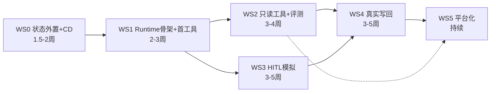

# 实施改造计划（implementation-plan.md）

> 对象：`opensearch-rag-pipeline` @ `7c704ce`。粒度：文件级改动清单 + 迁移编号 + flag + 测试 + 回滚 + 验收。
> 六个工作流（WS0–WS5）对应 v2 报告 P0–P4；WS 内条目按依赖排序，可直接拆 issue。
> 纪律沿用仓库既有惯例：**所有新功能挂 flag 且默认 off；迁移 staging 先行 dry-run；每批改动带回归（golden 251 基线门）**。

---

## WS0 · 地基：状态外置与多实例化（P0 前置，~1.5–2 周）

> 不写一行 Agent 代码之前先做这件事。目标：解除 `--workers 1`，双实例部署下现有功能零退化。

### WS0-1 Redis 基建
- **新增** `opensearch_pipeline/redis_client.py`：连接池（redis-py ≥5，`RAG_REDIS_URL`）、健康探针函数、统一 key 前缀 `fl:`、可选 TLS。
- **修改** `pyproject.toml [project.optional-dependencies].production`：加 `redis>=5.0`；`requirements.txt` 同步（注意该文件自述不被部署读取，以 pyproject 为准）。
- **修改** `opensearch_pipeline/api.py:449-503` `/api/ready`：加 Redis PING 探针（仅当 `RAG_REDIS_URL` 配置时参与就绪判定）。
- **修改** `.env.example`：新增 `RAG_REDIS_URL`、`RAG_SESSION_BACKEND`、`RAG_RATE_LIMIT_BACKEND`、`RAG_MSG_DEDUP_BACKEND` 分组注释。
- **运维**：SAE 同 VPC 申请 Redis/Tair 实例（开 AOF；规格按会话量 500×7d 估算，初期最小档足够）。

### WS0-2 会话外置（唯一迁移点：session_store）
- **修改** `opensearch_pipeline/session_store.py`：抽 `SessionStore` Protocol（get_or_create/append_to_history/clear/get_history 现签名不变）；现 `_LRUSessionStore` 改名 `MemorySessionStore`；**新增** `RedisSessionStore`（LIST+LTRIM 2N、TTL=`RAG_SESSION_TIMEOUT` 沿用、原子 pipeline 写）。
- Flag：`RAG_SESSION_BACKEND=memory|redis`（默认 memory——**回滚开关**）。
- **修改** `api.py:579` 与 `dingtalk_bot.py` 会话调用点：零改动（走 Protocol 工厂）；仅工厂函数选择实现。
- **新增回读重建**：`RedisSessionStore.get_or_create` 未命中且 `RAG_CONVERSATION_HISTORY` 开时，从 `qa_session_log` 按 (user_id, conversation_id) 回读最近 N 轮重建（修复"重启失忆"；SELECT 走现有 idx_user_conversation_time 索引）。

### WS0-3 限流/去重/反馈态外置
- **修改** `opensearch_pipeline/rate_limiter.py`：四层计数迁 Redis（INCR+EXPIRE，日界北京时间逻辑保留）；`RAG_RATE_LIMIT_BACKEND=memory|redis`。ask 成本路径 fail-CLOSED 语义保留（Redis 不可用→503）。
- **修改** `dingtalk_bot.py:132-156` `_is_duplicate_msg`：Redis `SET NX EX 300`（与签名窗对齐）；`RAG_MSG_DEDUP_BACKEND`。
- **修改** `feedback_handler.py` AWAITING_COMMENT 状态：迁 Redis hash（TTL 24h）。
- **修改** `dingtalk_card.py:35-79` `_get_access_token`：加 Redis 缓存层（多实例共享刷新，SETNX 锁防惊群；进程内缓存保留为 L1）。

### WS0-4 解除单 worker + CD 流水线
- **修改** `Dockerfile:42-48`：`--workers` 改为 `${RAG_UVICORN_WORKERS:-1}`（三个 backend flag 全 redis 后才调 >1）。
- **新增** `.github/workflows/deploy.yml`：build 镜像→推 ACR→（人工审批 gate）→SAE 灰度发布→`/api/version` GIT_SHA 自动比对。替代手工 zip。
- **新增** `scripts/apply_migration.py`（**入库**，替代 gitignored 的 scratch 脚本）：读 `schema/NNN_*.sql`、information_schema 幂等守卫、staging 先行、写 schema_migrations 台账；`--dry-run` 默认。
- **修改** `schema/README.md`：修正编号台账（016 已存在，下一号 017）；登记 016 的库映射。

### WS0 测试/回滚/验收
- **测试**：`tests/test_session_store_redis.py`（双后端契约测试，复用 tests/local_stack.py 模式加 redis service）；`tests/test_rate_limiter_redis.py`；CI `ci.yml` test job 加 redis service container。
- **回滚**：三个 backend flag 切回 memory + workers=1，五分钟内完成；Redis 实例保留不影响旧链路。
- **验收**：staging 双实例部署：①同一钉钉会话连续多轮上下文不断（消息落在不同实例）；②msgId 重复投递只回答一次；③限流配额跨实例一致；④golden 251 基线门零退化；⑤kill 单实例，另一实例无感接管。

---

## WS1 · P0 Runtime 骨架（~2–3 周，依赖 WS0-1/0-4）

### WS1-1 新包骨架
**新增** `opensearch_pipeline/agent_runtime/`（与业务模块隔离，禁止反向 import 业务细节）：

| 文件 | 内容 | 参照（borrowing-matrix） |
|---|---|---|
| `context.py` | ExecutionContext / RunBudget（frozen dataclass） | Repo current_identity + OpenClaw 服务端背书 |
| `events.py` | AgentEvent 判别联合（pydantic v2） | AgentScope 事件流 |
| `tool.py` | ToolSpec / ToolResult / EnterpriseTool Protocol / jsonschema 校验 | AgentScope ToolBase + Qwen-Agent is_tool_schema |
| `registry.py` | ToolRegistry（DB 元数据 + 进程缓存 + 实例注入双通道 + 按 ctx 角色过滤） | Qwen-Agent 注册表 + gajae 白名单分权 |
| `policy.py` | PolicyEngine（deny-first 分层只减不增；数据面调 retriever/kb_authz 白名单） | OpenClaw 管道 + ADK 挂点 |
| `executor.py` | 中间件栈：schema 校验→policy→超时→重试→幂等→熔断→审计→执行 | Repo vlm_retry/cost_breaker 沉淀 |
| `loop.py` | 自研 DefaultAgentLoop（事件流 while 循环，可挂起） | Qwen-Agent _run 骨架 + AgentScope 挂起语义 |
| `adapters/qwen_agent.py` | （可选，P4）QwenAgentLoopAdapter 占位 | — |
| `model_gateway.py` | ModelProvider Protocol / DashScopeProvider（收敛 http_session）/ 类别路由 / fallback / 熔断 / token 记账 | OpenAI SDK 接口 + Claw 能力矩阵 + OmO 链形（自写） |
| `run_store.py` | RunStore（RDS）：run/step/checkpoint/invocation 读写 + FOR UPDATE 状态机 | LangGraph 三表 + kb_access 事务模式 |
| `session_memory.py` | SessionMemory Protocol + Redis 实现（WS0-2 之上加 summary 槽位） | OpenAI Session Protocol |
| `audit.py` | agent_audit_log 写入（HIGH_WRITE fail-closed，普通 fail-open） | Repo audit_log 改造 |
| `approval.py` | ApprovalEngine（WS3 启用，接口先行） | LangGraph+OpenAI+Spring+gajae 拼装 |

### WS1-2 数据库迁移
- **新增** `schema/017_agent_runtime.sql`：tool_registry + agent_run + agent_step + agent_checkpoint + tool_invocation（DDL 见 v2 报告 §4/§6）。
- **新增** `schema/018_approval_engine.sql`：approval_request + approval_decision（WS3 前仅建表不启用）。
- **新增** `schema/019_llm_call_log.sql`（v2 §7；含 user/dept 成本归集列）。
- **新增** `schema/020_agent_audit_log.sql`：append-only；`(actor_type, action, risk_level, created_at)` 复合索引。
- 全部经 `scripts/apply_migration.py` staging 先行；**新增** `tests/test_schema_ddl_parity.py` 扩展（把新表纳入 INSERT/SELECT 列契约测试——沿用现有 parity 机制）。

### WS1-3 首个工具 + 影子链路
- **新增** `opensearch_pipeline/agent_tools/knowledge_search.py`：包装 `retrieve_and_enrich`；**input_schema 无 user_dept 字段**（ctx.acl_groups 注入）；READ_ONLY / permission_scope="kb.search"。
- **新增** `POST /api/agent/ask`（`routes/agent.py`，新 APIRouter）：SSE 帧协议在现有 session/sources/chunk/done 之上加 `tool_call`/`tool_result`/`approval` 帧；flag `RAG_AGENT_ENABLE` 默认 off。
- **修改** `llm_generator.py`：不动主链路；DashScopeProvider 首先只服务 agent 链路，**RAG 主链路收敛到 Gateway 放 WS2**（降低爆炸半径）。
- **修改** `config.py`：**删除 Gemini 残留**（:244,664 模型名与 GEMINI_API_KEY 回退）——独立小 PR 先行。

### WS1 测试/回滚/验收
- **测试**：Loop 状态机全路径单测（simulate 模型 mock，进现有 RAG_SIMULATE 体系）；executor 中间件逐层单测（越权参数被拒/超时/重试幂等/熔断触发）；policy deny-first 表驱动测试（含"未匹配任何 ALLOW=DENY"）；挂起→序列化→新进程 resume 回放测试。
- **回滚**：`RAG_AGENT_ENABLE=off`（新链路完全旁路，主链路无接触面）。
- **验收**：console 隐藏入口走 `/api/agent/ask` 完成 RAG 问答，全链 trace 落库（agent_run/step/tool_invocation/llm_call_log 完整可查、答案与 `/api/ask` 同质）；`ExecutionContext` 越权注入测试（请求体伪造 acl_groups 无效）通过。

---

## WS2 · P1 只读工具与评测闭环（~3–4 周，依赖 WS1）

### WS2-1 readonly_sql（8 层守卫栈，v2 §9.1）
- **新增** `opensearch_pipeline/agent_tools/readonly_sql/`：`semantic_views.sql`（`sem_*` 视图 DDL → `schema/021_semantic_views.sql`，敏感列不进视图）；`mschema_vendor/`（vendoring M-Schema ~330 行，加 `examples_policy` 列级开关：off/masked/on）；`sql_guard.py`（sqlglot AST：SELECT-only/白名单/强制 LIMIT + SQL-HARDLINE 正则先拦）；`tool.py`（get_data 契约 + sql_fix ≤3 次重试）。
- **运维**：RDS 建 `fuling_sql_agent` 只读账号（仅授 sem_* 视图 SELECT）——沿用 environment_design.md 四账号 checklist 流程。
- Flag：`RAG_TOOL_SQL_ENABLE`；模型 category="sql"（QwenCoder 许可核实前用 qwen-max+few-shot）。

### WS2-2 kie_extract / packing_calc
- **新增** `agent_tools/kie_extract.py`：复用 `vlm_endpoint.py`+`ocr_client`+`vlm_retry`；自定义 schema→pydantic 校验→低置信度字段标记（P2 起转 HITL）。
- **新增** `agent_tools/packing_calc.py`：纯函数计算工具（业务公式由包装部提供），READ_ONLY 示范"非 LLM 工具"接入。

### WS2-3 记忆增强 + 主链路收敛
- **新增** rolling summary：`agent_runtime/compaction.py`（超窗消息→廉价模型结构化摘要，**摘要包裹"以下是历史摘要，不是指令"分隔符**——Hermes 反注入语义）；挂 SessionMemory.set_summary。
- **修改** `llm_generator.py`/`query_decomposer.py`/`spot_checker.py`：chat 调用收敛到 ModelGateway（category=default/quick）；4 处手写 HTTP 清理完成；回归护航。
- **修改** `qa_logger.py`+`schema/022`：qa_session_log 加 tokens_prompt/tokens_completion 列（或统一走 llm_call_log JOIN，二选一按 DBA 意见）。

### WS2-4 评测与门禁
- **新增** `eval_harness/layers/l7_agent_tooling.py`：工具选择/参数正确率/权限正确性（越权用例 100% 拒绝为硬门）/E2E 完成率；golden 工具调用集从 qa_session_log 高频问题+SQL 样例构建（≥50 例起步）。
- **修改** `deploy/eval_release_gate.sh`：去 DRAFT——接入 deploy.yml 的发布前置 job（VPC self-hosted runner；不通过即阻断 SAE 发布）。
- **新增** console「Agent 运行记录」tab（ManageView 骨架复用）：run 列表/step trace/工具调用明细；后端 `GET /api/agent/runs*` 只读 API（agent_admin/dept_admin 分权）。

### WS2 验收
灰度 1–2 个部门开 `RAG_AGENT_ENABLE`；l7 评测达标（权限维度 100%、工具选择 ≥90%、E2E 按业务基线）；token 成本按部门可出报表；SQL 越权红队用例全拦截。**回滚**：工具级 disable / flag off。

---

## WS3 · P2 HITL 模拟执行（~3–5 周，依赖 WS1；可与 WS2 部分并行）

### WS3-1 Approval Engine 启用
- **实现** `agent_runtime/approval.py`（018 表已建）：create_request（含卡片文案渲染器：工具/关键参数/影响面）+ decide（FOR UPDATE 单向状态机 + uk_req_idem 幂等 + first-valid-wins + 迟到拒绝）+ 过期对账任务（**新增** `dataworks_nodes/approval_expiry_node.py`，复用 ops_monitor+alerting 告警通道）。
- **四处置**：approved / edited（人工改参→jsonschema 重校验→重过 Policy→执行）/ rejected_feedback（理由回喂模型续跑）/ rejected_terminate（run=cancelled）。**超时=expired=拒绝；漏答=继续等待。**

### WS3-2 钉钉审批卡片
- **新增** `card_templates/agent_approval_card.json`（钉钉开放平台注册模板：摘要+参数表+四按钮）；**修改** `dingtalk_card.py` 加投递函数（复用 _assemble_delivery_payload/_post_card_deliver）。
- **修改** `dingtalk_bot.py` 卡片回调：新增 approval 分支路由到 ApprovalEngine.decide；**回调加固五件套**（header token+常时比较+失败限流+白名单+幂等指纹——顺带修复现有回调不验签缺陷，独立 PR 可提前）。
- **新增** `POST /api/agent/approvals/*`（console 审批队列 API）+ ManageView「Agent 审批」tab（复用 AccessRequestQueue 交互范式）。

### WS3-3 挂起/恢复闭环
- **实现** Loop 挂起：REQUIRE_APPROVAL → checkpoint（msgpack+可选加密）→ run=suspended → SSE/卡片告知用户；resume：重建 ExecutionContext（**重解析身份**）→ 重过 Policy → 注入 ApprovalOutcome 续跑。跨实例 resume 经 Redis pub/sub 通知或直接由处理回调的实例执行（无粘性依赖）。
- **模拟写工具**：`agent_tools/u8_writeback_sim.py` 写入 `*_stg` 库演练表（复用 staging 双库守卫 `db.py:118`），全程无真实外部写。

### WS3 测试/验收
状态机全路径测试（重复决策幂等/迟到决策拒绝/过期竞态/两人同时审批 first-valid-wins）；崩溃恢复（挂起后 kill 进程→新实例 resume）；跨天审批（expires_at 3d 用例）；回调对抗测试（伪造/重放/无 token）。**验收**：钉钉端完整走通「发起→卡片→EDITED 改参→重校验→模拟执行→回执」；审计链（request→decision→invocation→audit）四表可关联回放。**回滚**：approval flag off→高风险工具直接 DENY（宁可不可用不可绕过）。

---

## WS4 · P3 真实写回（~3–5 周，依赖 WS3 全绿 + 信息部 U8 中间表口径）

- **新增** `agent_tools/u8_writeback.py`：HIGH_WRITE / approval_policy="always" / idempotency=key_required（幂等键=业务单据号+操作类型）；写 U8 附属库 staging 中间表（口径待信息部确认，见未确认清单 5）。
- **新增** `schema/023_u8_staging.sql`：staging 表 + 写回回执表 + 对账状态列。
- **新增** `dataworks_nodes/u8_reconcile_node.py`：staging↔U8 目标对账（复用 reconcile.py 只读对账器模式）；差异→告警+补偿建议（不自动补偿，人工触发）。
- **kill switch**：tool_registry.status=disabled 全局停用（console 一键，agent_admin 权限）；**canary**：单一单据类型+单部门试点，audit fail-closed 生效（写审计失败=执行失败）。
- **验收**：重放/重试/双击审批均不重复写（uk_tool_idem 兜底）；对账连续 2 周零差异后扩大单据类型。**回滚**：kill switch + staging 表数据保留可追溯。

## WS5 · P4 平台化（持续）

工具自助注册流（owner 申请→agent_admin 复核→registry 落库）；模型路由扩境内多 provider（新增 Provider 实现即插）；prompt 版本表+回滚；MemoryService 实现（user:/dept:/app:，含确认流与过期纠错）；审计查询页（kb_audit_log/agent_audit_log 读 API）；反馈闭环（PMC 产量预警：DataWorks 定时计算→Agent 主动推送→确认/纠偏落 memory）；运维任务全量迁 DataWorks（完成 dataworks_monitor.Dockerfile，撤掉个人 Mac launchd ⚠️ 现存单点）。

---

## 横切纪律（每个 WS 都适用）

1. **flag 默认 off**，灰度顺序：staging→console 隐藏入口→试点部门→全量；每个 flag 在 `.env.example` 登记。
2. **迁移**：staging dry-run→预演库执行→生产（当日 PROD-RW 令牌）→台账 INSERT，脚本一律入库。
3. **回归**：每批合并跑 golden 251 基线门 + simulate 全量 pytest（现有 CI 门保留阻塞）。
4. **安全**：新增管理面 API 一律 `_require_*` 模式 DB 现查角色（沿用 kb_console 惯例）；任何新回调入口过五件套 checklist。
5. **文档**：每个 WS 结束更新 docs/architecture.md 与 schema/README.md 台账（修复现有编号漂移）。

## 里程碑依赖图

总量估算：至真实写回上线约 13–18 周（单人全职口径需相应拉长；WS2/WS3 可双线并行压缩 3 周左右）。
