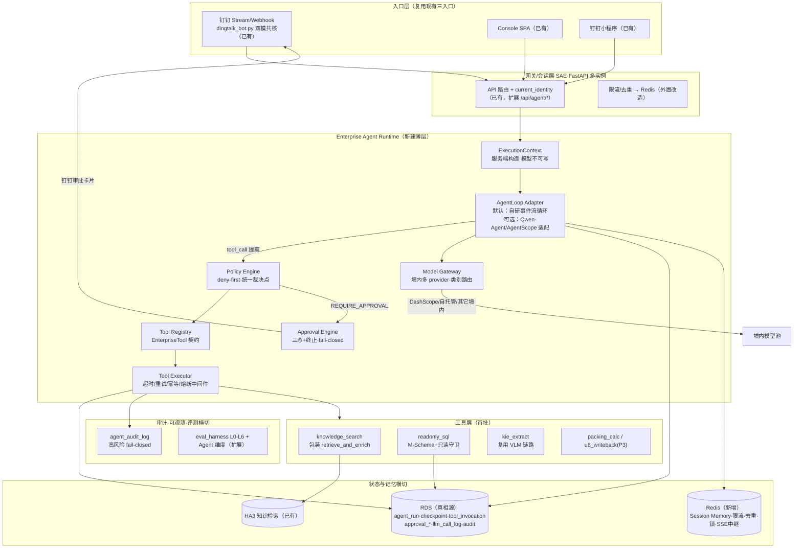
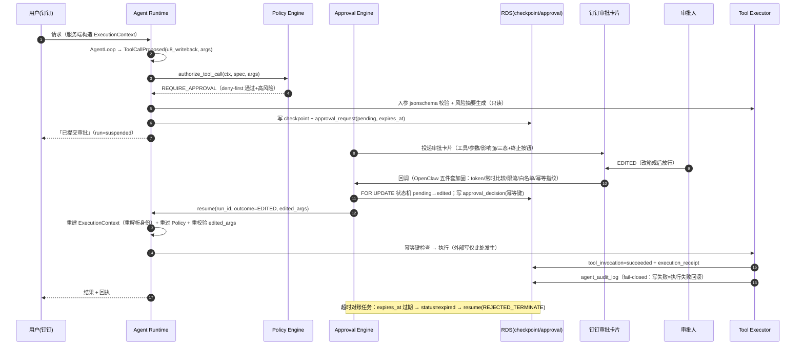
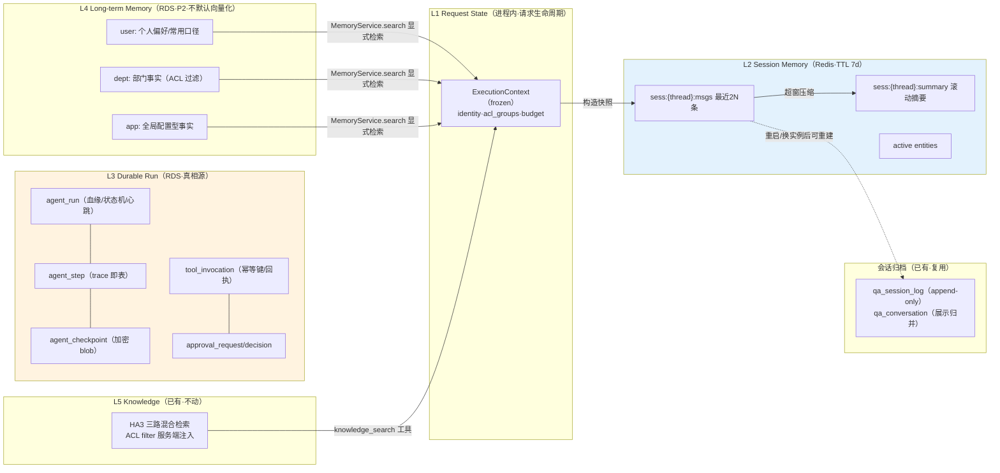

# 富岭企业级 Agent 底座架构设计报告 v2

> **版本**：v2.0（2026-07-03）· 取代 v1（2026-07-02 PDF）
> **方法**：本版全部结论由证据重建——富岭 Repo（`opensearch-rag-pipeline` @ `7c704ce`）全量源码扫描 + 15 个开源仓库 clone 到 commit 的静态源码审查 + v1 报告 38 条主张逐条裁决。不预设保留 v1 任何结论。
> **配套文件**：`repo-architecture-map.md`（Repo 事实基线）· `report-gap-analysis.md`（主张裁决与 A–N 判定）· `open-source-code-review.md`（开源证据）· `borrowing-matrix.md`（采纳决策底座）· `report-v2-changelog.md`（逐条变更）· `implementation-plan.md`（实施改造计划）。
> **证据标记**：✅ 源码已验证（再分 `[代码存在]` / `[线上在跑]`）· 🟡 官方文档 · ⚪ 工程推断 · ❌ 缺失 · ⚠️ 风险。本 Repo 无部署流水线，所有 Repo 结论最高 `[代码存在]`。
> **相对 v1 的变更类型**在各节标注：〔确认〕〔重写〕〔推翻〕〔新增〕。

---

## 0. 硬约束与设计基调

1. 模型层 provider 无关、仅限境内：DashScope 默认，业务代码一律经 ModelProvider 接口；allowlist 内容是配置决策。
2. 钉钉为主要入口但不被框住；性能优先。现状已有三入口（钉钉 bot / console / 小程序）。
3. 境外模型一律不用，数据与核心服务留境内。
4. SAE + FastAPI 主部署形态。5. 复用 HA3 / RDS / DataWorks / OSS。6. 不绕过现有多部门 ACL。7. 高风险操作强制 HITL。8. 在现有 RAG 底座上构建 Runtime，不推倒重建。

**设计基调（由证据决定）**：15 个候选仓库无一进入"完整依赖引入"——Qwen-Agent（假并行/无 HITL 挂点/默认公有云路由）、AgentScope（2.0.4dev 不稳+重依赖）、LangGraph（运行时复杂+生态境外）、ADK（换架构级引入）各有硬伤，但各有一块最强的"数据模型/API 语义/局部源码"可取。**骨架 = 自研薄层接口（约 3–5 千行）+ 各家最强件的语义拼装**；换 AgentLoop、换 checkpointer、换 provider 都不伤主结构。

---

## 1. 现状基线（一页版；全量见 repo-architecture-map.md）

**已有且直接复用**：
- 检索链路 `retrieve_and_enrich`（retriever.py:1866）——签名纯函数式，首个 EnterpriseTool 的天然包装对象 ✅
- ACL 单点 `_build_permission_filter`（fail-closed、服务端注入、白名单单一来源）✅——Policy Engine 的数据面，不建第二套
- 身份链：钉钉免登→服务端解析→HMAC 令牌→读时 live-reread；**权限每请求重解析**（resume 重授权已有先例）✅
- 审批状态机范式：`kb_access_request`（FOR UPDATE + from_status 幂等 + 同事务 outbox）✅——approval 表族的模板
- 评测资产：L0–L6 编排 + golden 76/**251**/338 + Claude judge + 冻结基线门 ✅（release gate DRAFT 未接 CI ⚠️）
- 钉钉双模接入（HTTP webhook + Stream WSS 共核）✅——v1 误当待建项
- 生产守卫：prod_access（当日 RW 令牌）/ env_guard / 四账号体系 / gitleaks CI ✅

**缺失且必须新建**：工具层（function-calling 全库零命中）❌ · ModelProvider 抽象（4+ 处手写 HTTP，dashscope SDK 死依赖，Gemini 配置残留 ⚠️）❌ · durable run/审批/审计表族 ❌ · Redis（零接入）❌ · 会话摘要/长期记忆 ❌ · CD 与迁移工具化 ❌。

**全局前置瓶颈**：`--workers 1` 硬约束——会话/限流/去重/token 缓存全部进程内内存。**多实例化（状态外置）是 P0 的地基，先于一切 Agent 功能。**

---

## 2. 总体架构〔重写：v1 的 L0–L4 分层保留骨意，接缝与宿主全部重画〕

### 图一 · 总体 Runtime



**边界铁律**（每条均映射硬约束或源码教训）：
1. 工具协议 / 权限 / 记忆 / 审批 / 审计**不进 AgentLoop**——Loop 只产出事件（模型增量、tool_call 提案、挂起、完成），执行与裁决全在 Runtime。任何框架只能经 Adapter 接入〔硬约束 + Qwen-Agent 无 HITL 挂点的源码证据〕。
2. ExecutionContext 由服务端构造，模型与请求体不可写身份/ACL/审批策略〔Repo 已有先例：acl_groups 服务端生成、请求体 dept 废弃；OpenClaw groupId 服务端背书同构〕。
3. 审批策略的管理面与工具调用信道**物理分离**——审批配置绝不注册为工具〔OpenClaw CVE-2026-28466，修复形态源码已核〕。
4. 外部写一律在审批之后；审批前只允许读取/计算/参数组装/风险评估/生成拟执行计划〔LangGraph 节点重跑语义的直接推论〕。
5. resume ≠ 恢复旧权限：每次恢复重建 ExecutionContext 并重过 Policy〔Repo live-reread 先例延伸〕。

---

## 3. 模块 A · Runtime 边界：ExecutionContext / AgentLoop / Adapter〔重写〕
**状态判定：新建独立模块 · P0**

**① Repo 现状**：无任何编排层（api.py 固定 RAG 链路；tools 字段全库零命中）✅[代码存在]。**Qwen-Agent 未在用**（依赖/import 零命中）——v1"以 Qwen-Agent 为主循环核心"是对空地的规划，不是对现状的演进。
**② 报告覆盖**：v1 选定 Qwen-Agent 并以 C1（Qwen-only）论证唯一性；未定义 Adapter 边界与 Loop 事件模型。
**③ 缺口**：循环、上下文对象、事件协议、Adapter 接口全缺。
**④ 推荐架构**：**自研事件流式可挂起循环为默认 AgentLoop**。依据：(a) 钉钉审批是异步回调，循环必须能挂起-序列化-跨进程恢复——四家中仅 AgentScope 2.0 有此形态（`_reply_impl` 遇确认事件即 return，源码已核），但其 2.0.4dev + 重依赖不可作依赖；(b) 循环本体很小（Qwen-Agent `_run` 仅 ~35 行），复杂度都在挂起/持久化/策略——而这些按铁律 1 本就不在 Loop 里；(c) Qwen-Agent 的"并行调用"实为顺序 for 循环、无 HITL 挂点（源码已核）——引入它得不到想要的东西。Qwen-Agent 降级为**可选 Adapter 对象 + 源码借鉴库**（分级截断、提示词模拟 function-calling、异常回灌）。

**⑤ 核心接口**（Python 3.11，落 `opensearch_pipeline/agent_runtime/`）：

```python
# context.py —— 服务端构造，不可变；模型/请求体不可写任何字段
@dataclass(frozen=True, slots=True)
class ExecutionContext:
    request_id: str                  # 复用 request_context.py 的 X-Request-Id
    run_id: str | None               # agent_run 主键；同步问答可为 None
    user_id: str                     # current_identity()/_resolve_user_dept 解析
    acl_groups: tuple[str, ...]      # 服务端生成，白名单归一后
    roles: tuple[str, ...]           # employee/dept_admin/kb_admin/agent_admin...
    channel: Literal["dingtalk", "console", "miniapp", "api"]
    thread_id: str                   # 会话键；钉钉沿用 f"{conversation_id}:{staff_id}"
    auth_resolved_at: datetime       # resume 时超过阈值必须重解析（LIVE reread 延伸）
    budget: RunBudget                # max_turns / max_tool_calls / token_budget / deadline

# events.py —— AgentLoop 与 Runtime 的唯一通信协议
class AgentEvent: ...                # 判别联合（pydantic）
class ModelDelta(AgentEvent): text: str; reasoning: str | None
class ToolCallProposed(AgentEvent):  # Loop 只提案，不执行
    call_id: str; tool_name: str; arguments: dict
class RunSuspended(AgentEvent):      # 命中 REQUIRE_APPROVAL → Runtime 挂起
    approval_request_id: str; checkpoint_id: str
class RunCompleted(AgentEvent): final_text: str; usage: Usage
class RunFailed(AgentEvent): error: str; retryable: bool

# loop.py —— AgentLoop 协议；自研实现 + 未来任意框架的 Adapter 都实现它
class AgentLoop(Protocol):
    def run(self, ctx: ExecutionContext, messages: list[Msg],
            tools: list[ToolSpec],
            tool_results: ToolResultInjector) -> Iterator[AgentEvent]: ...
    def resume(self, ctx: ExecutionContext, checkpoint: RunCheckpoint,
               resume_value: ApprovalOutcome) -> Iterator[AgentEvent]: ...
```

自研 Loop 语义（借鉴映射见 borrowing-matrix A/B 组）：while turn < max_turns：Model Gateway 调用 → 解析 tool_calls（原生优先，提示词模拟兜底）→ 逐个 yield ToolCallProposed → Runtime 裁决执行后回注结果 → 无 tool_call 则 RunCompleted。工具异常转结构化文本回灌（Qwen-Agent 语义）；挂起=把 messages+待执行调用序列化为 checkpoint（AgentScope AgentState 单对象语义）。

**⑥ 集成点**：新增 `POST /api/agent/ask`（SSE，扩展现有帧协议加 `tool_call`/`approval` 帧类型）与钉钉侧 `_process_agent_query`（与 `_process_rag_query` 并列，flag 切换）；`RAG_AGENT_ENABLE` 默认 off。
**⑦ 安全权限**：Loop 拿不到 DB/HA3 连接与任何 secret——只见 ToolSpec 元数据与注入的结果；ExecutionContext frozen。
**⑧ 故障恢复**：每 turn 结束写 agent_step；挂起写 checkpoint；进程崩溃后 run 状态=suspended/running 可由 resume 端点或对账任务恢复（superseded 判定用 run 心跳列）。
**⑨ 迁移步骤**：见 implementation-plan WS1。
**⑩ 测试验收**：Loop 状态机单测（simulate 模型）；挂起→序列化→跨进程 resume 的回放测试；Adapter 契约测试（同一测试套件跑自研 Loop 与 Qwen-Agent Adapter，保证可替换性）。
**⑪ 优先级**：P0。
**⑫ 证据等级**：设计 ⚪；所有依据源码 ✅[代码存在]（fncall_agent.py:73-108 / _agent.py:575-732 / tools.json 扫描）。

---

## 4. 模块 C · EnterpriseTool 契约与 Tool Registry〔新增（v1 仅"注册为 BaseTool"一句，已推翻）〕
**状态判定：新建独立模块 · P0**

**① Repo 现状**：工具抽象零命中；类工具组件三形态混用（函数/类/生成器）；幂等/重试/熔断素材成熟但散落 ✅[代码存在]。
**③ 缺口**：契约、注册表、执行中间件全缺。
**④ 推荐架构**：契约主参照 AgentScope 2.0 ToolBase 元数据（`is_read_only`/`is_concurrency_safe`——四家最强，源码已核）+ 企业治理字段；注册表借 Qwen-Agent 双通道模式（实例注入优先、注册表兜底，~60 行改写）但元数据落 DB、进程内只是缓存。**业务工具绝不 import 任何框架类型**；EnterpriseTool→BaseTool Adapter 是 <100 行的可选包装（接缝已探明：`agent.py:212-237` 实例直接注入）。

**⑤ 核心接口与数据模型**：

```python
# tool.py
class RiskLevel(StrEnum): READ_ONLY="read_only"; LOW_WRITE="low_write"; HIGH_WRITE="high_write"

@dataclass(frozen=True, slots=True)
class ToolSpec:
    name: str; version: str                     # 语义化版本；运行记录固化 name@version
    description: str
    input_schema: dict; output_schema: dict     # JSON Schema，注册时 jsonschema 校验（借 is_tool_schema）
    risk_level: RiskLevel
    permission_scope: str                       # Policy 裁决键，如 "kb.search" / "sql.readonly.pmc" / "u8.writeback"
    data_classification: Literal["public", "internal", "confidential"]
    timeout_s: float = 30.0; max_retries: int = 0
    idempotency: Literal["none", "natural", "key_required"] = "none"   # 写型工具必须 key_required
    side_effects: bool = False
    approval_policy: str | None = None          # None=按 risk_level 默认；"always"；"policy:<id>"
    owner_team: str = ""                        # N 模块治理：每工具必有 owner
    concurrency_safe: bool = True               # AgentScope 语义，驱动并行调度
    deprecated: bool = False

class ToolResult(BaseModel):
    status: Literal["succeeded", "failed", "denied", "pending_approval"]
    content: list[ContentBlock]                 # 文本/表格/图片引用，回灌模型前可截断
    receipt: dict | None                        # 写型工具的执行回执（对账用）
    error: str | None

class EnterpriseTool(Protocol):
    spec: ToolSpec
    def run(self, ctx: ExecutionContext, args: dict,
            idempotency_key: str | None = None) -> ToolResult: ...
```

```sql
-- schema/017_agent_runtime.sql（fuling_operation；编号续现有台账，下一号=017）
CREATE TABLE IF NOT EXISTS tool_registry (
  tool_name      VARCHAR(64)  NOT NULL,
  version        VARCHAR(16)  NOT NULL,
  spec_json      JSON         NOT NULL,          -- ToolSpec 全量（含 schema）
  risk_level     VARCHAR(16)  NOT NULL,
  permission_scope VARCHAR(64) NOT NULL,
  owner_team     VARCHAR(64)  NOT NULL,
  status         ENUM('active','deprecated','disabled') NOT NULL DEFAULT 'active',
  registered_by  VARCHAR(64)  NOT NULL,
  created_at     DATETIME(3)  NOT NULL DEFAULT CURRENT_TIMESTAMP(3),
  PRIMARY KEY (tool_name, version),
  KEY idx_status (status)
) ENGINE=InnoDB DEFAULT CHARSET=utf8mb4;
```

首批工具：`knowledge_search`（READ_ONLY，包装 retrieve_and_enrich，**user_dept 由 ctx.acl_groups 注入，schema 中无此参数**）→ `readonly_sql`（READ_ONLY，K 模块守卫栈）→ `kie_extract`（READ_ONLY，复用 vlm_endpoint/ocr_client/vlm_retry）→ `packing_calc`（READ_ONLY 纯计算）→ `u8_writeback`（HIGH_WRITE，P3，approval_policy="always"，idempotency=key_required）。"下一个没想到的工具"的接入清单：实现 EnterpriseTool + 注册 ToolSpec + 声明 permission_scope——不改 Runtime 任何代码。

**⑥ 集成点**：Registry 加载=启动时读 tool_registry 表 + 代码内声明比对（漂移告警）；Executor 中间件栈（超时→重试→幂等→熔断→审计）沉淀自 vlm_retry/embedding_client/cost_breaker 既有实现。
**⑦ 安全**：工具注册/禁用走管理面 API（N 模块角色），**不是工具**；input 经 jsonschema 校验后才进 Policy。
**⑧ 故障恢复**：key_required 工具的幂等键=run_id+step_no 派生，重试/重放不重复副作用；失败落 tool_invocation.status=failed 供补偿任务扫描。
**⑨–⑫**：迁移 017；契约测试（每个工具的 schema 快照测试 + 拒绝越权参数测试）；P0；设计 ⚪ / 依据 ✅[代码存在]。

---

## 5. 模块 D · Policy Engine 与 Approval Engine（HITL）〔重写：v1 只有理念，此处给全套〕
**状态判定：新建独立模块 · P0（Approval 执行链 P2 启用）**

**① Repo 现状**：检索 ACL 单点成熟；操作守卫 20+ 端点手写分散；KB 域已有人审状态机（kb_access_request）与三类审批队列前端 ✅[代码存在]。
**③ 缺口**：统一"主体×操作×资源×风险"裁决点、工具审批引擎、审批传输层（钉钉卡片）全缺。**开源侧核验结论：没有任何现成生产级审批传输层可复用**（Spring 半成品/OpenAI opt-in/Hermes 有 fail-open 旁路/ADK 默认 False）——必须自建，但状态机语义可拼装。

**④ 推荐架构**：
- **Policy Engine**：deny-first 单点 `authorize_tool_call(ctx, spec, args) -> PolicyDecision{ALLOW|DENY|REQUIRE_APPROVAL}`。规则来源分层只减不增（OpenClaw 管道形态）：平台基线（risk_level 默认策略：HIGH_WRITE 一律 REQUIRE_APPROVAL）→ 部门策略 → 角色策略 → 会话/场景收窄。数据面**复用**现有 ACL：检索类工具的行级过滤仍走 `_build_permission_filter`；SQL 工具的部门行级过滤由语义层注入（K 模块）——Policy 裁决"能不能调"，数据面裁决"能看多少"，两层正交。
- **Approval Engine**：状态机 = LangGraph resume 协议（挂起持久化、resume 值回注、崩溃后可重复 resume）+ OpenAI SDK 粘性批准三态（tool 级 always / call 级单次）+ Spring **EDITED**（人工改参重建 tool_call 放行）+ gajae ActionRegistry（幂等键、first-valid-reply-wins、迟到拒绝）。**四种处置**：APPROVED / EDITED / REJECTED_FEEDBACK（理由回喂模型换方案）/ REJECTED_TERMINATE（硬终止 run）。**fail-closed 全覆盖**：超时=EXPIRED=拒绝（"沉默不是同意"）；漏答=继续等待（反 Spring 默认放行）；无审批人可达=拒绝。

**⑤ 核心接口与数据模型**：

```python
# policy.py
@dataclass(frozen=True)
class PolicyDecision:
    decision: Literal["allow", "deny", "require_approval"]
    policy_id: str; reason: str
    obligations: tuple[str, ...] = ()       # 如 "mask_output:phone"、"limit_rows:1000"

class PolicyEngine:
    def authorize_tool_call(self, ctx: ExecutionContext,
                            spec: ToolSpec, args: dict) -> PolicyDecision: ...
    # deny-first：任何规则层 DENY 即终裁；未匹配任何 ALLOW 也是 DENY

# approval.py
class ApprovalEngine:
    def create_request(self, ctx, invocation: ToolInvocation,
                       render_summary: str, expires_at: datetime) -> ApprovalRequest: ...
    def decide(self, request_id: str, decision: ApprovalOutcome,
               decided_by: str, idempotency_key: str,
               edited_args: dict | None = None, reason: str = "") -> DecideResult: ...
    # DecideResult ∈ {Accepted, DuplicateAccepted(幂等重放), RejectedLate(已决绝迟到), Unauthorized}
```

```sql
-- schema/018_approval_engine.sql（fuling_operation）
CREATE TABLE IF NOT EXISTS approval_request (
  request_id     CHAR(32)  NOT NULL PRIMARY KEY,
  run_id         CHAR(32)  NOT NULL,
  invocation_id  CHAR(32)  NOT NULL,
  tool_name      VARCHAR(64) NOT NULL, tool_version VARCHAR(16) NOT NULL,
  proposed_args_json JSON  NOT NULL,             -- 脱敏后
  render_summary TEXT      NOT NULL,             -- 卡片文案（工具名/关键参数/影响面）
  requested_for  VARCHAR(64) NOT NULL,           -- 发起用户
  approver_scope VARCHAR(64) NOT NULL,           -- 审批人裁决键（部门管理员/指定角色）
  status ENUM('pending','approved','edited','rejected_feedback',
              'rejected_terminate','expired','cancelled') NOT NULL DEFAULT 'pending',
  expires_at     DATETIME(3) NOT NULL,
  card_delivery_json JSON NULL,                  -- 钉钉卡片投递回执
  created_at     DATETIME(3) NOT NULL DEFAULT CURRENT_TIMESTAMP(3),
  decided_at     DATETIME(3) NULL,
  KEY idx_status_expiry (status, expires_at), KEY idx_run (run_id)
) ENGINE=InnoDB DEFAULT CHARSET=utf8mb4;

CREATE TABLE IF NOT EXISTS approval_decision (
  decision_id    CHAR(32) NOT NULL PRIMARY KEY,
  request_id     CHAR(32) NOT NULL,
  decision       ENUM('approved','edited','rejected_feedback','rejected_terminate') NOT NULL,
  edited_args_json JSON NULL,
  reason         TEXT, decided_by VARCHAR(64) NOT NULL,
  idempotency_key VARCHAR(64) NOT NULL,
  decided_at     DATETIME(3) NOT NULL DEFAULT CURRENT_TIMESTAMP(3),
  UNIQUE KEY uk_req_idem (request_id, idempotency_key),
  KEY idx_req (request_id)
) ENGINE=InnoDB DEFAULT CHARSET=utf8mb4;
-- 决策事务复用 kb_access 模式：SELECT ... FOR UPDATE + from_status='pending' 单向状态机；
-- first-valid-wins 由状态机保证，重复 idempotency_key 返回 DuplicateAccepted。
```

### 图三 · 高风险工具执行全链



**⑥ 集成点**：审批卡片复用 `dingtalk_card.py` 投递链 + `card_templates/` 模板惯例；审批队列页挂进 ManageView 现有 tab 骨架（console.json 证据：三类审批队列交互范式现成）。
**⑦ 安全**：审批策略读写=独立管理 API + `agent_admin` 角色，与工具信道物理分离（OpenClaw 铁律）；回调按五件套加固（现有卡片回调不验签的缺陷一并修复）；策略配置行加 content-hash CAS 防并发覆盖。
**⑧ 故障恢复**：审批与 checkpoint 同库同事务；resume 崩溃可重复（decision 已落库，回放幂等）；过期对账任务兜底。
**⑨–⑫**：迁移 018；测试=状态机全路径（含迟到决策/重复决策/过期竞态）+ 回调鉴权对抗测试；P0 定义 P2 启用；设计 ⚪ / 语义来源全部 ✅[代码存在]。

---

## 6. 模块 B · 分层记忆与 StateStore / Memory Service〔新增：v1 最薄处（仅"Redis 会话+state 作用域"两笔），此处为 P0 接缝全量设计〕
**状态判定：新建独立模块 · P0（长期记忆仅定接口，P2 实现）**

**① Repo 现状**：双轨——LLM 上下文在进程内存 LRU（30min TTL，重启即失忆），审计历史在 RDS qa_session_log（append-only，但恢复会话不回读重建）；无摘要、无长期记忆、无 durable run；Redis 零接入 ✅[代码存在]。
**② 报告覆盖**：v1 把"会话+checkpoint 统一落 Redis"设为既定组件——已推翻（Repo 无 Redis；LangGraph 官方无 Redis checkpointer；跨天审批需 durable+可审计）。
**③ 缺口**：五层记忆中四层缺失（仅 conversation archive 已有）。

**④ 推荐目标架构 —— 五层记忆，各有真相源**：

| 层 | 内容 | 真相源 | 生命周期 | 现状→改造 |
|---|---|---|---|---|
| L1 Request State | ExecutionContext、单请求临时值（ADK temp: 语义） | 进程内 | 请求内 | 新建，绝不落库 |
| L2 Session Memory | 最近 N 轮消息 + rolling summary + active entities | **Redis**（新增） | thread TTL 7d | session_store.py 唯一迁移点（注释自认"生产可替换为 Redis"） |
| L3 Durable Run | agent_run/agent_step/tool_invocation/checkpoint | **RDS** | run 生命周期+留存策略 | 全新表族（017/018/019） |
| L4 Long-term Memory | user:/dept:/app: 三 scope 结构化事实 | **RDS**（不默认向量化） | 治理字段控制 | P0 定接口，P2 实现 |
| L5 Knowledge | 企业文档知识 | **HA3**（已有） | 摄取管线管理 | 不动；与 L4 边界=「文档知识走 RAG 工具检索，用户/部门事实走 MemoryService」 |

**Redis 与 RDS 分工判据**（回答 §12 问题）：Redis 承载**丢了可重建或可容忍**的热态（会话窗口可从 qa_session_log 重建、限流计数、消息去重、分布式锁、SSE 中继）；RDS 承载**丢了不可接受**的事实（run/审批/审计/回执/长期记忆）。审批跨天挂起的 checkpoint 属于后者。

**⑤ 核心接口与数据模型**：

```python
# session_memory.py（Redis 实现；接口=OpenAI SDK Session Protocol 四方法扩展）
class SessionMemory(Protocol):
    def get_snapshot(self, thread_id: str) -> SessionSnapshot: ...
        # SessionSnapshot{messages: list[Msg], summary: str|None, active_entities: dict}
    def append(self, thread_id: str, msgs: list[Msg]) -> None: ...
    def set_summary(self, thread_id: str, summary: str, upto_msg_id: str) -> None: ...
    def clear(self, thread_id: str) -> None: ...
# 键设计：sess:{thread_id}:msgs (LIST, LTRIM 2N) · sess:{thread_id}:summary (STRING)
# TTL 7d；超窗消息进 summary 而非丢弃（压缩实现借 Hermes 边界分隔符防注入 + Qwen-Agent 分级截断）

# run_store.py（RDS；LangGraph 三表模型按"工具粒度"裁剪为两表+checkpoint）
class RunStore(Protocol):
    def create_run(self, ctx: ExecutionContext, agent_profile: str) -> str: ...
    def append_step(self, run_id: str, step: AgentStep) -> None: ...
    def save_checkpoint(self, run_id: str, state: RunCheckpoint) -> str: ...
    def load_latest_checkpoint(self, run_id: str) -> RunCheckpoint | None: ...
    def transition(self, run_id: str, from_status: str, to_status: str) -> bool: ...
        # FOR UPDATE 单向状态机，复用 kb_access 模式

# memory_service.py（P2 实现；接口按 ADK 三方法语义，写入必须显式）
class MemoryService(Protocol):
    def search(self, ctx: ExecutionContext, scope: Scope, query: str, k: int = 5) -> list[MemoryItem]: ...
    def write(self, ctx: ExecutionContext, item: MemoryItem) -> None: ...
    def correct(self, ctx: ExecutionContext, item_id: str, patch: dict) -> None: ...
# Scope ∈ {user, dept, app}；MemoryItem 治理字段（缺一不入库）：
#   source(哪次 run/谁说的) · confidence · confirmed_by(用户确认才升级为长期)
#   expires_at · data_classification · created_from_run_id
# 检索裁决：user scope 仅本人；dept scope 过 ctx.acl_groups；调岗=按当前组重算可见集（不迁移数据）
```

```sql
-- schema/019_agent_run_store.sql（fuling_operation）
CREATE TABLE IF NOT EXISTS agent_run (
  run_id CHAR(32) PRIMARY KEY,
  thread_id VARCHAR(160) NOT NULL, conversation_id VARCHAR(128) NULL,
  user_id VARCHAR(64) NOT NULL, channel VARCHAR(16) NOT NULL,
  agent_profile VARCHAR(64) NOT NULL,
  status ENUM('running','suspended','succeeded','failed','cancelled','expired') NOT NULL,
  parent_run_id CHAR(32) NULL, parent_reason VARCHAR(32) NULL,   -- 血缘（Hermes 语义）
  acl_groups_snapshot JSON NOT NULL,        -- 审计快照；resume 时不用它授权，重新解析
  model_profile VARCHAR(64), prompt_version VARCHAR(32), git_sha VARCHAR(40),
  heartbeat_at DATETIME(3), started_at DATETIME(3) NOT NULL, ended_at DATETIME(3) NULL,
  KEY idx_thread (thread_id, started_at), KEY idx_status_hb (status, heartbeat_at)
) ENGINE=InnoDB DEFAULT CHARSET=utf8mb4;

CREATE TABLE IF NOT EXISTS agent_step (
  run_id CHAR(32) NOT NULL, step_no INT NOT NULL,
  kind ENUM('model_call','tool_call','approval','compaction','system') NOT NULL,
  payload_json JSON NOT NULL,               -- 脱敏后；大对象放 digest+OSS 引用
  tokens_prompt INT NULL, tokens_completion INT NULL, latency_ms INT NULL,
  created_at DATETIME(3) NOT NULL DEFAULT CURRENT_TIMESTAMP(3),
  PRIMARY KEY (run_id, step_no)
) ENGINE=InnoDB DEFAULT CHARSET=utf8mb4;

CREATE TABLE IF NOT EXISTS agent_checkpoint (
  run_id CHAR(32) NOT NULL, checkpoint_id CHAR(32) NOT NULL,
  state_blob MEDIUMBLOB NOT NULL,           -- msgpack+可插拔加密（LangGraph EncryptedSerializer 语义）
  state_digest CHAR(64) NOT NULL,
  created_at DATETIME(3) NOT NULL DEFAULT CURRENT_TIMESTAMP(3),
  PRIMARY KEY (run_id, checkpoint_id)
) ENGINE=InnoDB DEFAULT CHARSET=utf8mb4;

CREATE TABLE IF NOT EXISTS tool_invocation (
  invocation_id CHAR(32) PRIMARY KEY,
  run_id CHAR(32) NOT NULL, step_no INT NOT NULL,
  tool_name VARCHAR(64) NOT NULL, tool_version VARCHAR(16) NOT NULL,
  args_json JSON NOT NULL, args_digest CHAR(64) NOT NULL,     -- 脱敏后入 JSON，原文只留 digest
  idempotency_key VARCHAR(96) NULL,
  status ENUM('proposed','denied','pending_approval','executing',
              'succeeded','failed','compensated') NOT NULL,
  policy_decision VARCHAR(16) NOT NULL, policy_id VARCHAR(64),
  approval_request_id CHAR(32) NULL,
  result_digest CHAR(64) NULL, receipt_json JSON NULL,
  started_at DATETIME(3), ended_at DATETIME(3), error_text TEXT,
  UNIQUE KEY uk_tool_idem (tool_name, idempotency_key),
  KEY idx_run (run_id, step_no), KEY idx_status (status, started_at)
) ENGINE=InnoDB DEFAULT CHARSET=utf8mb4;
-- 长期记忆表（P2 apply）：memory_item(scope, scope_key, key, value_json, source_run_id,
--   confidence, confirmed_by, expires_at, data_classification, ...)——按 ADK 三表分层語義合并为单表+scope 列
```

### 图二 · Memory 与 State 分层



**⑥ 集成点**：SessionMemory 替换 session_store 调用点（api.py:579 与 dingtalk_bot 会话读写，flag `RAG_SESSION_BACKEND=memory|redis` 灰度）；恢复旧会话时若 Redis 无快照，从 qa_session_log 回读最近 N 轮重建（修复"重启失忆"）。
**⑦ 安全权限**：checkpoint blob 可插拔加密；memory_item 带 data_classification 与 scope 裁决；**任何记忆读取都过 ctx 当前 acl_groups**，调岗后 dept 记忆自动不可见。
**⑧ 故障恢复**：Redis 故障→SessionMemory 降级为"每次从 qa_session_log 重建"（慢但可用，fail-open）；RDS 故障→Agent 拒绝启动新 run（fail-closed，与现有 ask 成本路径 503 语义一致）。
**⑨ 迁移**：见 implementation-plan WS0/WS1。**⑩ 测试**：双后端契约测试；崩溃-恢复回放；摘要注入对抗测试（摘要内容不得被当成指令）。**⑪** P0（L4 接口 P0/实现 P2）。**⑫** 设计 ⚪；来源 ✅[代码存在]（session_store.py:6/44、ADK schemas/v1.py、LangGraph checkpoint-postgres/base.py:43-91、Hermes context_compressor.py）。

---

## 7. 模块 F · Model Gateway（境内多 provider）〔重写：v1 只有"OmO 路由理念"，此处落接口〕
**状态判定：新建独立模块 · P0**

**① Repo 现状**：chat 至少 4 处手写 HTTP；`dashscope` SDK 死依赖（声明未 import）；config 残留 Gemini 模型名与 GEMINI_API_KEY 回退 ⚠️；token 用量解析后不落库 ✅[代码存在]。已有素材：http_session 连接池、vlm_endpoint 端点路由抽壳、embedding_client 指数退避。
**③ 缺口**：ModelProvider 接口、类别路由、fallback/熔断、token 记账、结构化输出兜底全缺。
**④ 推荐架构**：两方法 Model 接口（OpenAI SDK 语义）+ provider 能力矩阵（Claw Code 语义）+ 类别→fallbackChain 路由（OmO 数据结构自写，license 禁抄源码）+ 提示词模拟 function-calling 兜底（Qwen-Agent 源码可摘）。**业务代码只声明 task_category，不出现任何 provider/模型名**；allowlist 与链内容全在配置。

**⑤ 核心接口**：

```python
# model_gateway.py
class ModelCapabilities(BaseModel):
    native_tool_calls: bool; json_mode: bool; thinking: bool
    context_window: int; supports_stream: bool

class ModelProvider(Protocol):            # 每个境内 provider/自托管端点一个实现
    name: str
    def capabilities(self, model: str) -> ModelCapabilities: ...
    def chat(self, req: ChatRequest) -> ChatResponse: ...
    def chat_stream(self, req: ChatRequest) -> Iterator[ChatDelta]: ...

# 路由配置（DB/配置文件，非代码）：
# category_routes:
#   deep:    [{provider: dashscope, model: qwen3.6-max}, {provider: selfhosted_vllm, model: ...}]
#   default: [{provider: dashscope, model: qwen3.6-plus}, {provider: dashscope, model: qwen3.6-turbo}]
#   quick:   [{provider: dashscope, model: qwen3.6-turbo}]
#   sql:     [{provider: dashscope, model: xiyansql-qwencoder-32b}, ...]   # 许可核实后
class ModelGateway:
    def complete(self, ctx: ExecutionContext, category: str,
                 req: ChatRequest) -> ChatResponse: ...
    # 解析期选链 + 运行期沿链 fallback（可重试错误分类）+ 每 provider 熔断器
    # + token/成本记账落 llm_call_log + ctx.budget 扣减（超预算=拒绝，fail-closed）
    # + 模型不支持 native_tool_calls 时自动切提示词模拟通道
```

```sql
-- schema/020_llm_call_log.sql（fuling_operation）
CREATE TABLE IF NOT EXISTS llm_call_log (
  call_id CHAR(32) PRIMARY KEY, run_id CHAR(32) NULL, request_id VARCHAR(32),
  provider VARCHAR(32) NOT NULL, model VARCHAR(64) NOT NULL, category VARCHAR(32),
  prompt_version VARCHAR(32), tokens_prompt INT, tokens_completion INT,
  cost_estimate DECIMAL(10,4) NULL, latency_ms INT, status VARCHAR(16),
  user_id VARCHAR(64), dept_group VARCHAR(32),      -- 成本按用户/部门归集（补 Repo 缺口）
  created_at DATETIME(3) NOT NULL DEFAULT CURRENT_TIMESTAMP(3),
  KEY idx_run (run_id), KEY idx_cost (dept_group, created_at)
) ENGINE=InnoDB DEFAULT CHARSET=utf8mb4;
```

**⑥ 集成点**：现有 4 处手写 chat 调用逐个收敛到 Gateway（llm_generator 先行，RAG 主链路回归测试护航）；embedding/rerank/VLM 后续纳入同一 provider 注册表。**⑦ 安全**：provider 凭证只在 Gateway 层；**清除 Gemini 残留配置**；DashScope 端点显式配置（防 Qwen-Agent 式默认公有云路由教训）。**⑧ 故障**：沿链 fallback；全链不可用=对用户明确降级文案（复用钉钉三级降级惯例）。**⑨–⑫**：迁移 020；测试=能力矩阵路由/降级/预算扣减单测 + 4 处调用点回归；P0；设计 ⚪ / 来源 ✅[代码存在]。

---

## 8. 模块 L · 部署与多实例化〔重写：问题范围比 v1 大——不止 Stream〕
**状态判定：小幅扩展现有实现 · **P0 前置（一切之先）**

**① Repo 现状**：`--workers 1` 硬编码；会话/限流/msgId 去重/AWAITING_COMMENT/token 缓存全进程内；钉钉 Stream 是"连接分担"模型（同 clientId 多在线连接分摊消息，SDK 内置 3s 退避重连）✅[代码存在]。运维定时任务在个人 Mac launchd ⚠️。
**④ 推荐架构**：**"逻辑单入口、物理多实例"**。状态全部外置后：
- Stream 连接分担=天然负载均衡，**不需要 leader election / 粘性路由**（v1 的一致性哈希方案不必要）——消息落到任何实例，会话态在 Redis、durable 在 RDS，都能处理；
- msgId 去重迁 Redis SETNX+TTL（与现有 300s 签名窗对齐）；
- SSE/流式推送与审批 resume 的跨实例事件用 Redis pub/sub 中继；
- 解除 --workers 1 → SAE 多实例 + /api/ready 已有深度探针做摘流量；
- 运维定时任务迁 DataWorks（完成 deploy/dataworks_monitor.Dockerfile 占位符）。
**⑨ 迁移**：implementation-plan WS0（含灰度与回滚：flag 切回 memory + 单实例即回滚）。**⑪** P0 前置。**⑫** ✅[代码存在] 全组证据（Dockerfile:36-46、dingtalk_stream_runner.py:20-23、rate_limiter.py、session_store.py）。

---

## 9. P1 模块群（按模板 ①③④⑤⑥⑨⑪⑫ 精简）

### 9.1 模块 K · Text-to-SQL 语义层〔重写：v1 停在"AST 校验"，升级为语义层〕
**判定：新建独立模块 · P1（只读最小版）**
① 现状：无任何 NL2SQL 代码；地基现成——RDS 双库四账号（fuling_ro 只读 + prod_access 会话只读双保险）、GuardedDBConnection 写守卫。③ 缺口：语义层全缺。
④ 架构（守卫栈自上而下，每层独立可测）：
1. **连接层**：专用只读账号（仅授语义视图 SELECT）——物理边界；
2. **语义视图层**：`sem_*` 只读视图白名单（业务口径/字段别名/join 预先固化在视图内，敏感列不进视图）——LLM 只见视图，不见基表；
3. **Schema 呈现**：M-Schema vendoring（~330 行，加列级 Examples 脱敏开关——源码已证其默认抽 5 个真实值仅滤 email/URL）；
4. **生成**：ModelGateway category="sql"（QwenCoder 权重许可核实后接入，否则 qwen-max + few-shot）；
5. **校验层**：sqlglot AST——仅 SELECT、表/列 ∈ 视图白名单、强制 LIMIT、禁子查询逃逸；SQL 版 HARDLINE（DROP/TRUNCATE/UPDATE/DELETE/INTO OUTFILE 等正则先拦，借 Hermes 去混淆思路）；
6. **行级权限**：按 ctx.acl_groups 注入部门 WHERE（视图带 owner_dept 列）；
7. **预算层**：EXPLAIN 预检 + 超时 + 行数上限；
8. **结果校验**：列名/类型对齐 output_schema，异常值提示置信度。
⑤ 接口：`readonly_sql` 工具（READ_ONLY / permission_scope="sql.readonly.<domain>" / timeout 15s）；`sql_fix` 重试循环 ≤3 次（借 xiyan-mcp 契约，本体不采用——其无守卫/SQL 注入/无鉴权已源码证实）。
⑥ 集成：语义视图 DDL 走 schema/ 迁移惯例；DataWorks 侧数据准备复用。⑨ implementation-plan WS2。⑪ P1。⑫ 设计 ⚪ / 依据 ✅[代码存在]（prod_access.py:79-115、m-schema/schema_engine.py、xiyan-mcp db_source.py 反例）。

### 9.2 模块 H · 可观测与评测〔重写〕
**判定：小幅扩展现有实现 · P1**
① 现状：评测资产厚（L0-L6/golden 251/judge/基线门）但 release gate DRAFT 未接 CI；token 不落库；"MySQL 表即指标"路线；request_id 中间件已有。③ 缺口：Agent 维度评测、token 记账、trace 表、门禁闭环。
④ 架构：**"RDS 表即 trace"路线延续**（agent_step/tool_invocation/llm_call_log 即 trace，量级到瓶颈再评估 OTel——现阶段引 OTel 全家桶属过度设计）；评测扩展四个 Agent 维度（工具选择正确率 / 参数正确率 / 权限正确性〔越权尝试必须 100% 被拒〕/ E2E 完成率），复用 L0-L6 编排与 judge 面板；release gate 接入发布流程（先做 P0 的 CI 化）。⑤ 新增 eval layer：`l7_agent_tooling.py`（golden 工具调用集，从 qa_session_log 高频问题衍生）。⑨ WS2。⑪ P1。⑫ ✅[代码存在]（eval_harness 全组证据）。

### 9.3 模块 I · 可靠性中间件〔新增〕
**判定：小幅扩展现有实现 · P1**
① 现状：素材成熟但分散（vlm_retry compress-on-retry、embedding 指数退避、cost_breaker 三道闸、outbox drain、多个只读对账器）；钉钉出站零重试；问答链路无幂等键。③ 缺口：统一工具执行中间件。
④ 架构：Executor 中间件栈=超时（per-ToolSpec）→ 重试（仅幂等安全的错误分类，借 vlm_retry 的 is_retryable 白名单思路）→ 幂等（key_required 工具查 uk_tool_idem）→ 熔断（per-tool 错误率，借 cost_breaker 三道闸形态）→ 死信（失败 invocation 落表，对账任务扫描补偿/告警，复用 ops_monitor+alerting 钉钉告警通道）；钉钉出站调用补齐重试与退避（现固定 10s 超时零重试）。**kill switch**：tool_registry.status=disabled 即全局停用某工具（P3 写回必备）。⑨ WS2/WS4。⑪ P1。⑫ ✅[代码存在]。

### 9.4 模块 J · 安全与 Secrets〔确认+扩展〕
**判定：小幅扩展现有实现 · P0 随 D 落地**
① 现状：prod_access/env_guard/四账号/gitleaks 成熟；卡片回调不验签 ⚠️；审计 fail-open ⚠️。④ 架构：钉钉回调五件套加固（OpenClaw hooks 参照）；**agent_audit_log 对 HIGH_WRITE 工具 fail-closed**（写审计失败=工具执行失败，区别于现有 kb_audit_log 的 fail-open——普通操作维持 fail-open 不阻断业务）；prompt injection 防线=工具结果注入标记（tool result 包裹 + "不是指令"前导，Hermes 摘要分隔符同思路）+ 高风险工具参数不采信自由文本来源；secrets 全部经 SAE 配置注入（现状惯例延续），Gateway 层集中管理 provider 凭证。⑪ P0-P1。⑫ ✅[代码存在]。

### 9.5 模块 E · Durable Workflow〔重写：明确"不引 Temporal"〕
**判定：小幅扩展现有实现 · P1-P3 按需**
① 现状：摄取侧已有确定性编排（DataWorks + 幂等重入 + outbox）；在线侧无状态机。④ 架构：**LLM 管意图与异常解释，确定性流程用显式状态机**——包装测算/BOM/对账走普通代码函数（注册为 READ_ONLY 工具）；U8 写回的"审批→staging→写回→对账→补偿"是 approval/invocation 状态机 + 对账任务的组合（模式已在 kb_access outbox 验证），**不引入 Temporal/整套 LangGraph**——当前并发量级（单公司内部）不匹配其运维成本。判据留档：当出现 ≥3 个跨天多级审批流或补偿链 >3 步的流程时重评估。⑪ P1。⑫ ✅[代码存在]。

### 9.6 模块 M · DevEx / CI-CD〔新增〕
**判定：小幅扩展现有实现 · P1（部分 P0 前置）**
① 现状：CI 测试门健康（三阻塞 job）；迁移 apply 脚本 gitignored 不可审计；无 CD；部署手工 zip。④ 架构：迁移工具化（apply 脚本入库 `scripts/apply_migration.py` 通用化，读写 schema_migrations 台账，staging 先行；不强推 Alembic——尊重现有台账机制，先把"脚本入库+可审计"补上）；CD=GitHub Actions 构建镜像→推 ACR→SAE 灰度发布（/api/version GIT_SHA 比对自动化）；Agent 相关代码 mock-model contract test 进现有 simulate 体系；feature flag 惯例延续（RAG_AGENT_ENABLE 等）。⑨ WS0/WS2。⑪ P0 前置+P1。⑫ ✅[代码存在]。

### 9.7 模块 N · 治理与责任边界〔新增：v1 缺失〕
**判定：新建独立模块（轻量） · P1**
① 现状：KB 域三角色+dept_admin_grant 治理成熟；工具治理零。④ 架构：新增 `agent_admin` 角色（复用 user_role.role 机制）；职责矩阵：**注册工具/改风险等级/发布 prompt=平台 agent_admin（双人复核高风险变更）**；部门工具 owner=申请与日常维护；审批写回=业务部门管理员（approver_scope）；审计查看=agent_admin+安全。管理面=console ManageView 新 tab（Agent 工具注册表/运行记录/审批队列/审计查询——审计查询需先补 kb_audit_log/agent_audit_log 的读 API，现状只写不读）；**管理面路由与工具执行信道分离**（独立 APIRouter + 独立角色裁决，绝不经 LLM 触达）。⑪ P1。⑫ ✅[代码存在]（kb_authz.py/console.json）。

## 10. P2 模块（①③④⑪⑫ 简记）

- **G Prompt/配置版本**：① prompt 硬编码 llm_generator 常量+240 个环境变量分裂。③ 无版本/回滚/重现。④ 最小闭环：prompt 外置为版本化资源（表或文件+版本号），agent_run 记录 prompt_version+model_profile+git_sha（017 已含列）——先可重现，后可 A/B；配置读取收敛到 config.py 单路径。⑪ P2（记录列 P0 就位）。⑫ ✅[代码存在]。
- **长期记忆实现（B 模块 L4）**：接口 P0 已定；P2 实现 user:/dept:/app: 结构化存取+确认流（用户确认才升级长期）+过期/纠错；**不默认向量化**——先结构化 KV+关键词，语义检索需求实证后再挂 HA3 命名空间。⑪ P2。
- **子 Agent/上下文隔离**：仅当出现"长报告分节生成"类真实需求时按"隔离窗口+只回摘要"引入（Claude Code 语义，v1 方向确认）；当前不建。⑪ P2+。
- **MCP 接入**：外部工具生态有真实消费方时经 Adapter 归一化（Qwen-Agent MCPManager 范式记录在案）；当前不建。

---

## 11. 实施路线（P0–P4 总览；文件级明细见 implementation-plan.md）〔重写：v1 顺序保留，P0 内容重定义〕

> 排序原则不变：先读后写、先工具后 agent、先单后多。**P0 从"Qwen-Agent 起编排壳"重定义为"接口边界+状态外置+durable 表"**——壳一天能起，接缝错了全盘返工。

| 阶段 | 目标 | 关键交付 | DB 迁移 | API 变化 | 主要风险与回滚 | 验收标准 |
|---|---|---|---|---|---|---|
| **P0 地基与边界**（3-4 周） | 多实例化 + Runtime 骨架 | Redis 基建；session/限流/去重外置；ExecutionContext/ToolSpec/Registry/PolicyEngine/AgentLoop/ModelGateway 接口与实现；knowledge_search 首工具；agent 表族；CD 流水线 | 017/018/019/020（staging 先行，dry-run 验证——016 未预演的教训） | `POST /api/agent/ask`（flag off）；/api/ready 加 Redis 探针 | Redis 引入影响现有链路→**flag `RAG_SESSION_BACKEND=memory` 一键回滚**；迁移失败→单库回滚脚本 | 双实例部署下会话连续、去重有效；agent 影子链路 E2E 通过；现有 RAG 回归零退化（golden 251 基线门） |
| **P1 只读 Agent**（3-4 周） | 问数+检索+测算上线 | readonly_sql（语义视图+守卫栈）；kie_extract；packing_calc；session summary；l7 评测层+gate 接 CI；token 记账看板 | 021 语义视图族 + memory_item（可延后） | /api/agent/ask 放开（灰度部门）；console Agent 运行记录页 | SQL 越权→守卫栈 8 层逐层测试+越权评测 100% 拦截才放行；回滚=工具级 disable | 工具选择/参数/权限评测达标；试点部门 E2E 完成率与人工纠正率达标 |
| **P2 HITL 模拟执行**（3-5 周） | 审批闭环（不接真实写） | Approval Engine+钉钉审批卡片（四处置）+checkpoint 挂起/恢复+超时对账；审批队列页；回调五件套加固 | 018 启用 + 卡片模板注册 | /api/agent/resume（内部）；/dingtalk/card/callback 扩展 | 恢复语义错误→**模拟工具（dry-run staging 表）验证幂等**，全程无真实外部写 | 跨天审批恢复、崩溃恢复、重复决策幂等、过期自动拒绝全路径通过；审批人 EDITED 改参重执行正确 |
| **P3 真实写回**（3-5 周） | U8 staging 写回 | u8_writeback 工具（HIGH_WRITE/always 审批/幂等键）；staging 中间表+对账+补偿；kill switch；canary（单一单据类型试点） | 022 u8_staging/对账表 | 无新公开 API | **最高风险阶段**：写回错误→kill switch 全局停用+补偿任务+对账报告；audit fail-closed 生效 | 端到端幂等测试（重放/重试不重复写）；对账零差异；审批-执行-回执-审计链完整可查 |
| **P4 平台化**（持续） | 治理与自助 | 工具自助注册+owner 治理；模型路由完整化（多境内 provider）；prompt 版本/A-B；长期记忆；审计页；反馈闭环（PMC 产量预警形态） | 023+ | 管理面 API 族 | 逐项灰度 | 新工具接入"零 Runtime 改动"演练通过；成本按部门归集报表 |

---

## 12. 关键问题直答（§12 清单）

1. **PDF 哪些结论被推翻/重写**：见 changelog；核心=Redis 唯一真相源（推翻）、工具直挂 BaseTool（推翻）、ADK 绑 GCP（推翻）、Qwen-Agent 唯一选型论证（重写）、Spring 三态名与语义（重写）、xiyan-mcp 现成组件（重写）、Stream 多副本问题范围（重写）。
2. **"代码存在但无线上运行证据"**：全仓皆是——尤其 RAG_ALLOWED_DEPTS_ACL/RAG_CONVERSATION_HISTORY/RAG_RERANK_ENABLE 等 flag 生产取值、schema 012-016 apply 状态、DataWorks 调度实况（待确认清单见 architecture-map §10）。
3. **Repo 有无 Agent 骨架雏形**：无（function-calling 零命中）；但素材件充足（检索入口/ACL 单点/审批状态机/幂等 outbox/评测）。
4. **Qwen-Agent 接在哪层**：AgentLoop Adapter 之后的可选实现之一；工具/权限/记忆/审批/审计一律不依赖它。
5. **必须独立于 Qwen-Agent 的能力**：全部横切层（EnterpriseTool 契约、Policy、Approval、StateStore/Memory、ModelGateway、Audit）。
6. **记忆分层**：五层（Request/Session/Durable Run/Long-term/Knowledge），见 §6 图二。
7. **Redis 与 RDS 分工**：Redis=可重建热态；RDS=不可丢事实（含跨天审批 checkpoint）。
8. **durable checkpoint 是否已存在**：否（仅摄取管线幂等重跑，非对话 run 恢复）。
9. **工具注册与权限统一抽象**：无，P0 新建；权限数据面复用现有 ACL 单点。
10. **会话历史能否支撑长任务**：不能（内存 LRU/重启失忆/无摘要）；P0-P1 修复。
11. **钉钉 Stream 多实例**：连接分担+状态外置即可，无需粘性路由/leader election。
12. **现有 ACL 能否扩展到工具**：能且应该——检索 filter 与 kb_authz 白名单作 Policy 数据面；缺的是统一裁决点（Policy Engine），不是权限数据。
13. **真正的 P0**：状态外置多实例化 + 四件套接口（Context/Tool/Policy/Loop）+ durable 表族 + ModelGateway + CD/迁移工具化。
14. **现在不建**：多 Agent、MCP 对外、代码沙箱、向量化记忆、Temporal、OTel 全家桶、线上 A/B 分桶框架。

## 13. 未确认问题清单（需业主/运维口径）

1. SAE 生产环境变量实值（各 flag 生产取值——影响"审批通过≠检索放行"等产品语义判断）；
2. schema 012–016 生产 apply 状态（生产库 schema_migrations 台账导出即可确认）；
3. Redis/Tair 实例选型与规格（SAE 同 VPC；建议开启持久化 AOF——虽然设计上可容忍丢失）；
4. XiYanSQL-QwenCoder 权重许可（仓库无 LICENSE，以 ModelScope/HF 模型页为准）与 DashScope 上的可用性；
5. U8 附属库/中间表的对接口径（信息部确认表结构与写回窗口）——P3 前置；
6. 审批人组织口径（哪些单据类型→哪个部门管理员审批）；
7. DashScope json_object/json_schema 当期能力（落地前以官方文档复核，🟡 未重验）；
8. 境内 provider 池首批名单（骨架不依赖此决策，配置期定）。
