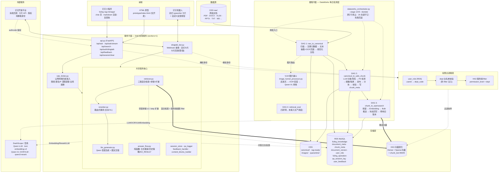
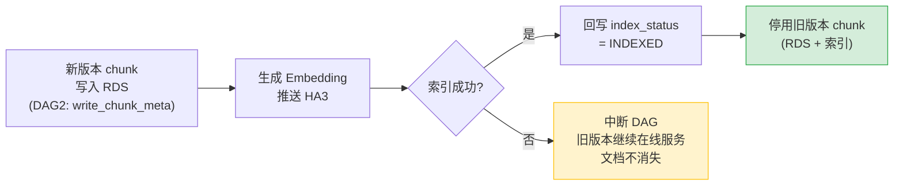

# 系统架构介绍 — Fuling 企业 RAG 知识问答系统

> 本文是当前代码库的综合架构文档（2026-06）。`README.md` 仅描述早期 4-DAG 骨架，`CLAUDE.md` 是面向开发的简要指引；本文覆盖系统的完整现状：摄取流水线、索引、检索与生成、权限过滤、对外 API、钉钉双前端及外部依赖。

---

## 目录

1. [系统概览](#1-系统概览)
   - [设计取向：为什么自建链路，而非购买黑盒 RAG 产品](#设计取向为什么自建链路而非购买黑盒-rag-产品)
2. [整体架构图](#2-整体架构图)
3. [摄取流水线（4 条 DAG）](#3-摄取流水线4-条-dag)
4. [多模态处理与 Step Card](#4-多模态处理与-step-card)
5. [检索与答案生成](#5-检索与答案生成)
6. [权限与安全](#6-权限与安全)
7. [对外 API 与前端](#7-对外-api-与前端)
   - [调优与评测：黑盒产品给不了的质量闭环](#调优与评测黑盒产品给不了的质量闭环)
8. [数据存储](#8-数据存储)
9. [配置与运行环境](#9-配置与运行环境)
10. [已知限制与可靠性缺口](#10-已知限制与可靠性缺口)
11. [关键文件路径索引](#11-关键文件路径索引)

---

## 1. 系统概览

**这是什么**：为浙江富岭塑胶（一次性餐具/包装制造企业）构建的**阿里云原生企业 RAG 问答系统**。它把企业内部文档（SOP/作业指导书、U8+ ERP 操作手册、HR/行政制度、FAQ）转化为自助问答服务：员工在**钉钉**中提问，后端 RAG 流水线从企业自有文档中检索并生成答案，带**部门级权限过滤**和内嵌图片。

**命名澄清（重要）**：尽管项目名叫 `opensearch-rag-pipeline`，生产检索引擎是**阿里巴巴 HA3 向量引擎**（"OpenSearch 向量检索版"，SDK `alibabacloud_ha3engine_vector`），**不是** Elastic/AWS OpenSearch。代码同时支持标准 OpenSearch 作为本地开发回退。

**技术栈一览**：

| 层 | 技术 |
|---|---|
| 文档存储 | 阿里云 OSS（`raw/` → `canonical/` → `rag-ready/` 三级目录） |
| 元数据/审计 | 阿里云 RDS MySQL（`fuling_knowledge` + `fuling_operation` 两库） |
| 向量索引 | 阿里云 HA3 向量检索版（Dense + Sparse + BM25 三路混合） |
| 模型服务 | DashScope/百炼：Qwen LLM（`qwen3.6-plus`）、`text-embedding-v4`、Qwen-VL（OCR/VLM）、`qwen3-rerank` / `qwen3-vl-rerank` |
| 批处理调度 | 阿里云 DataWorks（每日调度 stage 1/2/3） |
| 在线服务 | 阿里云 SAE（FastAPI + 钉钉机器人，单容器） |
| 前端 | 钉钉机器人卡片（流式 typewriter）+ 钉钉小程序（`fuling-rag-miniapp/`） |

**系统分为两个平面**：

- **摄取平面（批处理，DataWorks）**：把 OSS `raw/` 中的原始文档逐步加工为带向量的安全 chunk，写入 HA3 索引。由 4 条 DAG 组成，每日调度。
- **服务平面（在线，SAE）**：接收用户问题，执行混合检索 + 重排 + LLM 生成，通过 REST API / 钉钉机器人 / 小程序返回图文答案，并记录问答日志与用户反馈。

---

## 设计取向：为什么自建链路，而非购买黑盒 RAG 产品

把一批文档丢进托管 RAG SaaS、点一下「建索引」就能问答——这条路看起来更省事。但富岭这套系统不是为了「能问答」，而是为了在**企业自有云内、对一份会动的、含敏感信息的、图文混排的真实语料**做到可控、可审计、可修复、可复现。下面逐条对照：每一条都不是「自建更灵活」这类空话，而是黑盒产品在结构上给不了、而本系统已经用代码焊死的能力（实现细节散见 §3.5/§3.6、§6）。

> 一句话总览：黑盒产品把「丢进去就能搜」做成了一个不透明的承诺；本系统把「在什么条件下、以什么顺序、用什么模型、对什么数据做了什么」全部做成了可见、可断言、可回滚的工程约束。

**一、数据主权——语料、向量、日志全程在企业自有阿里云内闭环。** 原始文档与规范化产物在自有 OSS，元数据/审计/问答日志在自有 RDS，向量在自有 HA3，模型调用走 DashScope/百炼。配置加载期有一道**生产强制 Qwen、禁止回退 Gemini 的守卫**：生产/预发环境无 DashScope key 即拒，并逐一检查 LLM/OCR/VLM/Embedding 四条模型链路，任一 base_url 含 google 或模型名含 gemini 即拒——VLM 这条图像通道被单独纳入检查，防止有人从图片侧绕过把企业内部图片喂给境外模型。黑盒 SaaS 你无法控制语料、向量、日志存到哪、数据流向哪个模型，更无法在配置层把「只能用境内模型」焊死。

**二、部门级服务端权限过滤（HA3 下推 + 防注入）。** 权限不是「先全量召回再在应用层过滤」，而是在 HA3 服务端就过滤掉：放行 public + 用户本部门 dept，部门值先经白名单净化（只保留字母/数字/下划线/连字符/中文）从源头堵 filter 注入；权限从来不让模型介入，`permission_level` 完全由 OSS 路径启发式确定性算出（实现见 §6）。黑盒产品要么没有行级/部门级 ACL，要么靠不可审计的标签，且你无法保证它不被注入绕过。

**三、「文档永不消失」的事务式版本切换。** 文档更新时最危险的是「旧版本删了、新版本还没进去」。本系统把摄取节点顺序焊成不可重排的硬拓扑（抢锁 → 嵌入 → 建载荷 → 推送 → 回写状态 → 停用旧版本，停用永远在最后），并叠加三重保证：DAG 拓扑硬连线、节点级主动 raise（失败信息直写「中止以防止停用旧版本」、状态先落地再中断）、停用前的正向僵尸断言（2026-06-16 焊死，详见 §3.5）。黑盒产品把「删旧+写新」做成一个不透明的 upsert，对外只有一个「重建索引」按钮，无法保证这条次序不变量。

**四、可确定性重切片与冻结路由——分块策略可控、可复现。** 黑盒产品重新摄入同一批文档，分块边界不可见、不可调、不可复现。本系统把分块行为做成可证明的确定性函数：分类强制确定（JSON Schema + temperature=0，因为分块模式路由是 category 的确定性函数）、维护重切冻结路由（完全跳过 LLM 分类器复用冻结 category）、未冻结 re-chunk 整批阻断（要故意重分类需绑定到具体文档集的当日授权 token）、库内一致性指纹（chunk_set_hash 可直接核验「这次重切和上次结构一致」）。79-vs-47 chunk 漂移事故（PRODUCTION_14DFDF）正是被这套机制双重焊死的（见 §3.5）。

**五、可修复的领域多模态——图到步精确绑定，误绑能改源码。** 工厂 SOP/ERP 是截图密集型文档，图绑错步骤就等于答非所问。本系统按三种格式各用最强原生位置证据做绑定（DOCX 段落级 image_ref 精确位置；PDF page_num + bbox + 圈号几何归属；XLSX anchor_row 物理行号 + 「如图N」正则 + 身份列优先消歧），而非启发式均匀分配；更重要的是**遇到误绑能改源码**——设备清扫基准书这类 XLSX 同一行常挂多张近似图，靠「身份列优先 + 驱逐 + 强者归并」三规则把绑定门控从 0.8167 拉到 0.8917。黑盒产品顶多按页/按段粗放关联，且这种领域误绑你只能等厂商修——可能永远等不到。

**六、治理内建合规——分类时序/PII 哈希/物理隔离。** 合规不是事后补的而是摄取链路里的强制节点：脱敏前分类、分类后脱敏的 DAG 时序编排黑盒产品给不了；PII 仅存 SHA-256 + 掩码预览、原文永不落库；分级三态分流（high 整篇隔离根本不切块不嵌入不推送、medium 就地掩码保留）；最终风险取 LLM/正则/图像三路 max；API 失败 fail-safe 向最严格倾斜（强制最高密级 + 自动人工审核单）。隔离是「物理上不进可检索空间」而非「进了再靠过滤器挡」，没有越权命中的可能；留痕本身不制造新的 PII 泄露源（实现表见 §6）。黑盒 SaaS 把你的文档原文连同 PII 一起吞进它的索引。

**七、成本可控——VLM 熔断与跨文档缓存，而非不透明按量计费。** VLM 是整条管线最贵的一环，本系统同时做了「省」和「封顶」：三级递增成本漏斗（大量装饰图在零 API 的第一级就被筛掉根本不触达付费 VLM）、跨文档/跨运行持久缓存（MD5 去重命中即 0 调用、缓存键带 pub/sec 命名空间是安全闸、degraded 兜底结论不入缓存）、成本熔断器三道闸（单文档 50 单元 / 单文档 5 元 / 单次运行 200 元，原子 try_reserve 杜绝 check→record 竞态，超限就地隔离不丢文档）。这防的是「4000 页扫描 PDF 一次性过 VLM」烧掉数千到数万元的失控开销——黑盒产品按量计费且不透明，你既看不到每张图花了多少、也无法设单文档/单次运行硬上限、更没有跨文档去重把重复调用打到零。

**八、评测金集可及、阈值可校准。** 相关度的高/中阈值（7.7 / 5.8）不是拍脑袋常量，而是在自己语料的 251 题金集上跑评测实测分位数标定的（旧阈值仅约 38% 正确命中被标「高」，新阈值约 50% 标高、约 85% 不低于「中」）；融合默认 weighted（kNN 0.7 / 文本 0.3），因为 baseline 实测 weighted 的 R@1 100% 优于 RRF 的 97.87%；代码注释明确记录阈值与融合算法强耦合，换 RRF 必须重标。黑盒产品给你一个不可见、不可标定、不知是否适配你语料的相关度判定。

**九、优雅降级——辅助环节失败绝不毁答案。** 整条链路把「可用性」和「正确性」分层：邻居拼接、step-card 整组展开、重排、多查询——任一增强环节挂掉都 fail-open 退化到能用的答案而非报错；但持续性故障不静默（多查询全路失败则向上抛、空内容文档发布阶段标记留痕而非炸整批、图片/OCR 失败 never break 文本抽取）。黑盒批处理常一颗坏文档拖垮整次入库，本系统把「失败开放但持续故障不静默」做成细颗粒度的工程控制。

**十、无供应商锁定——存储、模型、引擎都在自己手里。** 跨云（RDS↔HA3）没有 2PC 的现实下用 PENDING_DELETE outbox + 搁浅版本对账做最终一致补偿；NDJSON 序列化与切批逻辑抽成单一来源让「评测里测的就是生产里跑的」；每次运行生成血缘（git sha + 抽取器/分块器/检测器/嵌入版本 + 模型名 + bizdate）写审计表，能精确回答「这条答案的 chunk 是哪次运行、哪版代码、哪个模型切出来的」。黑盒 SaaS 的存储一致性、索引文档结构、内部 doc id、失败语义对用户完全不可见，出问题无从介入、想迁移无从下手。

> **小结**：自建的不可替代价值，不在「更灵活」这种泛泛之词，而在于一连串**结构性的可控**——数据不出域、权限服务端可审计、版本切换事务化、分块可复现、多模态误绑可修复、合规内建、成本可封顶、阈值可校准、降级可分层、无锁定。这些能力的共同点是：它们都需要对存储、模型、引擎、节点顺序的完全掌控，而这恰恰是黑盒 RAG 产品按定义无法交付的。

---

## 2. 整体架构图



**两个平面的衔接点**是 HA3 索引和 RDS：摄取平面是唯一的写入者（chunk + 向量 + 元数据），服务平面只读检索；问答日志和反馈则由服务平面写入 `fuling_operation` 库，再由离线脚本（`scripts/feedback_miner.py` 等）反哺语料优化。

---

## 3. 摄取流水线（4 条 DAG）

### 3.1 DAG 引擎

自研轻量 DAG 引擎（[dag_engine.py](../opensearch_pipeline/dag_engine.py)）：节点拓扑排序执行，节点间通过共享 `context` 字典传递数据。DAG 结构在 [dag_definitions.py](../opensearch_pipeline/dag_definitions.py) 中声明，约 19 个 `node_*` 节点函数全部实现在 [pipeline_nodes.py](../opensearch_pipeline/pipeline_nodes.py)（约 4,300 行，摄取核心，含 DB 连接池、各类客户端、分类、PII、嵌入、推送、停用逻辑）。

### 3.2 四条 DAG 的节点级流程

**DAG 1 `raw_to_canonical` — 文件解析**

| 节点 | 职责 |
|---|---|
| `node_scan_raw_files` | 扫描 OSS `raw/` 待处理文件；准入策略见 [ingest_policy.py](../opensearch_pipeline/ingest_policy.py)（可摄取白名单 `pdf`/`docx`/`xlsx`/`pptx`/`txt`/`md` 等；过滤临时文件/垃圾文件；不支持的 legacy 二进制 `.doc`/`.xls`/`.ppt` 走一次性转换为 `docx`/`xlsx`/`pptx` 后回灌） |
| `node_register_metadata` | 写 `document_meta` + `document_version` 到 RDS |
| `node_extract_text_with_ocr` | 原生抽取（[extraction/unified_extractor.py](../opensearch_pipeline/extraction/unified_extractor.py) 按格式分发，PPTX 经 `_extract_pptx` 做 Shape 级结构化+演讲备注+嵌入图）→ 文本量不足时回退 Qwen-VL OCR |
| `node_build_canonical` | 产出 `content.md` + `content.canonical.json` 到 OSS `canonical/` |

**DAG 2 `canonical_to_safe_chunk` — 分类 + 脱敏 + 分块**

| 节点 | 职责 |
|---|---|
| `node_classify_and_risk_assess` | LLM 在**原始文本**上判定 category / permission / risk |
| `node_detect_sensitive` | 正则 PII/凭证检测，与 LLM 风险合并 |
| `node_redact_or_quarantine` | 高风险→隔离（quarantine），中风险→脱敏（redact），低风险→放行 |
| `node_publish_to_rag_ready` | 写 `content.md` + `metadata.json` 到 OSS `rag-ready/` |
| `node_chunk_documents` | 调用 [chunker.py](../opensearch_pipeline/chunker.py)，策略路由（text/faq/clause/step）在此节点按 category/title 子串匹配决定 |
| `node_validate_chunks` | 校验空块、超长、缺元数据 |
| `node_write_chunk_meta` | 新 chunk 持久化到 RDS `chunk_meta` |

**DAG 3 `chunk_to_opensearch` — 嵌入 + 索引 + 版本切换**

| 节点 | 职责 |
|---|---|
| `node_acquire_index_lock` | 乐观锁抢占，防并发冲突 |
| `node_generate_embeddings` | DashScope `text-embedding-v4` 生成向量 |
| `node_build_opensearch_payload` | 组装 Bulk/NDJSON 载荷 |
| `node_push_to_opensearch` | 批量写入 HA3 / OpenSearch |
| `node_update_index_status` | 回写 `chunk_meta.index_status`；**索引失败时中断 DAG**，保护下一步 |
| `node_deactivate_old_chunks` | 新版本索引确认成功后，停用 RDS 与索引中的旧版本 chunk |

**DAG 4 `retrieval_eval`** — `node_simulate_retrieval` + `node_eval_report`，仅评测用途，**未接入生产调度**（生产只调度 DAG 1–3）。

### 3.3 关键安全不变量：文档永不"消失"

新 chunk 必须**先持久化到 RDS 且成功写入索引**，旧版本 chunk 才能停用。若顺序颠倒，任何中途失败都会让该文档从搜索结果中消失。`node_update_index_status` 在索引失败时中断 DAG 正是为保护这一顺序。**严禁重排 DAG 3 节点或将停用提前。**



### 3.4 生产编排：dataworks_orchestrator.py

DataWorks 节点每日 shell 调用 `dataworks_orchestrator.py --stage {1|2|3} --bizdate ${bizdate}`（节点脚本在 [dataworks_nodes/](../dataworks_nodes/)：`stage1_node.py` / `stage2_node.py` / `stage3_node.py`）。在 DAG 引擎之上叠加的生产可靠性机制：

- **原子行抢占**：`UPDATE ... SET content_process_status='LOADING' ... LIMIT 100`，多 worker 互不重复处理；
- **2 小时失锁守卫**：stage-3 对超时 `PROCESSING` 行接管；
- **失败回滚** + 部分加载错误时**主动 `raise`**——DataWorks 以退出码判定任务失败，从而触发告警与重跑。

辅助脚本：`dataworks_nodes/register_new_files.py`（批量注册增量文档）、`scan_oss_sync_keys.py`（OSS 盘点诊断）、`move_files_to_admin.py`（敏感/失败文档迁移隔离）。

### 3.5 数据入库之旅：一份文档从原始件到可检索 chunk

§3.2 的节点表是骨架，本节把它走成一条故事线。把一份 SOP、一本 U8+ ERP 手册、一份制度文件从 OSS `raw/` 里的原始件，变成员工在钉钉里搜得到、配着正确截图的答案，要穿过三段流水线（DAG1 解析 / DAG2 安全分块 / DAG3 嵌入推送与版本切换）。三段之间唯一的交接物是一份规范化产物，每一段都遵循同一条底层信条——**辅助环节失败绝不毁掉主流程，但安全方向上宁可保守隔离**。下面跟着一份文档走完全程。

#### 第一站 · 解析：把任意格式榨成统一的「文本+图片」契约

文档刚进来还是一坨原始字节——版面混乱的 PDF、截图密布的 Word、同一行挂着好几张图的 Excel。统一抽取入口按后缀归一化后路由到各格式抽取器，每个分支都吐出同一套结构（文档 id、正文、长度、版面块、页数、OCR 状态、图片资产、警告）。**DAG 层完全不感知文件格式**：新增一种格式只动这张分发表，下游一律消费统一的「块+资产」契约。

PDF 最难啃——盖章件、传真件、扫描混排件比比皆是，抽取走三层降级「能取一点是一点」：版面感知抽取（字号直方图推正文/标题、0.5pt 粒度分桶判标题、表格优先）→ 取到 0 字符则平铺取文本 → 仍空则交 OCR 兜底。任一库报错都被吞进警告继续往下试，绝不抛断主流程。而 OCR 兜底的关键不是「整文档判一次」，而是**逐页判定**：每页累加原生文本长度，凡某页不足 50 字符就判扫描页/坏字体页，只把这些页号送 OCR。「封面有字、正文全扫描」的多页 PDF 是头号语料失败模式——旧版按整文档总字数判 OCR，封面那几个字就让整本扫描件一页都不补 OCR。

> **事故 RD 61D861**：一份扫描型 PDF 因页数被判成 0（可能真 0 页，也可能两个解析库都挂了），旧版静默返回「无页需 OCR」，整份文档以零内容混进索引，用户永远搜不到它。现在页数 ≤ 0 时先用三个库轮流重拿真实页数，都拿不到就强制 OCR 第 1 页——宁可多花一页 OCR，也绝不让扫描件以「空文档」身份溜进索引。

**图片漏斗**把「图片入库」从一刀切变成精细分诊：每张嵌入图过一道逐级递增成本的三级级联（静态启发式 → OCR 文本密度 → 大模型语义+安全审计），最终四个去向——敏感图（印章/公章）隔离、低相关但文字多降级成文本否则丢弃、干净图存向量。但有一条反直觉的规则：**文字多 ≠ 降级成文本**。合格证、包装箱、标签照片本质是实物照（文字多但语义价值在「这是什么物」），命中实物照片白名单时即便满屏文字也保留为图片向量——否则员工问「XX 包装箱长什么样」就再也召不回那张图。

> **VLM-OCR 的「话痨幻觉」**：对一张照片它会把同一表格行复制几十次，或在尾部「合格 合格 合格…」死循环，这些编造文本曾直接进了索引 chunk。一套反幻觉清洗专治这个（连续重复行只留 2、主导行占比超 40% 只留 2、尾部短语循环截断，外加一条按像素密度判定的物理上界）。整页渲染只修剪重复、绝不整体丢，只有传入尺寸的嵌入图才触发密度上界——既杀幻觉又不误删「合格 合格 合格」这类合法的短单元格重复。

VLM 是整条管线最贵的环节。漏斗第一级之后按文件 MD5 去重、再查跨文档持久缓存（本地快缓存 + OSS 跨调度运行持久化），富岭语料大量复用同一批 U8/ERP 界面截图与公司 logo，跨文档复用把调用量压到极低。缓存键带命名空间 `{md5}:pub|sec`,这不是性能优化而是**安全闸**——公开文档绕过敏感审计得出的「干净」结论绝不能被隔离文档复用，否则等于让敏感图免审。

图绑错步骤是步骤卡的头号灾难，所以绑定那一步必须用各格式最强的原生证据，而非均匀分配：DOCX 用段落级精确内联位置（同图多处引用时复制资产对象，否则后面的引用会覆盖前面、先出现的步骤永远绑不到图）；PDF 用页码 + 显示坐标（贴图圈号按几何包含归属，再与正文「如图⑧」联合命中）；XLSX 用物理行号（`anchor_row`）+ 图号正则，同一行多图时把物理行号提到图序之前唯一决定绑定顺序。XLSX 最难：设备清扫基准书同一行常挂「链条/电机」多张近似图，物理行号是同行多图消歧的强身份，丢了它就静默误绑。

抽取的兜底与拒收同样讲究：空文档标「跳过-空内容」、留痕、降级，不抛错也不进索引；legacy 二进制 `.xls` 单独一个分支直接判「不支持」并留警告，让运维可见、可追、可人工转格式回灌，而非伪装成「无内容文件」污染库；HTML 剥标签、CSV 解析后才进统一分块。还有一个反直觉的坑（2026-06-10 对抗评审发现的一片 403 死图）：UI 截图大多被路由成「文本」类，早期只把「向量」类图片回传 OSS，于是步骤卡里绑的这些「文本」类截图路径根本不存在，几天后 serving 签 URL 全是破图——现在**所有保留图（含路由到文本的）都在删临时目录之前固化到 OSS**。

抽取的最终交接物是规范化产物：一份结构化 JSON（给后续结构化分块）+ 一份平铺 Markdown（给分类/PII 用），并带上内容指纹（规范化文本哈希 + 原始字节校验和）。开启「跳过未变重入库」开关时，第 2 版以上的再入库若逐字节相同就标重复、回退版本指针、跳过后续全流程——但只在正向哈希命中时跳过，任何缺失/异常都按「不确定就处理」正常走完。

#### 第二站 · 分类、风险、PII：把安全闸门焊在分块之前

文档进入第二段后，先在**原始文本（未脱敏）**上跑一次大模型分类——这个时序是刻意的：原始文本 → 分类（看完整内容才准）→ 脱敏（不污染分类结果）。分类一次性吐出 L1/L2 类目、是否适合做 FAQ、置信度、风险等级、摘要，正文截断到前 8000 字符、温度写死 0 强制确定性。**为什么必须确定性？** 因为分块模式路由是 category 的确定性函数——分类一抖动，整篇文档的 chunk 家族就翻转。

但**权限完全绕过模型**：密级由路径启发式纯本地算出后注入（路径含 `restricted`/`internal` 子串否则默认 public），绝不让大模型幻觉一个 public 出来——安全边界必须确定性可审计。模型即便有 Schema 约束仍会偶尔发明类目或错配 L1/L2，所以返回值再过一道白名单：L1 不在 8 类里整个降为兜底类，L2 错配则单独降级。**不信任模型输出，硬卡白名单。**

一旦分类 API key 缺失或调用抛异常，文档不是被默默放过，而是被一刀切到最严格态：类目降级、置信度归零、风险强制 high、权限强制 restricted、动作 QUARANTINE，并自动生成一条人工审核单。这是「成功地失败」——挡在索引外等人来看，绝不让它以默认 public 漏进去。

PII 检测完全独立于大模型，用正则在原始文本上硬扫身份证、手机号、邮箱、阿里云/AWS 密钥前缀（LTAI/AKIA）、口令式赋值，命中即生成 hit，按实体类型分级：身份证/AccessKey/口令为 high → 整篇隔离不进索引；手机号/邮箱为 medium → 就地打码保留照样入库。这种分级而非一刀切很关键——否则一份正常 SOP 因含个内部分机号就整篇消失。最终风险取**三路上界** `final_risk = max(大模型风险, 实体风险, 图像风险)`：大模型说 low 但正则扫到身份证 → 最终 high；两个误报方向相反的检测器取最严上界，是合规系统的标准做法——漏检比误隔离代价大。

> **PII 留痕本身不能成为新泄露源**：敏感命中入库只存匹配文本的 SHA-256 哈希 + 掩码预览（长度 >4 保留首 2 尾 2 中间打星，≤4 全打星），原始命中文本从不写入任何表。审计可比对、预览可定位，但还原不出原文。

发布到 `rag-ready/` 后开始切块。切法不是固定窗口，而是按文档结构动态路由——制度文档按条款边界切、SOP 按步骤边界切（标题/类目/id 含 faq → FAQ；类目含 policy/standard/regulation 或标题含「制度/规定/规范」→ 条款；含 manual/guide → 手册，兜底 SOP；普通文本若检测到步骤结构再升级到步骤卡）。

> **faq_eligible 劫持惨案（124 文档批次）**：真实大模型把多数 SOP 都标成「适合 FAQ」，导致一个 124 篇 SOP 的批次里只有 1 个走步骤模式、123 个被劫持进 FAQ 模式。现在路由刻意把「是否适合 FAQ」踢出路由决策——它是下游标记、不是结构信号。

SOP 类文档切成一个**过程父卡**（总览）+ 每步一个**步骤卡**子卡，父卡回填所有子卡 id 和步骤数，每个步骤卡回填父卡 id，同一节内还建前后双向链表，检索命中某一步时能顺链拉出相邻步骤和父级概览。

> **116 孤儿事故（0959E5）**：一份 116 步的 SOP，过程父卡把全部步骤标题拼进去算出 2370 token，撞穿 chunk 校验的 2000 token 上限被**静默丢弃**，连锁导致 116 个步骤卡全部失去父级成为孤儿，整篇流程从检索结果里彻底消失。修复后父卡按 1800 token 前向累加标题、主动为校验线让出余量，超出就截断并标注「仅展示前 N 个标题，完整流程共 M 步」；同时对结构型 chunk 被丢必打全量诊断日志，对孤儿步骤卡切断悬挂父引用写 NULL、留痕告警但保留步骤仍可检索——优雅降级到单 chunk 粒度，而不是一个孤儿炸掉整篇。

> **条款正则曾让约 47% 制度文档静默降级**：旧正则太严漏掉真实制度编号（真实文档写「3.1公司办」带小数级写法），约 47% 制度文档条款模式空命中 → 静默退化成普通文本切块、丢失条款完整性。后来放宽了三处（去尾部空格、带小数守卫的单级编号、顿号子项），无匹配时仍回退兜底切分。

切完的 chunk 入库不是按 id 增量删改，而是**按（文档,版本号）全量先删后插**且同事务完成。

> **strand 僵尸 chunk（50 文档批次实测）**：re-chunk 后 chunk 数变少，旧实现只按 chunk_id 删，但 chunk_id 只依赖（文档,版本,序号）与内容无关，shrink 时旧的高位 chunk 永远不在新集合里、删不掉，残留为僵尸，造成元数据库与检索引擎双份、同一内容重复召回。全量按文档删才能消除它；但全量删必须先断言持有完整新切分集（每个文档必须在本次产物里，否则拒绝删除），否则会「删多插少丢数据」。

每条 chunk 还携带溯源指纹（git 提交/抽取器/分块器/检测器/嵌入模型版本/业务日期）和一个 chunk_set_hash（对该文档全部 chunk 的有序三元组算哈希取前 16 位）。这个哈希独立于时间戳和 git 提交，所以同一规范文本的冻结路由维护 re-chunk 能复现同一哈希——可在库内直接核验「这次重切和上次结构一致」而不用重跑。维护型 re-chunk 启用**冻结路由**：分类节点检到冻结清单就完全跳过大模型、复用冻结类目、零调用；若忘记冻结，未冻结守卫整批拦下（在抢占之前 raise），要故意重分类需带当日 + 文档集绑定的授权 token。

> **79-vs-47 事故（PRODUCTION_14DFDF）**：同一篇文档 re-chunk 时重跑分类，类目被重新掷出，分块模式从「SOP→步骤」翻成「标准→条款」，chunk 数从 79 变 47——同一份文件今天切 79 块、明天切 47 块。根因正是分块模式是 category 的确定性函数。要厘清一点：冻结固定的是**路由的输入**（类目），不是已切出的家族——分块器自身的修复仍可以合法地改变 chunk 数/类型，那正是维护 re-chunk 的目的；守卫保证的是「这次 re-chunk 是冻结的」，而每文档的「数量+类型构成」清单校验门才是真正的安全网。

#### 第三站 · 嵌入、推送、版本切换：把「永不消失」讲透

文档现在是一堆持久化好的 chunk，第三段把它们变成检索引擎里的可检索文档。这一段被焊成一条**不可重排**的六节点直链：抢锁 → 生成嵌入 → 构建批量载荷 → 推送检索引擎 → 回写索引状态 → 停用旧版本（§3.3 的 mermaid 图是其权威形态，此处不再复述）。

嵌入由官方原生 API 一次生成 dense + sparse 双向量（dense 维度 1024）。**为什么必须走原生 API？** 因为 OpenAI 兼容模式会静默丢掉 sparse 向量，让三路混合检索退化成纯 dense、召回严重下滑。还有一条 sparse 兜底：入库侧对拿不到 sparse 的 chunk 注入一个极小占位向量（索引 [0] / 值 [0.001]），因为稀疏索引会把完全没有 sparse 的文档排除在索引之外——那个文档就检索不到了，这是「永不消失」在向量层的延伸。

每条 chunk 被拍平成检索文档（不支持嵌套对象，所以权限、部门、版本号、激活标志、章节标题、页码、序号、正文、图片摘要全部平铺成顶层字段）。**主键陷阱**：推送和删除若用了不同标识，删除会永远匹配不到，所以主键统一用 chunk 元数据表的自增 INT64 id；模拟/进程内路径无此 id 时用 MD5 取前 8 字节转 63 位正整数兜底，并**显式禁用 Python 内建 hash()**——它随哈希种子漂移、同一 chunk 跨进程会得到不同主键。载荷组装成 NDJSON，按 1.5MB 贪心切批、推送时再按 100 条/批二次切分，瞬时错误指数退避、权限类 4xx 立即失败；这套序列化逻辑抽成共享模块，生产入库与离线 A/B 评测共用单一来源——保证「评测里测的就是生产里跑的」。

**「新版先就位、旧版才退役」** 是整条入库链路最关键的安全顺序。一旦有人把停用挪到前面（先删旧、后写新），中间任意一环（嵌入限流、检索引擎超时、OSS 上传失败）失败，就会卡在「旧版本已删、新版本未进」——员工搜这份 SOP 搜不到任何版本，文档凭空消失。这条不变量靠多重保证焊死，而非靠程序员记得调用顺序：DAG 拓扑硬连线（停用节点显式依赖回写节点）、引擎依赖跳过（上游抛异常自动级联跳过下游）、回写节点 abort-raise（任何推送/嵌入失败即抛错中断 DAG，且**先把失败文档状态落地并提交、再抛错**）、停用节点负向过滤（已记失败集对应的版本不参与停用）、停用节点正向断言（拒绝停用任何含「伪 INDEXED 僵尸」chunk 的当前版本）。

> **僵尸文档事故签名（P0，2026-06-16 焊死）**：官方原生 API 偶尔在批量响应里漏掉某个文本索引，那条 chunk 拿不到向量、停在「未开始」状态。早期代码只剔除「已失败」的 chunk，这种**无向量僵尸**就混进了载荷、被推上检索引擎标记为「已索引」——但它没有向量，kNN 永远看不见它。系统却以为该文档全部成功、转头停用了旧版本，结果旧版本被删、新版本检索不到，文档静默蒸发且永不重试。修复是三层焊死同一不变量：① 构建载荷时改成按「状态≠完成」剔除（而非只剔「已失败」），把无向量 chunk 踢出载荷并单独计入失败；② 回写节点把这些计入失败集触发 abort；③ 停用节点真删之前**正向扫描**，一旦发现当前版本存在「标记已索引但嵌入未完成」的僵尸 chunk 立即抛错拒绝停用。正向断言不依赖失败集是否被填充，专门挡住未来「绕过回写节点 abort 闸、直接调停用节点」的重构/对账路径。

抢锁是第一个节点，对每个（文档,版本）做三级乐观锁抢占：未索引/失败 → 处理中；抢不到再试从成功态重新锁定；再抢不到则接管「处理中但超过 2 小时没动过」的失效锁。这里藏着一个 **MySQL changed-rows 陷阱**：接管失效锁是「处理中→处理中」的同值更新，MySQL 返回 changed-rows=0、rowcount 报 0，连自动时间戳都不触发，接管会「看起来失败」——修复是在更新语句里显式写 `updated_at=NOW()` 强制改行，并发抢锁中只有第一个 rowcount=1 的能真正接管。

检索在 HA3、元数据在 RDS，两套存储没有 2PC，系统在两处设硬闸防裂脑：第三段入口硬检查「元数据模拟标志 ≠ 检索引擎模拟标志」就拒跑；真实删除路径里检测到拿着 mock 客户端就抛错。停用真删失败时不草率标「已停用」，而是登记成**待删除 outbox**（旧版本标 PENDING_DELETE 但保持激活、继续在线服务，下次运行排空 outbox 重试删除，删成功后才置非激活）——这是没有跨云 2PC 时的最终一致补偿：「宁可旧版本多活一会儿，也绝不让文档出现空窗」。推送成功的 chunk 被原地置「已索引」，逐条记录嵌入状态/模型/版本/维度/嵌入时间、索引状态/索引名/文档 id/批次 id/错误码/索引时间，让对账能精确回答「这条 chunk 哪一秒进的索引、用哪个批次、错在哪」。

#### 旅程终点

走完三段，一份原始件已经变成检索引擎里一组带权限、带版本、带图片绑定的可检索 chunk：截图密布的 SOP 被拆成父过程卡 + 逐步卡，每张图绑到了正确的步骤；身份证密钥被隔离在索引之外、手机号被打码保留；旧版本在新版本 100% 就位后才退役。整条旅程里每一个事故签名（扫描件零内容、116 孤儿、79-vs-47 漂移、僵尸文档、403 死图、strand 僵尸）都对应一道焊死的护栏——这套确定性、可复现、永不消失的入库不变量，正是把「丢进向量库就完事」的黑盒产品和一套可审计可治理的企业级管线区分开的地方。

### 3.6 管线工程细节索引：黑盒产品看不见的硬功夫

§3.5 是叙事主线，本节把同一批工程化设计按主题归档成一张可检索的索引——每条只给「机制摘要 + 为什么非这样不可」，事故画面已在 §3.5 讲透、此处不复述。它们大多是托管 RAG / 黑盒 parser 既看不见、也无法保证的边界。

**一、并发与认领——用数据库行锁串行化，而非应用层协调。** 批量入库要并发提速，但绝不能让两个调度实例把同一批文档各处理一遍。系统把「认领」反过来——先 `UPDATE ... SET status='LOADING' ... ORDER BY created_at LIMIT 100` 占坑、用 `rowcount` 拿到真正抢到的行数、commit 后再用 `WHERE status='LOADING'` 只回读自己刚改的那批。经典「先 SELECT 再 UPDATE」竞态会让两实例各跑一遍，压成带 WHERE 谓词的原子 UPDATE 后数据库行锁天然串行化，另一个实例 `rowcount=0` 打印「all preempted by another instance」空转退出，无需分布式锁。分类阶段则用线程池并发（默认 8 worker），每个文档独立 API 调用 + 独立 DB 连接 + 独立失败隔离。

**二、2 小时失效锁守卫——救活「静默卡死」的语料。** 持锁的运行若中途 OOM/被杀，文档会永久卡在中间状态、连「待处理行数」统计都看不见它——进程崩了、语料静默停止入库、调度还显示绿色成功，这是企业批处理最阴险的失败模式。系统在三处都焊了 2 小时年龄守卫：Stage-3 装载旁路加 `OR updated_at < NOW()-INTERVAL 2 HOUR` 把崩溃残留的 PROCESSING 强行重新捞起；Stage-2 排空循环每轮先把超时的 LOADING/PROCESSING 重置为 FAILED 并 `retry_count+1` 重新入队；索引锁三级抢占接管超时失效锁。`retry_count+1` 还顺带让持续搞崩进程的「毒文档」3 次后停在 FAILED 等人工，不会无限崩溃循环。这里的 **MySQL changed-rows 陷阱**（同值更新 rowcount=0 → 显式写 `updated_at=NOW()` 强制改行）见 §3.5。

**三、对 DataWorks 主动 raise——失败即非零退出码，绿色必须真成功。** DataWorks 只认子进程退出码（exit 0=绿、exit 1=红触发重试/告警），所以代码处处 fail-fast，把各种「部分失败」翻译成非零退出码：no-progress 守卫（一整批跑完剩余行数没下降即 raise 而非 break）、超迭代守卫、partial-load 守卫（扫到任一 FAILED 节点即 raise）、索引部分失败闸（push 失败 + embedding 失败 >0 时先 commit 失败状态、再 raise「Aborting DAG execution to prevent deactivating older chunk versions」）、main 兜底（异常冒泡即 `run_finish(FAILED)` + 告警 + `sys.exit(1)`）。还有一个**死代码陷阱**值得记入工程史：DAG 引擎为隔离把传入 context 复制了一份，节点写的锁集只落在副本上，回滚锁的逻辑若从传入的 ctx 读锁集永远是空集、整段回滚静默变成死代码、文档永久卡死——必须从 `run()` 返回的 result context 读。

**四、「永不从索引消失」不变量——版本停用的严格次序 + 三层防御。** 这是整条入库链路最关键的安全顺序，§3.3 的 mermaid 图是其权威形态、§3.5 讲透了僵尸文档事故。归档要点：硬拓扑而非君子协定（停用节点只能在回写状态节点之后跑，后者失败即被级联标 SKIPPED）；停用节点自身三层防御挡住未来重构/对账绕过 raise 闸——负向过滤（失败集对应版本不参与停用）、正向僵尸断言（扫到 `index_status==INDEXED` 但 `embedding_status!=DONE` 的伪 INDEXED 僵尸立即拒绝停用）、mock 客户端硬拒（防 HA3 侧没动、RDS 侧真停用的跨云裂脑）；配套 PENDING_DELETE outbox 做没有 2PC 时的最终一致补偿。

**五、VLM 图像三级漏斗——逐级递增成本，而非每张都调大模型。** Funnel 1 静态启发式（分辨率 <50px / 文件 <3KB / 长宽比 >8.0，<1ms 零 API）→ DISCARD；Funnel 2 OCR 文本密度（>120 字符标 text-heavy，交 VLM 定夺）；Funnel 3 Qwen-VL 语义+安全审计 → 四路由（SENSITIVE 隔离 / LOW_RELEVANCE 且文字多降级文本否则丢弃 / CLEAN 存向量，但文字密集且不在**实物照片白名单**则降级文本）。配套成本与正确性工程：MD5 去重 + 本地快缓存 + OSS 跨运行持久缓存（原子写 `.tmp + os.replace`）；缓存命名空间 `:pub/:sec` 是安全闸不是性能优化；`degraded` 标记防「瞬时故障被缓存成永久错误」（VLM 超时走兜底一律打 degraded、`if not degraded` 才落盘，simulate 的 mock 同样绝不落盘）；未命中缓存的唯一图用线程池并发、送 VLM 前 >500KB 压成 JPEG q=60/最大边 1280px、`temperature=0` 钉死路由确定性。

**六、成本熔断器——防「4000 页扫描 PDF 一次性过 VLM」。** 在 VLM 版面重建前置三道闸，且只对未命中缓存的单元计费（全命中=0 元）：单文档硬单元上限 50（页+图，不扣缓存防绕过）、单文档预算 5.0 元、单次运行累计 200.0 元。关键在原子 `try_reserve`（单次加锁内完成判定+预留，杜绝 check→record 竞态，放行后实际没花就 refund），DENY 后就地隔离文档（`retry_count=3` 防 DAG 重认领）并回退确定性规则，绝不丢弃文档；还留了浮点容差 `_BUDGET_EPS=1e-6`，防恰好等于上限的预留被误拒。总开关默认关闭时整个熔断器是 no-op，可先于重建器安全落地。

**七、扫描件 OCR 兜底 + 反幻觉清洗——逐页判定而非整文档一刀切。** 「封面有字、正文全扫描」是 #1 语料失败模式：逐页累加原生文本、某页 <50 字符即判扫描页只送该页 OCR；页数 ≤0 时依次尝试多个 PDF 库重拿真实页数、都拿不到就强制 `return [1]`（事故 RD 61D861）；三层 PDF 降级任一库异常都被 catch 进 warnings 继续。OCR 输出再过反幻觉清洗（连续重复行 >2 只留 2、主导行占比 >40% 只留 2、尾部短语循环截断、嵌入图按像素密度物理上界 `max(120, w*h/40)`），并区分整页渲染（只修剪）vs 嵌入图（可整体拒绝）。

**八、PII 仅哈希 + 掩码 + 敏感隔离区——物理上不进检索空间。** 正则零幻觉硬扫五类实体（身份证、手机号、邮箱、阿里云/AWS 凭证、密钥关键字），分级处置（身份证/AccessKey/secret_like=high 整篇隔离不进索引；手机号/邮箱=medium 就地掩码保留入库）；入库只存 `sha256(命中文本)` + 掩码预览、原文从不落库；隔离=「不进索引」而非「进了再过滤」（high 文档脱敏文本置 None、切块节点 `continue` 跳过，敏感内容物理上不存在于可检索空间）；最终风险 `max(LLM, 正则, 图像 VLM 审计)`；脱敏前分类、分类后脱敏；`permission_level` 完全绕过模型由路径启发式确定。分类 API 失败的「成功失败」一刀切到最高密级 + 自动人工审核单。

**九、冻结路由——维护重切的可重放确定性 + fail-closed 守卫。** 分块模式是 category 的确定性函数、真实 LLM run-to-run 会重掷 category（79-vs-47 事故）。机制：冻结路由（维护重切注入冻结清单、分类节点完全跳过 LLM、复用冻结 category、零调用、标 FROZEN_MAINTENANCE/confidence=1.0）；未冻结 fail-closed 守卫（已有 chunk 行却没设冻结路由就在抢占之前整批 raise，混批也整批阻断）；授权 token 绑文档集（`<op>:<日期>:<docset_hash>`,hash 对去重排序后的 doc_ids 取 sha256 截 12 字符、顺序无关，为文档集 A 铸的 token 不能复用到 B）；内容指纹去重（canonical 文本 sha256 命中即 SKIPPED_DUPLICATE 跳过全程，仅正向 hash 匹配才跳过）；库内一致性指纹（chunk_set_hash 独立于时间戳/git，可在库内直接核验结构一致）。

**十、全链路优雅降级——辅助环节失败绝不毁答案，但持续性故障不静默。** 抽取层（图片/OCR 失败 never break 文本抽取，`.xls` 显式 unsupported 留痕）；publish 层空内容守卫（标 SKIPPED_EMPTY、跳过 OSS 写、留痕、不 raise）；chunk 校验层（空块/token<5/token>2000/缺 doc_id 剔除，但结构型 chunk 被丢绝不静默、孤儿步骤卡父引用切断为 NULL 留痕但保 step 可检索）；检索增强层（邻居拼接/步骤展开/重排/多查询任一挂掉都 fail-open，但多查询全路失败则向上抛）；安全方向例外 fail-closed（无 API key 时公共文档放行 CLEAN、隔离文档强制 SENSITIVE）——故障语义是显式设计而非默认行为。

> **为什么这些是「黑盒产品看不见的硬功夫」**：托管 RAG 通常把「删旧+写新」做成一个 upsert 或后台 reindex，对外只暴露一个「重建索引」按钮，无法保证「新 chunk 确认索引成功之前绝不动旧版本」这条次序不变量，也无法在停用前做 embedding↔index 状态的交叉断言；它们对图片只有「全丢」或「全 embed」两档，没有逐级递增成本的漏斗、没有实物照片白名单、没有跨文档去重与命名空间隔离、没有单文档/单次运行的成本熔断；它们把你的文档原文连同 PII 一起吞进索引，没有「哈希+掩码留痕但不留原文」的治理；它们重新摄入时分块行为不可复现、不可冻结。这些边界上的工程化，正是自建可控性的价值所在——也是下文 §「为什么自建」的逐条注脚。

---

## 4. 多模态处理与 Step Card

针对截图密集的 SOP/ERP 文档，是当前重点演进方向。

### 4.1 VLM 图片漏斗

[image_funnel_processor.py](../opensearch_pipeline/image_funnel_processor.py)（由 `extraction/unified_extractor.py` 调用）对每张图片执行**三级级联**，成本从低到高：

```
1) 廉价启发式（尺寸/比例/纯色检测）
2) OCR 文本密度
3) Qwen-VL 语义理解 + 安全审核
        ↓ 路由到四个去向之一
DISCARD（装饰图丢弃） / ROUTE_TO_TEXT（文字图转文本） /
ROUTE_TO_VECTOR（语义图入向量索引） / QUARANTINE_SENSITIVE（敏感图隔离）
```

工程特性：MD5 去重、并发处理（`RAG_VLM_CONCURRENCY=8`）、**跨文档持久化缓存**（`scratch/vlm_cache.json` + OSS 同步），避免重复消耗 VLM 配额。配额本身由 [extraction/cost_breaker.py](../opensearch_pipeline/extraction/cost_breaker.py) 熔断控制。

### 4.2 Step Card 分块

程序性文档（操作步骤类）由 `chunker.py::_chunk_by_step` 切分为**一个 `procedure_parent` + 每步一个 `step_card`** 的结构，通过 `parent_chunk_id` / `step_no` 关联（DDL 见 [schema/002_step_card_enhancement.sql](../schema/002_step_card_enhancement.sql)），每个 step card 携带其绑定的图片（`image_refs_json`）。

**核心难题是图片↔步骤的正确绑定**，三种格式三种锚定方式：

| 格式 | 绑定依据 |
|---|---|
| DOCX | 精确位置的 `image_ref` 块（图片在文档流中的确切位置） |
| PDF | `page_num`（页码归属） |
| XLSX | `anchor_row` / `figure_refs`（单元格锚点） |

### 4.3 image_refs 契约（载荷型约定，勿破坏）

`image_refs` 字典结构是横贯**抽取器 → 分块器 → content_blocks_builder → 钉钉卡片**的端到端契约，字段必须全链路保持：

```
oss_key / source_image / visual_summary / ocr_text / image_index
```

---

## 5. 检索与答案生成

### 5.1 在线问答数据流

```mermaid
flowchart LR
    U["用户提问<br/>(钉钉机器人 / 小程序 / API)"] --> AUTH["身份解析<br/>userid → user_role(RDS)<br/>→ dept_code + 白名单校验"]
    AUTH --> EMB["Query Embedding<br/>DashScope 原生 API<br/>dense + sparse (只算一次)"]
    EMB --> MQ{"多意图分解?<br/>RAG_MULTI_QUERY_MODE<br/>(默认 off)"}
    MQ -- "是" --> FAN["多路扇出检索<br/>轮转交错合并"]
    MQ -- "否" --> HY["HA3 三路混合检索<br/>Dense + Sparse kNN<br/>+ BM25(chunk_text)<br/>weighted 融合 knn0.7/text0.3<br/>+ 服务端 dept filter"]
    FAN --> POST
    HY --> COVER["封面页降权"]
    COVER --> RRK{"重排开启?<br/>RAG_RERANK_ENABLE"}
    RRK -- "是" --> RR["路由式重排 pool=20→top7<br/>文本: qwen3-rerank<br/>带图: qwen3-vl-rerank"]
    RRK -- "否" --> POST
    RR --> CAP["文档多样性限额<br/>doc_diversity_cap"]
    CAP --> POST["后处理<br/>邻居拼接 ±1 (RDS)<br/>→ Step Card 上下文扩展<br/>→ 图片召回增强(opt-in)"]
    POST --> GEN["llm_generator.py<br/>Qwen 生成 (OpenAI 兼容模式)<br/>chunk 标注 高/中/低 置信<br/>图片经 IMG:N 标记交错"]
    GEN --> OUT["答案输出<br/>钉钉流式卡片 / SSE 流 / JSON"]
    OUT --> LOG["answer_flow.build_qa_log_kwargs<br/>→ qa_session_log (RDS)<br/>+ 会话历史追加策略"]
```



### 5.2 检索细节（retriever.py::retrieve_and_enrich，top_k=7）

统一检索入口，API 与钉钉机器人共用。实际执行顺序（与代码一致）：

1. **Query embedding 只计算一次**（传递给检索与图片召回复用）。**必须使用 DashScope 原生 API**（`output_type=dense&sparse`）——OpenAI 兼容模式会静默丢弃 sparse 向量，显著拉低召回。
2. （可选）多意图查询分解（`query_decomposer.py`，默认关闭）。
3. **HA3 三路混合检索**：Dense + Sparse 走 kNN 通道，BM25 走 `chunk_text` 文本通道；融合方式默认 **`weighted`（knn 0.7 / text 0.3）**——评测显示 weighted 优于 RRF。**权限过滤在 HA3 服务端执行**，dept 值经白名单校验防 filter 注入。
4. **封面页降权**（目录/封面 chunk 后置）。
5. **路由式重排**（`reranker.py`，默认关闭，`RAG_RERANK_ENABLE` 开启）：over-fetch pool=20 → 重排 → 取 top 7；纯文本池走 `qwen3-rerank`，带图池走 `qwen3-vl-rerank`；251 题金标集上 recall@1 +10.5pp。重排失败自动降级为原始顺序。
6. **文档多样性限额**（`doc_diversity_cap`，单文档最多占若干席）。
7. **邻居拼接**：从 RDS 取 ±1 相邻 chunk 修复边界断裂。
8. **Step Card 上下文扩展**：命中 step card 时补全父过程/兄弟步骤。
9. **图片召回增强**（仅图文渲染路径 opt-in，`RAG_IMAGE_COSURFACE`）。

### 5.3 生成（llm_generator.py）

- Qwen 经 OpenAI 兼容模式调用（生成侧兼容模式无副作用，区别于 embedding 侧）。
- 上下文中按分数给 chunk 标注 高/中/低 置信标签，阈值 `score_threshold_high=7.7 / medium=5.8`（251 题金标集校准）。**该阈值校准于 weighted 融合分数，换 RRF 即失效**；重排开启时切换为 rerank 分数阈值（`RAG_RERANK_SCORE_THRESHOLD_HIGH=0.9 / MEDIUM=0.8`）。
- LLM 被指示**不要自行输出来源列表**（来源由 content_blocks_builder 结构化拼装）；图片通过 `<>` 占位标记在答案文本中交错，由前端渲染层替换为真实图片。

### 5.4 answer_flow.py：四条回答路径的统一记账

四条回答路径——REST `/api/ask`、REST `/api/ask/stream`、钉钉同步回复、钉钉流式卡片——共用 [answer_flow.py](../opensearch_pipeline/answer_flow.py) 的**纯函数**：

- `build_qa_log_kwargs()`：`qa_session_log` 写入载荷的唯一来源；
- 历史追加策略：仅非空成功答案进入会话上下文；
- NO_RESULT 统一话术 + 拒答判定。

设计约束：该模块**必须保持无副作用**——实际的 `log_qa_session` / `append_to_history` 调用留在四个调用点，因为测试通过 monkeypatch 模块级名称拦截。

---

## 6. 权限与安全

| 机制 | 实现 |
|---|---|
| **文档权限定级** | `permission_level` 由 **OSS 路径启发式**判定（key 中含 `restricted` / `internal` 子串），**绝不由 LLM 决定** |
| **检索期权限过滤** | 服务端在 HA3 查询里下推 dept filter；dept 值先经白名单校验，杜绝 filter 注入 |
| **身份解析** | 钉钉 userid → RDS `user_role` 表 → `dept_code`（小程序经 `/api/auth/dingtalk` 用 authcode 换会话 token） |
| **PII 存储** | 命中的敏感信息只存 **SHA-256 哈希 + 掩码预览**（`document_sensitive_finding` 表），永不存原文 |
| **敏感文档隔离** | DAG 2 高风险文档进 quarantine，不进入索引；敏感图片由 VLM 漏斗路由 `QUARANTINE_SENSITIVE` |
| **生产模型守卫** | `config.py`：`environment ∈ {production, staging}` 时若无 DashScope key、或 LLM/OCR/Embedding 任一会解析到 Google/Gemini，**直接 hard-raise**。生产必须用阿里 Qwen |
| **环境↔目标交叉校验** | `config.py::_validate_environment_target_consistency`：dev 标签指向生产 RDS/HA3 指纹时 hard-raise，除非显式 `RAG_ALLOW_REMOTE_DB/SEARCH=read_only_ack` |
| **运行时写守卫** | [env_guard.py](../opensearch_pipeline/env_guard.py)：`RAG_READONLY=true`（PROD-RO 会话）一律拒写；非生产向生产目标写入需当日 `RAG_DESTRUCTIVE_PROD_ACK=<op>:<YYYY-MM-DD>`；sim→prod 另有三层写防护（含 6 个回归测试） |
| **生产访问通道** | 脚本访问生产**只能经** [prod_access.py](../opensearch_pipeline/prod_access.py)（默认只读会话；RW 需当日 `PROD-RW:<date>` 令牌），不得手解析 `.env.production` |
| **安全复审 / 对账** | [spot_checker.py](../opensearch_pipeline/spot_checker.py) 对已索引内容抽查复审；`reconcile_*` 家族（含 [ha3_reconcile.py](../opensearch_pipeline/ha3_reconcile.py) 的 `reconcile_ha3_orphan_pks`）按 HA3 主键自愈删除 `chunk_meta` 已不认账的孤儿物理行；其 `PENDING_DELETE` 对账模式是跨云删除一致性的参考实现 |

---

## 7. 对外 API 与前端

### 7.1 REST API（api.py，FastAPI，SAE :8000）

| 端点 | 方法 | 职责 |
|---|---|---|
| `/api/health` | GET | 健康检查 |
| `/api/auth/dingtalk` | POST | 钉钉 authcode → 会话 token（小程序登录） |
| `/api/search` | POST | 纯检索（无 LLM），返回带分 chunk + 引用上下文 |
| `/api/ask` | POST | 非流式问答：检索 + 生成 → 完整 JSON |
| `/api/ask/stream` | POST | 流式问答：SSE 推送 token 流 + 引用 |
| `/api/feedback` | POST | 用户反馈（赞/踩 + 原因）落 `user_feedback` |
| `/api/session/clear` | POST | 清空指定 session 的会话历史 |

身份经 `Authorization` 头解析（`current_identity` 依赖注入），CORS 经 `CORS_ALLOWED_ORIGINS` 配置。

### 7.2 钉钉机器人（dingtalk_bot.py）

- **接收**：Webhook POST 回调，验签（app secret + timestamp），区分群聊/单聊/stream 模式；
- **回复**：经 `session_webhook` 以**交互卡片**回复；流式路径 `_stream_answer_to_card()` 分片 PATCH 更新卡片，端上呈现 typewriter 效果；
- **卡片回调**：处理反馈按钮点击（赞/踩/转人工）；卡片模板在 [card_templates/](../card_templates/)（`native_feedback_card.json` / `streaming_rag_feedback_card.json`）。

### 7.3 钉钉小程序（fuling-rag-miniapp/）

| 目录 | 内容 |
|---|---|
| `pages/chat/` | 主问答页；`pages/settings/` 设置页 |
| `components/` | `answer-bubble`（消息渲染）、`feedback-bar`（赞/踩） |
| `utils/` | `api.js`（调 `/api/*`）、`auth.js`（token 流程）、`markdown.js`（Markdown 渲染）、`typewriter.js`（打字机效果）、`config.js` |
| `prototype/` | 浏览器 HTML 原型（开发/演示用，支持 `?api=` 直连真实后端） |

所有用户交互都是钉钉优先，没有独立的 Web 前端。

### 7.4 公网防刷（rate_limiter.py）

SAE 公网 EIP（HTTP 测试期形态）已被扫描器探到端口，匿名直打 `/api/ask` 照样会触发 DashScope（embedding + LLM + rerank）调用 = 刷百炼账单。[rate_limiter.py](../opensearch_pipeline/rate_limiter.py) 在**应用层**（不依赖框架，`api.py` 把拒绝翻成 `HTTPException`）做**四层进程内准入**——Dockerfile 钉死 `--workers 1`，进程内计数即权威，无需 Redis：

| 层 | 准入 |
|---|---|
| 1. 每用户限频 + 日配额 | 已登录（Bearer 令牌验证过）按 `user_id` 计 |
| 2. 匿名按 IP 严格限额 | 无令牌按客户端 IP 计，阈值远低于登录用户 |
| 3. 深思（thinking）日配额 | 仅登录用户可用；~8x token 计费，单独限量（耗尽不消耗常规预算，关掉深思可立即重问） |
| 4. 全局日熔断 | 全服务每日 LLM 问答总量帽，护住百炼账单底线 |

线程安全：所有计数在一把锁内"检查全部通过 → 原子计入"；日界按**北京时间**（UTC+8 固定偏移）划分，不用容器本地 UTC 日期。

---

## 调优与评测:黑盒产品给不了的质量闭环

前面几章讲的是「一条好答案怎么被生产出来」。但一个 RAG 系统上线后真正决定它能否**持续变好**的,是另一条闭环:对每一个具体的坏回答,能不能看清当时发生了什么、定位到底哪一层出了问题、再只动那个地方修好它;以及每一次改动上线前,能不能用自己的语料量出「这次相对上一版是退步还是进步」。市面上的黑盒 RAG 产品(托管检索 SaaS、Dify/百炼应用/Coze 这类)在这两件事上都是结构性缺位——它既不告诉你某条问答召回了哪些片段、分数多少,也不允许你只对一篇出问题的文档重切、重抽、重建,更没有一套能用你自己语料标定、带回归门禁的相关度与答案质量判定。本章把这条「**调优闭环**」与支撑它的「**评测体系**」讲透,二者合起来,正是「设计取向」第八条(评测金集可及、阈值可校准)落到工程上的完整形态。

### 一、调优闭环:看清 → 定位 → 精修

#### badcase 溯源:每条问答都可回放、可定位、可归因

**逐 chunk 血缘落库——回答出来之后还能复盘「当时为什么这么答」。** 黑盒产品的问答日志通常只是「问题 + 答案 + 点赞数」三元组;本系统对**每一次**问答都写一条结构化的可溯源日志。其中最关键的是召回链路快照:对每个召回片段保留 7 个字段——文档 ID、内嵌版本号的 chunk_id、版本号、标题、小节标题、检索分数、片段序号;另外单独存最终引用列表、最高分、命中数、以及「检索 / 生成」两段延迟拆分和图文块快照。这里有一个被代码注释专门点名的设计纪律:

> 答案血缘:chunk_id(内嵌 version)+ version_no,使一条回答可溯源到精确 chunk/版本。不带它们时,re-chunk 后 chunk_index 会漂移 → 历史答案无法定位到原始来源。

也就是说,光存「第几块」是不够的——一旦文档被重切,序号就错位了,历史答案就再也对不回它真正引用的来源。把版本号嵌进 chunk_id、再单独留一列版本号,是整个溯源体系的数据地基:后面所有的归因、回放、对照,都建立在「一条已落库的回答能精确还原它当时召回了什么」之上(这也正是「设计取向」第十条所说血缘审计表的服务侧用途)。

**拒答的二分语义化——把「未回答」拆成两种可行动信号。** 这是黑盒产品做不到的一个微妙但关键的区分。用户看到的同样是一句「抱歉,知识库未找到相关信息」,但它背后可能是两种完全不同的故障:检索压根没召回任何候选(真缺料),还是召回了候选但生成模型按护栏选择了拒答(语料偏弱 / 没召回到正确片段)。系统在落库前用一段正则对生成结果做二次判定——拒答句式出现在开头 30 字符内,或全文不超过 110 字且含强拒答句式——据此把状态翻成 `REFUSAL`,而检索为空走 `NO_RESULT`。两者指向的修复动作截然不同:

| 落库状态 | 含义 | 下一步动作 |
|---|---|---|
| `NO_RESULT` | 检索为空 | 补文档(直接的语料缺口信号) |
| `REFUSAL` | 有候选但 LLM 按护栏拒答 | 修检索 / 补弱语料 |
| `SUCCESS` | 正常作答 | —— |
| `LLM_ERROR` | 生成异常 | 查工程故障 |

黑盒产品只会把前两种都记成一个孤立的「未回答」,你无从判断该补文档还是该调召回。这里还有一个被刻意保留的工程纪律:服务侧的拒答正则与评测体系里的判定口径**故意维护成两份独立拷贝**——服务侧不得依赖评测代码,评测的度量口径也不随服务演进而漂移。

**拒答批量回放——用可重放的生产检索内核区分「索引缺口」与「真语料缺口」。** 这是整套溯源能力里最有杀伤力的一招,也是回答管理层「拒答率怎么这么高、是不是产品不行」这类灵魂拷问的硬证据。做法是:在本地起一个与线上服务同构的只读生产检索内核(同样的 rerank、同样的守卫、同样的上下文拼装),把一个时间窗内去重后的拒答问题**逐字**重新喂进去,再按「现在是否仍然检索为空 + 现在的最高分」裁决成四类:

- **RECOVERED**(现在能答了 → 索引/召回缺口已修)
- **RECALLED_STILL_REFUSE**(召回到高分但内容偏薄,LLM 仍保守拒答)
- **PERSISTENT_GAP**(仍召不回 → 真语料缺口)
- **NON_CONTENT**(无附件 / 实时数据 / 域外问题,本就不该答)

本周实测的 44 条去重拒答里,27 条(61%)当场「复活」判为 RECOVERED,其余 17 条分属真缺口、召回到高分仍拒、本就不该答三类。更直观的是分数跃升:同一逐字问题在窗口内「先拒后成」时,rerank 分从拒答时的低分一跃回到 0.9+ 的高置信带——相关片段重新进了检索池。这不是用户改了问法,而是 chunk_meta 重建 + 切块修复在途造成的**临时索引缺口**被补上了,而非语料问题。一次回放,就把日志里看起来吓人的约 22% 拒答率还原成「稳态约 10% + 临时索引在途」,并精确锁出真该补的那十余条文档。黑盒产品没有可重放的检索内核、拿不到 rerank 分快照,根本做不了这种归因。

**四层诊断溯源——答案错了,能定位到具体是哪一层错。** 当一个回答出了问题(比如「那张扫码枪图怎么没出来」),系统沿一棵判定树自上而下逐层取证,每一层都有独立探针、每一层都附一条历史已修案例:

| 层 | 查什么 | 探针 |
|---|---|---|
| L1 摄取层 | 图文绑定对不对、是否版本回归 | 查切块元数据里的图绑定字段、父片段、步骤号 |
| L2 检索层 | 目标片段进没进上下文、rerank 几分 | dump 检索全表(片段类型/步骤/rerank 分/归属文档)+ 守卫判定 + 实际上下文头 |
| L3 提示层 | 图标记形态、LLM 引用倾向 | 看 `<>` 标记(引用是概率行为,单次不算结论,需多次探测) |
| L4 渲染层 | 配额轮转、近重抑制误杀、签名 URL 是否 200 | 看图片配额是否把后位步骤的图挤掉、URL 是否可达 |

末端还能从片段顺着文档 ID 一路回到文档版本的源文件键,定位到最初那份原始文件。一个具体案例:早期「每答最多 3 张图」是按顺序整段消耗的,结果靠后步骤的扫码枪图永远被前面的图挤出去——四层树走到 L4 就能定位,修复是改成轮转 +6。黑盒产品答案错了只能整体重试或猜。

**赞踩 / 转人工通过关联键精确回流。** `message_id` 这个关联键在四个落库点统一发码——同步问答接口、流式问答接口、钉钉流式卡、钉钉成品卡——赞、踩、转人工都靠它精确回灌到原始问答上下文。点踩时,系统先回查那条问答日志,把会话 ID、原问题、回答、引用文档、用户部门冗余拷进反馈行(解耦后续日志清理),于是一个孤立的「踩」就升级成了一张带完整上下文的 badcase 工单。「其他原因」的自由文本走两段式:因为流式卡片弹内联表单会把正文冲成白屏,所以改成「点一下标记 `AWAITING_COMMENT` 存进数据库(多 worker 安全)→ 用户下一条私聊在 600 秒窗口内被精确接住、写进同一条反馈」,还带超窗兜底回收,免得几天后一句普通问题被误吞成补充原因。

**反馈自动归桶——把被动收集变成主动驱动改进。** 反馈日志不再是一堆孤立的踩。一个只读的挖掘器把日志 JOIN 起来后自动归到 5 个「可行动桶」,每桶绑定一个明确的修复杠杆:

- **B1** 低/中分检索 + 差评/转人工 → 疑似语料缺口(对照缺失文档清单)
- **B2** 高分检索 + 差评 → 排序错 / 答案质量(攒够 20 条作 rerank 困难负例)
- **B3** `NO_RESULT`/`REFUSAL` → 按 2-gram Jaccard(相似度 ≥ 0.5)贪心聚类找主题
- **B4** `LLM_ERROR`/`RETRIEVAL_ERROR` → 按错误信息聚类(工程故障)
- **B5** 带评论 → 逐条人工看(评论是最高信号)

它还自动处理双分制:rerank 开启时分数落在 0–1(高 ≥0.9 / 中 ≥0.8),未开启时融合分落在 0–10(高 ≥7.7 / 中 ≥5.8),按「分数是否 >1.5」判断该用哪套阈值(这正是 §5.3 生产服务用的同一组阈值与融合参数)。黑盒产品的反馈只是一个孤立的踩,不会自动告诉你该补文档还是改排序。

#### 精准维护:只修问题文档,而非整库黑箱重来

定位到病根之后,关键是能**只对出问题的那部分**动手,而不是把整库推倒重来。本系统提供了一整套粒度可控、可复现、可门控、可回滚的维护手段。

**精准重切——冻结路由、零重分类、数量+类型清单校验。** 这里的根因与机制在 §3.5(数据入库之旅)与 §3.6(管线工程细节索引)的「冻结路由」一节已经讲透:分块策略路由(FAQ / 条款 / 步骤卡 / 普通文本四种切块家族)是 LLM 分类标签的确定性函数,而 LLM 分类非确定,于是同一份文档重切两次可能一次落「步骤模式」切 79 块、另一次落「条款模式」切 47 块(PRODUCTION_14DFDF 事故)。

> 同一份文档重切两次,一次切出 79 块、一次 47 块——区别只在分类器那一刻的非确定性(步骤 vs 条款)。冻结分类,就是把这个「唯一的非确定旋钮」钉死,让重切变成可复现的纯函数。

站在「精修闭环」的视角,这套机制提供的是**外科级、可门控、可回滚的重切**:维护重切注入冻结清单,分类节点检到冻结后对每个文档直接复用旧分类、全程零 LLM 调用(回归测试断言调用次数为 0);清单缺任何一条、未冻结却重切已切过的当前版本,都在任何数据库连接之前就整批 raise;要**刻意**重分类则需绑定到具体文档集的当日令牌(「操作人:今天日期:这批文档指纹」,过期或指纹对不上都拒)。而真正决定性的那道闸不是「切完没报错」,而是**逐文档的数量 + 类型构成清单校验**——先离线试跑断言每个文档预测的片段数与类型构成精确匹配从向量库重建出的原始清单,生产跑完再只读复核同一指标。微妙之处在于:冻结只钉死路由的**输入**,并不保证切块家族绝对不变(一个切块算法修复本就会合法地改动块数),所以这道「数量+类型」门**始终强制**,它才是真正的安全网。一次真实灰度验证了这套机制:一个切块修复要落到 277 个受影响文档,分四批(10 + 50 + 100 + 117)滚动,每批「reset → 冻结重切 → 嵌入推送 → 按显式主键清旧」,每批都做到 RDS↔向量库一致性 Jaccard=1.0、零双份、零回归,所有回滚快照保留并做 SHA256 校验,连最后一批不可逆的清理命令都被自动分类器拦下、要求用户显式授权。

**重抽取 / VLM 重建——单点升级,数字保真。** 对于扫描件或坏字体页,系统能**逐页**判断:只把原生可提取文本不足 30 字符的「不可提取页」渲染后交给视觉模型重建为结构化文本,其余页面的确定性输出原样保留——明确避免用生成模型覆盖可信文本。表格精修则有两道硬闸把关数字保真:重建后的表格必须以**多重集包含**关系覆盖原生表的每一个数字(用计数而非集合,因为表格会重复数字),漏改一个就拒绝、退回原生表;还要覆盖原生表至少一半的内容词,确保精修的是「同一张表」。这一切都被一个三道闸的成本熔断器护住(单文档页数上限 / 单文档预算 / 单次运行累计预算),原子化预留 + 实际未发生调用时退款,超预算的文档就地隔离而非丢弃、回退到确定性规则输出。

**重建索引——单点精修或全量「先推后删」。** 系统能在分钟级别只修一篇出问题的文档(reset → 重切 → 推送 → 对账 → 校验),实测修过 OCR 孤儿、超大父片段被丢、若干 PPTX 和 XLSX 图序号问题,每篇约 2 分钟,而不必重跑一两个小时的全量。需要全量重建时,核心安全思想是「先推新(与旧并存)→ 端到端验证通过 → 才删旧」——这正是 §3.3/§3.5「文档永不消失」不变量在维护场景的延伸:在最终清理之前任何失败都让生产继续服务旧(陈旧但可用)的索引,旧片段就是安全网。这比「先删后推」(带来多小时搜索下线窗口)安全得多,把「重建一个生产向量库」做到了零搜索下线窗口,而那个不可逆的清理动作是最后一步、要靠多维验证「挣来」。清理前还有四道机器断言(只删旧片段、每个文档必须有新片段兜底、不碰白名单、删除数对得上枚举数),用机器证明「没有一个文档会因清理而消失」,并保留一份可回灌快照。

**HA3↔RDS 孤儿对账——跨云双写的自愈安全网。** 跨阿里云的 RDS 与向量库之间没有两阶段提交(§3.5/§3.6、§6 均提到这一先天缺陷),同版本重灌时会产生一个微妙的孤儿:同一 chunk_id 在向量库里留下新旧两个物理行。一个只读对账器以「RDS 里 is_active=1 的整型主键集合」为真相,判定向量库里哪些物理行已不被认账并删除,三道安全闸守护——目标若仍是活跃主键一律不删(还有删除集硬断言兜底,绝不让活跃主键泄进删除集)、替换尚未落地的不删、破坏性写受环境守卫拦截。这里有个关键细节:必须**按整型主键删,而不是按 chunk_id 删**——按 chunk_id 删会把新好的行一起误杀。它和「待删除版本对账」「搁浅版本对账」一起,在每次抽检和每次索引推送前自愈运行,用 outbox + 多重对账弥补了跨云无两阶段提交的先天缺陷。

#### 对照黑盒:看不见,就修不了

把上面两段合起来,本系统与黑盒 RAG 产品在「调优」上的根本差距可以浓缩成一句话:**你既看不到它召回了什么,也无法对单个 badcase 定向重切、重抽、重建。**

| 维度 | 黑盒 RAG 产品 | 本系统 |
|---|---|---|
| 召回可见性 | 只落「问题+答案+点赞」,拿不到逐片段血缘 | 每条问答结构化落库,含逐片段(文档/版本/分数)召回链路 |
| 拒答归因 | 「未回答」是一个孤立信号 | 二分为缺料 vs 弱召回,可批量回放区分索引缺口与真缺口 |
| 错误定位 | 答案错了只能整体重试或猜 | 四层判定树定位到摄取/检索/提示/渲染哪一层 |
| 反馈利用 | 一个孤立的踩 | 关联键回流成带上下文工单,自动归 5 个可行动桶 |
| 切块控制 | 一次性黑箱,结果不可复现 | 冻结路由零重分类、数量+类型清单校验、可复现指纹 |
| 重建粒度 | 通常意味着停服或盲切 | 单点 2 分钟精修,或全量「先推后删」零下线窗口 |
| 跨存储一致性 | 内部不可见、无真相集可对账 | RDS↔向量库孤儿主键对账自愈,多重 outbox 兜底 |

黑盒产品按调用计费、内部状态不可见,重建索引往往意味着停服或盲切,更没有「这次相对上一版对我的语料是退步还是进步」的任何信号。本系统的每一项精修能力,前提都是上半节那套「看得见」的溯源——正因为每条问答都留了逐片段血缘、每个拒答都分了桶、每个错误都能定位到层,才谈得上「只对这一篇、这一个步骤、这一张图」做外科级的修复,而不是把整库推倒重来、祈祷它这次变好。

### 二、评测体系:多层金集 + 发布门禁

黑盒 RAG 产品交付的是一个**不可见、不能用你自己语料标定、也没有回归门禁的相关度判定**:它说某个 chunk 相关,你既看不到分数是怎么来的,也无法验证它在你的文档上 recall@1 到底是多少,更没有「这次升级相对上个版本是否退步」的任何信号。本系统反其道而行——它有一套**七层金集 + 独立裁判 + 冻结基线 + 一条命令的发布门**的可信度工程,每一层都对自己的语料给出带置信区间的数字,每一次改动都必须先过这套门才能上线。

这套体系有强烈的**层次感**与**门禁感**:从「索引底层向量健不健康」一路向上评到「答案是否编造数字、判官本身准不准」,最后所有层的结论汇成一条 `make release-gate` 的退出码——非零即阻断发布。下面逐层展开。

#### 端到端检索/答案金集:251 题,指标全带置信区间

最外层是一个 **251 题金标集**,由官方 200 题评测集(一期模型评测集 v2.0)与 51 题 JSON GT 合并而成(正例 225 / 负例 26)。但它的第一条诚实纪律藏在「分母」里:

> **召回率的分母被诚实地限定为「金标文档确实在活索引里的题」。** 225 个正例里只有 **165 个 positives_live_scorable**(金标文档真在活索引中),另外 60 题(如 16 个财务 CWD-* 制度、印花税申报操作规范等本次未重建的文档)被**显式排除并单独上报,绝不计为一次 miss**。这是金集 README 写死的 "No unfair recall charges" 公平原则——避免把「语料不全」伪装成「检索失败」。

在这批可评分正例上,每个聚合指标都带 **Bootstrap 95% 置信区间**(固定 seed=7、2000 次重采样、百分位法)。最新一次 251 题实跑(rerank OFF):

| 指标 | 点估计 | 95% 置信区间 |
|---|---|---|
| recall@1 | 0.7778 | [0.7099, 0.8395] |
| recall@5 | 0.9259 | [0.8827, 0.9630] |
| MRR | 0.8489 | [0.8021, 0.8925] |
| nDCG@10 | 0.8540 | [0.8189, 0.8860] |

代码注释直言:在小样本子集上,**CI 宽度本身就是「这个点估计该信多少」的诚实信号**。不报区间只报点估计,就是把点估计当成确定真值汇报——这是统计上的不诚实。

**融合算法不是默认值,是 A/B 出来的。** 默认采用 weighted 融合(kNN 0.7 / 文本 0.3),依据写死在配置注释里:基线测试 weighted 的 R@1=100% 优于 RRF 的 97.87%。两者分数分布完全不同——RRF 落在 [0,1],weighted 落在约 0–10 区间——所以融合算法与下游的高/中阈值(7.7 / 5.8)强耦合:这两个阈值是在 251 题上实测分位数标定的(正确 top-1 命中分数均值约 7.63 / P50≈7.73),旧阈值 8.0/5.0 下仅约 38% 正确命中被标「高」,新阈值下约 50% 标「高」、约 85% 命中不低于「中」(这正是 §5.3 生产服务用的同一组阈值与融合参数,评测态与服务态由后文 regime guard 钉死一致)。注释同时坦承正负样本的分数区分度本身偏弱(Youden J≈0.46),阈值只是缓解,根因要靠重排器。

**重排增益用数据证明,而且穿透到了答案质量。** §5.2 给出的是「路由式重排 +10.5pp」这个结论;这里给出它的分池消融与答案侧穿透。一个非显然的结论:单一重排器不够,必须按「池里有没有图」路由。在 251 题 top-20 候选池(只重排不改召回)上:

- 纯文本池(122 题):`qwen3-rerank` 把 recall@1 从 0.754 拉到 0.885(**+13.1pp**);
- 图文池(40 题):同一个文本重排器反而把它砸到 0.700(**−12.5pp**)——因为图文 chunk 的正文稀薄如「[图片描述]」被错误降权;换 `qwen3-vl-rerank`(传签名图 URL、真看图)则救回到 0.850(+2.5pp)。

路由后(有图走 VL、否则走 text)全集 recall@1 从 0.772 升到 0.877(**+10.5pp**),MRR 0.846→0.918。更关键的是,三评审盲评显示这份检索增益穿透到了答案:correctness 4.29→4.51、completeness 4.00→4.23、来源标注 recall@1 0.789→0.947(**+15.8pp**),faithfulness 4.985→4.978(零回退),代价仅 +1.3s/答。黑盒产品无法对你的语料做这种分池消融,更证明不了「增益穿透到答案质量且 faithfulness 零回归」。

#### 分块结构金集:把「图该贴哪一步」做成逐张可打分的指标

第二层不评检索/答案,而评**分块产物本身的结构对不对**。这里有两套互补的金集。

**30 文档 / 356 GT chunk 的分块结构金集**评四个维度:recall(关键词 recall≥0.3 是否命中)、type_accuracy(代表 chunk 的类型对不对)、image_accuracy(带图与否匹配)、source_location(页码定位,DOCX 无原生页时报 N/A 不算 miss)。锁定基线为 recall=1.0、type_accuracy=0.886、image_accuracy=0.736、source_location=0.699、evidence_hit=0.941。它有一条反刷分纪律:**chunk_type 别名被严格控制**——只把「同一图内容的两种叫法」归一,步骤卡/过程父块/文本块/条款块/表格块之间**永不别名**,拒绝靠放宽类型定义来刷高 type 分。

**四格式统一的图文绑定坐标系**是这层最锋利的工具。GT 与 chunker 产出的图引用共用一个冻结的统一结构,四种格式各有 load-bearing 主键:DOCX 用全文 1-based 图序号、PDF 用全文图序号、XLSX 用 anchor_row、PPTX 用幻灯片号+形状序号。一个键判「这一步该不该有图」,另一个严格键判「贴的是不是对的那张」。XLSX 的严格键在 GT 显式标注文件名时升级为「(anchor_row, 文件名)」三元组——**这是同一物理行挂多张不同图时能逐张判对错的关键**(与 §3.5/§4.2 所讲的入库侧 anchor_row 同行多图消歧同源)。空集对空集的 Jaccard 记为 1.0,把「这一步本就不该有图」的负例算成正确,避免分母失衡拖低均值。

> **金集自己也会有 bug。** PDF 图文绑定首轮 Jaccard=0.0 全 miss,根因是评测一度臆造了「页内重启」坐标系,与生产 chunker 的全文图序号脱节——改回全文图序号主键才修复。教训:连金集都要对文档做哈希 + 抽取器版本锁档防漂移,run 之前预飞校验每个引用键都存在于图清单里。

**真修复的样板:XLSX 设备清扫绑定 0.8167 → 0.8917。** 这是一次「不靠刷测试集」的提升示范。XLSX 绑定一路演进:0.6818 → 0.7727(一次 chunker race 蒙对)→ 0.8636(真修 step5/6 anchor 互换 bug)→ 0.8917(身份列优先 + 驱逐 + 强者归并三规则)。全程纪律:**GT 一个字不改、门控阈值一分不降、case 一个不删、跨 5 个不同 hash seed 全确定、全套测试通过**。剩下 3 个修不动的 case(液压泵/链条/电机螺丝因同部件近重复图无可信选择器)**诚实归类为标注缺口或证据不足**,拒绝写 case-specific 规则硬凑(那会回归另一个 case)。这套「GT 不变 + 闸不降 + 不删 case + 跨种子确定 + 剩余诚实归类」可以直接写进「我们如何避免刷分」。

还有一个黑盒系统永远自检不出的**过度绑定回归探针**:图复用因子 = 全文图引用数 / 唯一图身份数 = 平均每张图被几个步骤卡引用。1.0 完美,>1.5 是经典的「每个子步骤被塞进所有图」dogpile bug,硬闸定在 p95≤1.20。它的身份键从「按 anchor」改回「完整图身份」修掉了一个假阳性:figure-grid 版式会把多张不同图聚簇到同一物理行,它们各自 1:1 正确绑到不同步骤,按 anchor 会误判成 over-attach(实测假阳 dup=1.667);改用完整图身份后,「同一张图塞进 N 个卡」仍精确触警(dup=N),「同行多张不同图各 1:1」则正确归为 dup=1.0。

#### L6 全语料 chunk 质量层:八家族 + 三态裁决

前两层抽样评金集里的文档;L6 则对**整个活跃语料**跑一次只读审计(活跃 chunk join 文档元数据),所有指标在纯函数里算(可离线单测)。它有八个门控家族:结构完整性、生成→入库一致、边界分段(token 须落在 [5, 2000]、回读断句切割率、孤儿标题率)、自包含性(悬空指代「它/该/上述/见上图」启发式 + 判官抽样)、类型路由、冗余去重(区分同文档模板重复与跨文档孪生污染)、图文过度绑定、RDS↔HA3 全 id-set Jaccard。

它最重要的设计是**三态裁决**,而非简单的 pass/fail:

| Verdict | 含义 |
|---|---|
| GO | 硬闸实测且通过 |
| NO_GO_DEFECT | 硬闸实测但失败(`--strict` 下阻断发布) |
| NO_GO_INCOMPLETE_EVIDENCE | 硬闸输入根本没测到(七维 JSON 缺失 / HA3 枚举被截断) |

> **三态裁决拒绝在缺证据时假装通过。** 硬闸输入若为 None(未测量),永远返回 INCOMPLETE_EVIDENCE 而非 GO——层本身 fail-open 跑完,但门绝不在未测量的证据上声称 GO。大多数二态系统会把「没测」静默算成「通过」,这是工程诚实与不诚实的分水岭。

L6 锁定基线(全语料只读):**6690 个活跃 chunk / 562 文档**,其中 RDS↔HA3 的 id-set Jaccard=**1.0**(HA3 缺失=0、HA3 残留=0)、边界家族 oversize=0/undersize=0、964 个带图 chunk 的图复用因子 p95=1.0/max=1.0、verdict=GO。这个 Jaccard=1.0 是跨阿里云双写最危险的盲区——**「索引里有没有该删没删的残留 chunk」**——的可审计完整性证据(对应 §6、§10 所述跨云无 2PC 缺口的事后审计);黑盒系统的索引内部不可见,根本无法做这种集合对账。它还用 chunk_id 集合的 sha256 锁输入,两次运行输入不一致时报 input_drift 而非误判算法不稳。

#### 答案质量裁判:判官 ≠ 生成器,而且连判官都要被审判

答案由 `qwen3.6-plus` 生成,**评分一律用独立的 Claude 三评审面板**——因为让一个模型给自己的答案打分就是 self-eval bias,是黑盒 RAG 产品的结构性盲区。评委被 model-identity 致盲,只看问题 + 检索 context + gold 答案要点 + answer,从不知道是哪个模型生成的,按 1–5 锚定 rubric 打 faithfulness/correctness/completeness/relevance 四维 + fabricated/appropriate_refusal/image_binding。

聚合时把正例/负例/绑定三类分开算,每维出 bootstrap 95% CI,并报**跨评委一致性**。这个一致性被做成硬闸:

> **inter-judge stdev > 1.2(1–5 标度)即 FAIL。** 注释解释:stdev 约 1.2 意味着评委典型分歧超过 1 分,均值已不可信——高分歧的裁决不许静默通过。同时 thinking 强制关闭并校验 reasoning_leak_count 必须为 0,验证「思考过程没有泄露进答案」。

答案质量还有一组**确定性探针**(不靠判官,正则即可判):硬拒答(强拒答短语出现在前 30 字内,或全文≤110 字才算硬拒,避免完整答案里提一句缺失被误判)、来源泄露(区分非法的「参考来源/资料来源」与合法的「根据参考文档」接地短语,闸 ≤0.05)、reasoning_leak(必须=0)、关键词覆盖(≥0.70,专拦 prompt 格式规则悄悄吃掉细则的回归)。其中**过度拒答的定义被反复纠偏**:真误拒只在 gold 文档确实在索引里(live_scorable)才算;gold 不在索引的正例本就该拒答,归为 coverage_gap_refusal 而非 over_refusal(闸 ≤0.10)。黑盒产品的「拒答率」只是一个数,这套把「真误拒」和「gold 不在库的正确拒答」严格分开。

**连判官准不准都要拿人类校验。** 这是评测可信度的天花板级做法:判官校准层承认 Claude 面板可能系统性偏松/偏严还照样 pass,于是抽样建空白人工标注模板(故意不放 Claude 分数,避免锚定人类)→ 人工打 20–50 题 → 算每维 MAE + fabrication 检测的 P/R/F1。校准门:faithfulness/correctness 的 MAE≤0.75 且 fabrication F1≥0.70 且标注≥20 条才 PASS;标注不足则返回 pass=None、na_reason='not_executed'——`--strict` 下**不许蒙混过关**。模板已备 40 个空位,但必须人工填,Claude 自己填等于循环造假。

#### 负例公平性:区分「相关」与「可答」

L2 标定层有一条容易被忽略却很要命的指标定义纠偏。早先观测到「25% 负例高分泄漏」,看起来像安全缺陷;纠偏后发现:

> **只有 off-topic 负例才算真正的「高分泄漏」。** near-miss / answer-absent / metadata / modality-gap / live-data 这些负例检回的本就是话题相关的 chunk,重排器 SHOULD 给它们高分——惩罚它等于把「相关度」和「可答性」混为一谈(可答性该由生成器判,实测 0 fabrication)。

于是判别力改用「正例 vs off-topic 负例」的 Mann-Whitney AUC(separation_auc_offtopic),≥0.85 才算过,且需≥5 个 off-topic 负例否则降级为 advisory。判过的一次实跑中该指标达 **0.969**、off-topic 负例的高分率为零,证明早先的「25% 泄漏」全是 near-miss 误标,真 off-topic 上零假自信。这种对指标定义本身的反复打磨,是黑盒产品给不了的可审视性。

#### 发布门禁:一条命令、退出码即生死线

所有层的结论最终汇成一条 `make release-gate` 发布前回归门,四步走:

1. **preflight**:校验凭据 / 阿里云可达 / 数据仓 / claude CLI;
2. **run**:跑全部 L0–L6(不 strict,因为 run 阶段故意会在 pre-judge 处失败)→ 产出报告 + judge bundle;
3. **judge**:自动跑 Claude 三评审面板 → 产出裁决;
4. **merge --strict --baseline**:与冻结基线比对,**退出码即发布门**,非零阻断 rollout。

成本约 251 题 × 3 面板 × batch20 ≈ 39 次 claude 调用/轮。它被定位为 PRE-DEPLOY 步(不是定时 LaunchAgent,因睡眠/网络/本地凭据不可靠)。`--strict` 的阻断项包括:任一硬闸 pass=False、L6 NO_GO_DEFECT、manifest 漂移、not_executed 类的 N/A(样本不足的硬闸不许白过)、answer_correctness 未判、融合≠weighted、逐子集回归超过 delta;而 expected_na(如全 public 语料下不适用的某层)不阻断。

这条门背后有两道结构性保障。

**regime guard——评测态必须等于生产服务态,否则 fail-closed。** 因为阈值校准于 weighted 分数、且 rerank 开启时标定层切到 0.9/0.8 band,所以门把「融合=weighted + rerank=ON」双重钉死:rerank-OFF 跑就是在用错误的阈值打分,这种情况被做成 match=False、`--strict` 下直接 exit 1。生产已确认 rerank=ON(线上日志的 top_score 落在 0–1 的 rerank band 而非 7.7/5.8 标度)。**没有任何黑盒产品有「评测态≠服务态」这个概念,更不会把它做成阻断性失败。**

**冻结的 regime-tagged 基线——逐层逐子集回归门。** 基线把 54 个确定性指标连同一个 regime 指纹(金集哈希、融合算法、rerank 开关、LLM/embedding 模型、reranker 模型、阈值版本、code commit)一起冻结。比对时:

- **先校验 regime 必须完全匹配**——任一指纹不同就单条标 N/A「REGIME MISMATCH, refreeze」,**跨 regime 拒绝比较、绝不放水**;
- 再逐 path 比对:higher-better 指标跌过 delta=0.03、lower-better 涨过 0.03 即 FAIL,**哪怕绝对阈值还过**;指标名自动推断方向(含 refus/leak/dup/latency/drift/fabricat 等词即 lower-better);
- 子集粒度细到 by_module / by_source / by_difficulty——**能抓住「聚合达标但局部回退」**。

基线改写本身也留完整审计轨。例如一次局部刷新把某个 XLSX 绑定指标从 1.0 改到 0.891665,附了 main 仓 commit、data 仓 GT commit、分母(20 个强引用)、regime note 和整段理由:旧的 1.0 是对剔除了 degraded 样本的 GT 冻的、不可比;新值是对 verified GT 用 identity-aware 设备清洁绑定修复后的诚实测量。**带 commit/分母/理由的逐条审计杜绝了「偷偷把基线调低让自己过」**——这种可追溯性是手工维护评测体系特有的严谨。

#### L0 索引健康闸:专抓向量引擎底层陷阱

最底层的 L0 是五道只读健康闸,专门针对 HA3 重建后真实踩过的坑:G0 校验索引状态 IN_USE 且文档数约等于 RDS active(HA3 < RDS 直接判 DATA LOSS fail,盈余在 max(5, active×0.5%) 容差内算 stale 待清);G1 每分片 segment 数 > 0;G2 dense 自查询(chunk 重嵌入后须以 `order=DESC` 查回自己 rank-1、自分约 1.0),证明 dense 腿和排序都正确;G3 sparse 自查询命中率 ≥95%(否则 hybrid 退化成纯 BM25);G4 **向量保真度**——存储向量 vs 新鲜 embedding 的余弦 ≥0.99,防 stale/corrupt push。最新一跑 L0 PASS。这种对自己向量引擎底层行为(`order=DESC` InnerProduct 陷阱、向量漂移、sparse 是否真建)的可观测验证,黑盒检索的内部状态对你完全不可见。

#### 对照黑盒:这是一个可信度工程,不是一次 API 调用

| 维度 | 黑盒 RAG 产品 | 本系统 |
|---|---|---|
| 你的语料上的 recall/MRR/nDCG | 看不到 | 251 题金集逐题打分,带固定 seed 的 95% CI |
| 召回率分母公平性 | 无概念 | 60 题金标文档不在活索引被显式排除、绝不冤判 miss |
| 相关度阈值 | 不可见、不可标定 | 7.7/5.8 在 251 题实测分位数标定,并坦承 Youden J≈0.46 偏弱 |
| 融合/重排选型 | 厂商内部决定 | weighted>RRF、text/VL 重排必须路由——逐池 A/B 实测 |
| 分块产物质量 | 零可见性 | L6 八家族审计全 6690 chunk,三态裁决拒绝缺证据放行 |
| 跨云索引残留 | 无法自检 | RDS↔HA3 全 id-set Jaccard=1.0 可审计完整性 |
| 图文绑定对不对 | 整体感觉 | 四格式统一坐标系逐张 Jaccard,XLSX 靠文件名区分同行多图 |
| 质量评判 | 自家模型给自己打分 | Qwen 生成 / Claude 三评审盲评 / inter-judge stdev>1.2 即拦 |
| 判官准不准 | 无 | 人工标注反向校准(MAE≤0.75 / fabrication F1≥0.70),不足则拒绝放行 |
| 版本回归信号 | 没有 | regime-tagged 冻结基线 + 逐层逐子集回归门(delta 0.03) |
| 评测态=服务态 | 无概念 | regime guard 钉死 fusion=weighted + rerank=ON,否则 fail-closed |
| 发布把关 | 厂商升级、你被动接受 | 一条 `make release-gate`,exit code 即生死,机器可重复 |

> **小结**:黑盒产品把「丢进去就能搜」做成了一个不透明的承诺;本系统把整套 L0–L6 + 独立评审 + 判官校准 + 冻结基线封装成一条 exit-code 即生死的发布前闸——**改动要过门才能上线**。它的核心不是「我们测得多」,而是一连串**结构性的诚实**:分母公平(不冤判 miss)、缺证据不假装通过(三态裁决)、判官不自评且要被人类校准、评测态必须等于服务态、改基线要留审计轨。这些能力的共同点是它们都需要对金集、模型、阈值、引擎底层的完全掌控——而这恰恰是黑盒 RAG 产品按定义无法交付的。

---

## 8. 数据存储

### 8.1 RDS MySQL（两库，注意区分）

`schema/001_*.sql` 与 step card 增强使用 **`fuling_knowledge`** 库；`schema/002_feedback_system.sql` 使用 **`fuling_operation`** 库。查表前先确认库。

| 类别 | 表（schema/001 为主） |
|---|---|
| 权限 | `user_role`（userid→dept，003 加 UNIQUE 约束）、`document_acl_rule` |
| 文档元数据 | `document_meta`、`document_version`、`document_tag`、`tag_taxonomy` |
| Chunk | `chunk_meta`（含 `index_status`、`image_refs_json`、step card 字段） |
| 审计/任务 | `kb_audit_log`、`kb_import_job`、`review_task`、`faq_review_queue`、`batch_llm_job/_item`、`opensearch_bulk_job` |
| 敏感发现 | `document_sensitive_finding`（仅哈希+掩码） |
| 问答运营（fuling_operation） | `qa_session_log`（所有问答的唯一审计流水）、`user_feedback`、`escalation_ticket` |

### 8.2 OSS 目录布局

```
raw/          原始上传文档（摄取入口，ingest_policy 准入）
canonical/    DAG1 产物：content.md + content.canonical.json
rag-ready/    DAG2 产物：脱敏后的 content.md + metadata.json
images/       抽取出的图片资产（钉钉卡片经签名 URL 引用）
quarantine/   高风险隔离区
```

### 8.3 HA3 向量索引

每条 chunk 文档含：dense 向量（`text-embedding-v4`）、sparse 向量、`chunk_text`（BM25 字段）、`permission_level` / dept 过滤字段、`doc_id` / `chunk_id` / 版本与激活标记。旧版本 chunk 通过 DAG 3 末节点停用（详见 §3.3）。

---

## 9. 配置与运行环境

### 9.1 配置中心（config.py）

- 全部配置经 `RAG_` 前缀环境变量进入 `load_config()` →（缓存的）`get_config()`；
- `RAG_ENV` 选择 overlay：`.env`（共享 key/模型）+ `.env.{...}`（存储端点/凭证）。overlay 以 `override=True`（**文件覆盖 shell 导出变量**，banner 会列出被遮蔽项；`RAG_ALLOW_SHELL_OVERRIDE=VAR1,VAR2` 是逐变量逃生口）；
- **六层环境矩阵**（完整矩阵、凭证隔离与云控制台清单见 [docs/environment_design.md](environment_design.md)）：

  | 层 | overlay | 说明 |
  |---|---|---|
  | SIM | （无 overlay，`RAG_SIMULATE=true`） | 零外部依赖，哈希向量 + 本地文件 |
  | LOCAL-DEV | `.env.local` | 真实 DashScope + 本地 MySQL/OpenSearch |
  | LOCAL-EVAL | `.env.local_ab_new` / `.env.local_ab_old` | chunker A/B 评测的新旧两套 |
  | STAGING | `.env.staging` | 全链路预演层（HA3 `_s`/`_stg` 表） |
  | PROD-RO | `.env.prod_ro`（`RAG_ENV=test` 为其**弃用别名**） | 只读生产；`RAG_READONLY=true` |
  | PROD | （生产不设 `RAG_ENV`，SAE/DataWorks 直接注入） | DataWorks 正式 pipeline + 钉钉服务 |

- **模型名在运行时解析**，不是 dataclass 默认值：有 DashScope key 时 LLM→`qwen3.6-plus`、OCR→`qwen-vl-ocr-latest`、VLM→`qwen3-vl-plus`、embedding→`text-embedding-v4`。dataclass 里的 Gemini 名仅是回退。**读 `load_config()` 工厂逻辑，别信字段默认值。**

### 9.2 Simulate 模式（本地零依赖运行）

`RAG_SIMULATE=true`（默认）下整条流水线无需 OSS/RDS/OpenSearch/LLM：embedding 变哈希向量、OSS 读本地文件、HA3 返回 `MOCK_HA3_CLIENT`。粒度开关：`RAG_SIMULATE_DB/OPENSEARCH/OSS/API`。**所有流水线改动先在 simulate 模式验证**（`make sim` / `make sim-all`）。

### 9.3 三种部署形态

| 形态 | 内容 |
|---|---|
| **DataWorks（批）** | stage 1/2/3 节点每日 shell 调 `dataworks_orchestrator.py`，VPC 内访问 RDS/HA3 |
| **SAE（在线）** | FastAPI + 钉钉机器人单容器；**会话在进程内存中**（`session_store.py`），故 Dockerfile 钉死 `--workers 1`，重启丢会话——扩容需先换 Redis |
| **本地 Compose / simulate** | `make sim` 全模拟；`make api` 起本地服务 |

---

## 10. 已知限制与可靠性缺口

尚未修复、做架构决策时需要知晓的事项（与 `CLAUDE.md` Gotchas 同步）：

1. **乐观锁无通用租约/心跳**：stage-3 有 2h 失锁接管，但 stage-1/2 的 `content_process_status` 没有任何年龄守卫——进程崩溃会永久卡住行。
2. **跨云无两阶段提交**：HA3 删除是不可逆操作，与 RDS 之间没有 2PC。`spot_checker.py` 的 `PENDING_DELETE` 对账模式是待推广的解法；`ha3_reconcile.py::reconcile_ha3_orphan_pks` 已作为**事后自愈**部分缓解（按 HA3 主键清掉同 chunk_id 重灌产生的孤儿物理行），但写入时刻的强一致仍缺。
3. **部分批失败的双版本在线**：批内个别文档失败时，已 INDEXED 的文档其旧版本仍处激活态，新旧两版同时可检。
4. **会话内存态**：见 §9.3，横向扩容前必须迁 Redis。
5. **`.xls`（legacy 二进制）明确不支持**（有清晰告警，无静默失败）；HTML 去标签、CSV 解析后再分块。
6. 上下文上限（6,000 字符截断）与生产 ~11% 错误率为已知待办（详见 eval_harness 报告）。

---

## 11. 关键文件路径索引

### 摄取流水线

| 路径 | 职责 |
|---|---|
| `opensearch_pipeline/dag_engine.py` | DAG 执行器（拓扑排序 + 共享 context） |
| `opensearch_pipeline/dag_definitions.py` | 4 条 DAG 的节点声明 |
| `opensearch_pipeline/pipeline_nodes.py` | ~19 个 node_* 实现 + DB 池/客户端/分类/PII/嵌入/推送/停用（4,300 行核心） |
| `opensearch_pipeline/dataworks_orchestrator.py` | 生产 CLI（--stage/--bizdate，抢占/守卫/回滚） |
| `opensearch_pipeline/ingest_policy.py` | raw/ 准入策略（扩展名白名单、垃圾过滤） |
| `opensearch_pipeline/chunker.py` | DocumentChunker，text/faq/clause/step 四模式（2,200 行） |
| `opensearch_pipeline/run_simulation.py` | 本地模拟运行器 + 4 个测试场景 |
| `opensearch_pipeline/bulk_helpers.py` | OpenSearch bulk action NDJSON 序列化（生产 + 评测共享） |
| `dataworks_nodes/stage{1,2,3}_node.py` | DataWorks 各 stage 入口脚本 |

### 抽取与多模态

| 路径 | 职责 |
|---|---|
| `opensearch_pipeline/extraction/unified_extractor.py` | 中央分发器：按格式路由抽取插件，组装 ExtractionResult |
| `opensearch_pipeline/extraction/{pdf,docx,text}_extractor.py` | 各格式抽取 |
| `opensearch_pipeline/extraction/ocr_client.py` | Qwen-VL-OCR 封装（扫描件逐页 OCR） |
| `opensearch_pipeline/extraction/image_extraction_utils.py` | 图片资产管理（下载/归一化/哈希/构建 image_refs） |
| `opensearch_pipeline/extraction/cost_breaker.py` | VLM/OCR 配额熔断 |
| `opensearch_pipeline/extraction/schema.py` | ExtractionResult / 块结构 TypedDict 契约 |
| `opensearch_pipeline/image_funnel_processor.py` | VLM 图片漏斗（三级级联 + 缓存） |
| `opensearch_pipeline/vlm_endpoint.py` | Qwen-VL 端点路由统一封装（compat vs native，勿在调用方手拼） |

### 服务层

| 路径 | 职责 |
|---|---|
| `opensearch_pipeline/api.py` | FastAPI：7 个端点（§7.1） |
| `opensearch_pipeline/dingtalk_bot.py` | 钉钉 Webhook/卡片/流式回复 |
| `opensearch_pipeline/dingtalk_card.py` / `oss_url.py` | 卡片构造 / OSS 签名 URL |
| `opensearch_pipeline/retriever.py` | retrieve_and_enrich：混合检索 + 拼接 + 扩展（§5.2） |
| `opensearch_pipeline/reranker.py` | 路由式重排（qwen3-rerank / qwen3-vl-rerank） |
| `opensearch_pipeline/llm_generator.py` | 答案生成 + 置信标注 + IMG 标记 |
| `opensearch_pipeline/answer_flow.py` | 纯函数记账：日志载荷/历史策略/NO_RESULT（§5.4） |
| `opensearch_pipeline/content_blocks_builder.py` | 答案 → 钉钉卡片 content_blocks |
| `opensearch_pipeline/session_store.py` | 进程内会话（workers=1 的根因） |
| `opensearch_pipeline/qa_logger.py` / `feedback_handler.py` | 问答日志 / 反馈处理 |
| `opensearch_pipeline/embedding_client.py` | DashScope 嵌入封装（原生 dense+sparse） |
| `opensearch_pipeline/query_decomposer.py` | 多意图查询分解（实验性，默认关） |
| `opensearch_pipeline/rate_limiter.py` | 公网防刷四层准入（限频/匿名IP/深思配额/全局熔断，§7.4） |
| `opensearch_pipeline/auth_token.py` | 轻量签名会话令牌（HMAC-SHA256，小程序免登后颁发短期令牌） |
| `opensearch_pipeline/dingtalk_identity.py` | 钉钉用户身份解析（机器人+小程序共用，OpenAPI 通讯录/免登） |
| `opensearch_pipeline/dingtalk_stream_runner.py` | 钉钉 Stream 模式接入（出站 WSS，免公网回调端点） |
| `opensearch_pipeline/spot_checker.py` | 已索引内容安全抽查 + PENDING_DELETE 对账 |
| `opensearch_pipeline/ha3_reconcile.py` | HA3↔RDS 物理行对账，按主键自愈删除孤儿 PK（§6） |

### 前端

| 路径 | 职责 |
|---|---|
| `fuling-rag-miniapp/pages/chat/` | 小程序主问答页 |
| `fuling-rag-miniapp/components/` | answer-bubble / feedback-bar |
| `fuling-rag-miniapp/utils/` | api / auth / markdown / typewriter |
| `fuling-rag-miniapp/prototype/index.html` | 浏览器原型（开发用） |
| `card_templates/` | 钉钉卡片模板（native / streaming） |

### 配置、Schema 与其他

| 路径 | 职责 |
|---|---|
| `opensearch_pipeline/config.py` | 配置中心 + 生产安全守卫 + 环境↔目标交叉校验 |
| `opensearch_pipeline/env_guard.py` | 运行时写守卫（`RAG_READONLY` / `RAG_DESTRUCTIVE_PROD_ACK`，§6） |
| `opensearch_pipeline/prod_access.py` | 生产资源访问唯一入口（只读会话 / RW 当日令牌，§6） |
| `schema/001_opensearch_pipeline.sql` | 主 DDL（fuling_knowledge 库，§8.1） |
| `schema/002_feedback_system.sql` | 反馈系统（fuling_operation 库） |
| `schema/002_step_card_enhancement.sql` | step card 字段增强 |
| `schema/003_user_role_unique.sql` | user_role 唯一约束 |
| `eval_harness/` | 端到端 HA3 RAG 评测 harness + 报告 |
| `scripts/` | 语料清理 / 覆盖率评测 / 图片绑定精度 / 反馈挖掘等独立工具 |
| `fuling_chunk_exp/` | 真实文档语料（分块实验用） |
| `Makefile` | install/sim/api/test/lint 入口（见 CLAUDE.md Commands） |

---

*文档版本：2026-06-15（六层环境矩阵 + 运行时写守卫 + 公网防刷 + PPTX 摄取 + HA3 孤儿对账）。代码持续演进，若与代码冲突以代码为准；开发约定与命令速查见 [CLAUDE.md](../CLAUDE.md)。*
