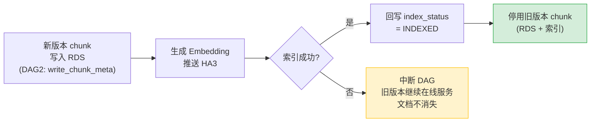

# 系统架构介绍 — Fuling 企业 RAG 知识问答系统

> 本文是当前代码库的综合架构文档（2026-06）。`README.md` 仅描述早期 4-DAG 骨架，`CLAUDE.md` 是面向开发的简要指引；本文覆盖系统的完整现状：摄取流水线、索引、检索与生成、权限过滤、对外 API、钉钉双前端及外部依赖。

---

## 目录

1. [系统概览](#1-系统概览)
2. [整体架构图](#2-整体架构图)
3. [摄取流水线（4 条 DAG）](#3-摄取流水线4-条-dag)
4. [多模态处理与 Step Card](#4-多模态处理与-step-card)
5. [检索与答案生成](#5-检索与答案生成)
6. [权限与安全](#6-权限与安全)
7. [对外 API 与前端](#7-对外-api-与前端)
8. [数据存储](#8-数据存储)
9. [配置与运行环境](#9-配置与运行环境)
10. [已知限制与可靠性缺口](#10-已知限制与可靠性缺口)
11. [关键文件路径索引](#11-关键文件路径索引)

---

## 1. 系统概览

**这是什么**：为浙江富岭塑胶（一次性餐具/包装制造企业）构建的**阿里云原生企业 RAG 问答系统**。它把企业内部文档（SOP/作业指导书、U8+ ERP 操作手册、HR/行政制度、FAQ）转化为自助问答服务：员工在**钉钉**中提问，后端 RAG 流水线从企业自有文档中检索并生成答案，带**部门级权限过滤**和内嵌图片。

**命名澄清（重要）**：尽管项目名叫 `opensearch-rag-pipeline`，生产检索引擎是**阿里巴巴 HA3 向量引擎**（"OpenSearch 向量检索版"，SDK `alibabacloud_ha3engine_vector`），**不是** Elastic/AWS OpenSearch。代码同时支持标准 OpenSearch 作为本地开发回退。

**技术栈一览**：

| 层 | 技术 |
|---|---|
| 文档存储 | 阿里云 OSS（`raw/` → `canonical/` → `rag-ready/` 三级目录） |
| 元数据/审计 | 阿里云 RDS MySQL（`fuling_knowledge` + `fuling_operation` 两库） |
| 向量索引 | 阿里云 HA3 向量检索版（Dense + Sparse + BM25 三路混合） |
| 模型服务 | DashScope/百炼：Qwen LLM（`qwen3.6-plus`）、`text-embedding-v4`、Qwen-VL（OCR/VLM）、`qwen3-rerank` / `qwen3-vl-rerank` |
| 批处理调度 | 阿里云 DataWorks（每日调度 stage 1/2/3） |
| 在线服务 | 阿里云 SAE（FastAPI + 钉钉机器人，单容器） |
| 前端 | 钉钉机器人卡片（流式 typewriter）+ 钉钉小程序（`fuling-rag-miniapp/`） |

**系统分为两个平面**：

- **摄取平面（批处理，DataWorks）**：把 OSS `raw/` 中的原始文档逐步加工为带向量的安全 chunk，写入 HA3 索引。由 4 条 DAG 组成，每日调度。
- **服务平面（在线，SAE）**：接收用户问题，执行混合检索 + 重排 + LLM 生成，通过 REST API / 钉钉机器人 / 小程序返回图文答案，并记录问答日志与用户反馈。

---

## 2. 整体架构图

```mermaid
flowchart TB
    subgraph SRC["数据源"]
        RAW[("OSS raw/<br/>原始文档<br/>PDF · DOCX · XLSX · TXT · MD ...")]
    end

    subgraph INGEST["摄取平面 — DataWorks 每日批调度"]
        direction TB
        DAG1["DAG 1: raw_to_canonical<br/>扫描 → 注册元数据 → 文本抽取+OCR 回退 → 规范化文档"]
        DAG2["DAG 2: canonical_to_safe_chunk<br/>LLM 分类/风险 → PII 检测 → 脱敏/隔离 → 发布 → 分块 → 校验 → 写 chunk_meta"]
        DAG3["DAG 3: chunk_to_opensearch<br/>抢锁 → Embedding → Bulk 推送 → 状态回写 → 停用旧版本"]
        DAG4["DAG 4: retrieval_eval<br/>(仅评测，未接入生产调度)"]
        ORCH["dataworks_orchestrator.py<br/>--stage 1/2/3 --bizdate<br/>原子行抢占 · 2h 失锁守卫 · 失败回滚"]
        FUNNEL["VLM 图片漏斗<br/>image_funnel_processor.py<br/>启发式 → OCR 密度 → Qwen-VL 审核"]
        DAG1 --> DAG2 --> DAG3
        ORCH -.调度入口.-> DAG1
        ORCH -.-> DAG2
        ORCH -.-> DAG3
        DAG1 -.图片路由.-> FUNNEL
    end

    subgraph STORE["存储层"]
        OSS[("OSS<br/>canonical/ · rag-ready/<br/>images/ · quarantine/")]
        RDS[("RDS MySQL<br/>fuling_knowledge:<br/>document_meta · chunk_meta<br/>document_version · user_role<br/>fuling_operation:<br/>qa_session_log · user_feedback")]
        HA3[("HA3 向量索引<br/>Dense + Sparse 向量<br/>+ chunk_text BM25")]
    end

    subgraph SERVE["服务平面 — SAE 在线服务 (workers=1)"]
        direction TB
        API["api.py (FastAPI)<br/>/api/ask · /api/ask/stream<br/>/api/search · /api/auth/dingtalk<br/>/api/feedback · /api/session/clear"]
        BOT["dingtalk_bot.py<br/>Webhook 接收 · 流式卡片<br/>卡片回调(赞/踩)"]
        subgraph CORE["共享服务核心"]
            RET["retriever.py<br/>三路混合检索+拼接+扩展"]
            RR["reranker.py<br/>路由式重排 (文本/VL)"]
            GEN["llm_generator.py<br/>Qwen 答案生成 + 图文交错"]
            FLOW["answer_flow.py<br/>纯函数: 日志载荷/历史策略/NO_RESULT"]
            AUX["session_store · qa_logger<br/>feedback_handler · content_blocks_builder"]
        end
        API --> CORE
        BOT --> CORE
        RET --> RR --> GEN
    end

    subgraph FRONT["前端"]
        DT["钉钉机器人<br/>流式 typewriter 卡片<br/>+ 自定义反馈按钮"]
        MINI["钉钉小程序<br/>fuling-rag-miniapp/<br/>chat 页 · markdown 渲染 · 反馈条"]
        PROTO["HTML 原型<br/>prototype/index.html (仅开发)"]
    end

    subgraph EXT["外部服务"]
        DS["DashScope / 百炼<br/>Qwen LLM · text-embedding-v4<br/>Qwen-VL OCR/VLM · qwen3-rerank"]
        DTOPEN["钉钉开放平台<br/>消息回调 · 卡片 API · 授权码换取身份"]
    end

    RAW --> DAG1
    DAG1 --> OSS
    DAG2 --> OSS
    DAG1 --> RDS
    DAG2 --> RDS
    DAG3 --> RDS
    DAG3 ==推送向量==> HA3
    INGEST -.LLM/OCR/VLM/Embedding.-> DS

    RET ==混合检索 + 服务端权限 filter==> HA3
    RET -.邻居拼接 ±1 / step 扩展.-> RDS
    CORE -.问答日志/反馈.-> RDS
    CORE -.Embedding/Rerank/LLM.-> DS

    DT <--> BOT
    MINI --> API
    PROTO --> API
    DTOPEN <--> BOT
    DTOPEN -.authcode 鉴权.-> API

    subgraph PERM["权限过滤路径"]
        UR["user_role (RDS)<br/>userid → dept_code"]
        WL["dept 白名单校验<br/>(防 filter 注入)"]
        SF["HA3 服务端 filter<br/>permission_level + dept"]
        UR --> WL --> SF
    end
    API -.解析身份.-> PERM
    BOT -.解析身份.-> PERM
    PERM -.过滤条件.-> HA3
```



**两个平面的衔接点**是 HA3 索引和 RDS：摄取平面是唯一的写入者（chunk + 向量 + 元数据），服务平面只读检索；问答日志和反馈则由服务平面写入 `fuling_operation` 库，再由离线脚本（`scripts/feedback_miner.py` 等）反哺语料优化。

---

## 3. 摄取流水线（4 条 DAG）

### 3.1 DAG 引擎

自研轻量 DAG 引擎（[dag_engine.py](../opensearch_pipeline/dag_engine.py)）：节点拓扑排序执行，节点间通过共享 `context` 字典传递数据。DAG 结构在 [dag_definitions.py](../opensearch_pipeline/dag_definitions.py) 中声明，约 19 个 `node_*` 节点函数全部实现在 [pipeline_nodes.py](../opensearch_pipeline/pipeline_nodes.py)（约 4,300 行，摄取核心，含 DB 连接池、各类客户端、分类、PII、嵌入、推送、停用逻辑）。

### 3.2 四条 DAG 的节点级流程

**DAG 1 `raw_to_canonical` — 文件解析**

| 节点 | 职责 |
|---|---|
| `node_scan_raw_files` | 扫描 OSS `raw/` 待处理文件；准入策略见 [ingest_policy.py](../opensearch_pipeline/ingest_policy.py)（过滤临时文件/垃圾文件/不支持的 legacy 格式 `.doc`/`.xls`/`.ppt`，维护可摄取扩展名白名单） |
| `node_register_metadata` | 写 `document_meta` + `document_version` 到 RDS |
| `node_extract_text_with_ocr` | 原生抽取（[extraction/unified_extractor.py](../opensearch_pipeline/extraction/unified_extractor.py) 按格式分发）→ 文本量不足时回退 Qwen-VL OCR |
| `node_build_canonical` | 产出 `content.md` + `content.canonical.json` 到 OSS `canonical/` |

**DAG 2 `canonical_to_safe_chunk` — 分类 + 脱敏 + 分块**

| 节点 | 职责 |
|---|---|
| `node_classify_and_risk_assess` | LLM 在**原始文本**上判定 category / permission / risk |
| `node_detect_sensitive` | 正则 PII/凭证检测，与 LLM 风险合并 |
| `node_redact_or_quarantine` | 高风险→隔离（quarantine），中风险→脱敏（redact），低风险→放行 |
| `node_publish_to_rag_ready` | 写 `content.md` + `metadata.json` 到 OSS `rag-ready/` |
| `node_chunk_documents` | 调用 [chunker.py](../opensearch_pipeline/chunker.py)，策略路由（text/faq/clause/step）在此节点按 category/title 子串匹配决定 |
| `node_validate_chunks` | 校验空块、超长、缺元数据 |
| `node_write_chunk_meta` | 新 chunk 持久化到 RDS `chunk_meta` |

**DAG 3 `chunk_to_opensearch` — 嵌入 + 索引 + 版本切换**

| 节点 | 职责 |
|---|---|
| `node_acquire_index_lock` | 乐观锁抢占，防并发冲突 |
| `node_generate_embeddings` | DashScope `text-embedding-v4` 生成向量 |
| `node_build_opensearch_payload` | 组装 Bulk/NDJSON 载荷 |
| `node_push_to_opensearch` | 批量写入 HA3 / OpenSearch |
| `node_update_index_status` | 回写 `chunk_meta.index_status`；**索引失败时中断 DAG**，保护下一步 |
| `node_deactivate_old_chunks` | 新版本索引确认成功后，停用 RDS 与索引中的旧版本 chunk |

**DAG 4 `retrieval_eval`** — `node_simulate_retrieval` + `node_eval_report`，仅评测用途，**未接入生产调度**（生产只调度 DAG 1–3）。

### 3.3 关键安全不变量：文档永不"消失"

新 chunk 必须**先持久化到 RDS 且成功写入索引**，旧版本 chunk 才能停用。若顺序颠倒，任何中途失败都会让该文档从搜索结果中消失。`node_update_index_status` 在索引失败时中断 DAG 正是为保护这一顺序。**严禁重排 DAG 3 节点或将停用提前。**



### 3.4 生产编排：dataworks_orchestrator.py

DataWorks 节点每日 shell 调用 `dataworks_orchestrator.py --stage {1|2|3} --bizdate ${bizdate}`（节点脚本在 [dataworks_nodes/](../dataworks_nodes/)：`stage1_node.py` / `stage2_node.py` / `stage3_node.py`）。在 DAG 引擎之上叠加的生产可靠性机制：

- **原子行抢占**：`UPDATE ... SET content_process_status='LOADING' ... LIMIT 100`，多 worker 互不重复处理；
- **2 小时失锁守卫**：stage-3 对超时 `PROCESSING` 行接管；
- **失败回滚** + 部分加载错误时**主动 `raise`**——DataWorks 以退出码判定任务失败，从而触发告警与重跑。

辅助脚本：`dataworks_nodes/register_new_files.py`（批量注册增量文档）、`scan_oss_sync_keys.py`（OSS 盘点诊断）、`move_files_to_admin.py`（敏感/失败文档迁移隔离）。

---

## 4. 多模态处理与 Step Card

针对截图密集的 SOP/ERP 文档，是当前重点演进方向。

### 4.1 VLM 图片漏斗

[image_funnel_processor.py](../opensearch_pipeline/image_funnel_processor.py)（由 `extraction/unified_extractor.py` 调用）对每张图片执行**三级级联**，成本从低到高：

```
1) 廉价启发式（尺寸/比例/纯色检测）
2) OCR 文本密度
3) Qwen-VL 语义理解 + 安全审核
        ↓ 路由到四个去向之一
DISCARD（装饰图丢弃） / ROUTE_TO_TEXT（文字图转文本） /
ROUTE_TO_VECTOR（语义图入向量索引） / QUARANTINE_SENSITIVE（敏感图隔离）
```

工程特性：MD5 去重、并发处理（`RAG_VLM_CONCURRENCY=8`）、**跨文档持久化缓存**（`scratch/vlm_cache.json` + OSS 同步），避免重复消耗 VLM 配额。配额本身由 [extraction/cost_breaker.py](../opensearch_pipeline/extraction/cost_breaker.py) 熔断控制。

### 4.2 Step Card 分块

程序性文档（操作步骤类）由 `chunker.py::_chunk_by_step` 切分为**一个 `procedure_parent` + 每步一个 `step_card`** 的结构，通过 `parent_chunk_id` / `step_no` 关联（DDL 见 [schema/002_step_card_enhancement.sql](../schema/002_step_card_enhancement.sql)），每个 step card 携带其绑定的图片（`image_refs_json`）。

**核心难题是图片↔步骤的正确绑定**，三种格式三种锚定方式：

| 格式 | 绑定依据 |
|---|---|
| DOCX | 精确位置的 `image_ref` 块（图片在文档流中的确切位置） |
| PDF | `page_num`（页码归属） |
| XLSX | `anchor_row` / `figure_refs`（单元格锚点） |

### 4.3 image_refs 契约（载荷型约定，勿破坏）

`image_refs` 字典结构是横贯**抽取器 → 分块器 → content_blocks_builder → 钉钉卡片**的端到端契约，字段必须全链路保持：

```
oss_key / source_image / visual_summary / ocr_text / image_index
```

---

## 5. 检索与答案生成

### 5.1 在线问答数据流

```mermaid
flowchart LR
    U["用户提问<br/>(钉钉机器人 / 小程序 / API)"] --> AUTH["身份解析<br/>userid → user_role(RDS)<br/>→ dept_code + 白名单校验"]
    AUTH --> EMB["Query Embedding<br/>DashScope 原生 API<br/>dense + sparse (只算一次)"]
    EMB --> MQ{"多意图分解?<br/>RAG_MULTI_QUERY_MODE<br/>(默认 off)"}
    MQ -- "是" --> FAN["多路扇出检索<br/>轮转交错合并"]
    MQ -- "否" --> HY["HA3 三路混合检索<br/>Dense + Sparse kNN<br/>+ BM25(chunk_text)<br/>weighted 融合 knn0.7/text0.3<br/>+ 服务端 dept filter"]
    FAN --> POST
    HY --> COVER["封面页降权"]
    COVER --> RRK{"重排开启?<br/>RAG_RERANK_ENABLE"}
    RRK -- "是" --> RR["路由式重排 pool=20→top7<br/>文本: qwen3-rerank<br/>带图: qwen3-vl-rerank"]
    RRK -- "否" --> POST
    RR --> CAP["文档多样性限额<br/>doc_diversity_cap"]
    CAP --> POST["后处理<br/>邻居拼接 ±1 (RDS)<br/>→ Step Card 上下文扩展<br/>→ 图片召回增强(opt-in)"]
    POST --> GEN["llm_generator.py<br/>Qwen 生成 (OpenAI 兼容模式)<br/>chunk 标注 高/中/低 置信<br/>图片经 IMG:N 标记交错"]
    GEN --> OUT["答案输出<br/>钉钉流式卡片 / SSE 流 / JSON"]
    OUT --> LOG["answer_flow.build_qa_log_kwargs<br/>→ qa_session_log (RDS)<br/>+ 会话历史追加策略"]
```



### 5.2 检索细节（retriever.py::retrieve_and_enrich，top_k=7）

统一检索入口，API 与钉钉机器人共用。实际执行顺序（与代码一致）：

1. **Query embedding 只计算一次**（传递给检索与图片召回复用）。**必须使用 DashScope 原生 API**（`output_type=dense&sparse`）——OpenAI 兼容模式会静默丢弃 sparse 向量，显著拉低召回。
2. （可选）多意图查询分解（`query_decomposer.py`，默认关闭）。
3. **HA3 三路混合检索**：Dense + Sparse 走 kNN 通道，BM25 走 `chunk_text` 文本通道；融合方式默认 **`weighted`（knn 0.7 / text 0.3）**——评测显示 weighted 优于 RRF。**权限过滤在 HA3 服务端执行**，dept 值经白名单校验防 filter 注入。
4. **封面页降权**（目录/封面 chunk 后置）。
5. **路由式重排**（`reranker.py`，默认关闭，`RAG_RERANK_ENABLE` 开启）：over-fetch pool=20 → 重排 → 取 top 7；纯文本池走 `qwen3-rerank`，带图池走 `qwen3-vl-rerank`；251 题金标集上 recall@1 +10.5pp。重排失败自动降级为原始顺序。
6. **文档多样性限额**（`doc_diversity_cap`，单文档最多占若干席）。
7. **邻居拼接**：从 RDS 取 ±1 相邻 chunk 修复边界断裂。
8. **Step Card 上下文扩展**：命中 step card 时补全父过程/兄弟步骤。
9. **图片召回增强**（仅图文渲染路径 opt-in，`RAG_IMAGE_COSURFACE`）。

### 5.3 生成（llm_generator.py）

- Qwen 经 OpenAI 兼容模式调用（生成侧兼容模式无副作用，区别于 embedding 侧）。
- 上下文中按分数给 chunk 标注 高/中/低 置信标签，阈值 `score_threshold_high=7.7 / medium=5.8`（251 题金标集校准）。**该阈值校准于 weighted 融合分数，换 RRF 即失效**；重排开启时切换为 rerank 分数阈值（`RAG_RERANK_SCORE_THRESHOLD_HIGH=0.9 / MEDIUM=0.8`）。
- LLM 被指示**不要自行输出来源列表**（来源由 content_blocks_builder 结构化拼装）；图片通过 `<>` 占位标记在答案文本中交错，由前端渲染层替换为真实图片。

### 5.4 answer_flow.py：四条回答路径的统一记账

四条回答路径——REST `/api/ask`、REST `/api/ask/stream`、钉钉同步回复、钉钉流式卡片——共用 [answer_flow.py](../opensearch_pipeline/answer_flow.py) 的**纯函数**：

- `build_qa_log_kwargs()`：`qa_session_log` 写入载荷的唯一来源；
- 历史追加策略：仅非空成功答案进入会话上下文；
- NO_RESULT 统一话术 + 拒答判定。

设计约束：该模块**必须保持无副作用**——实际的 `log_qa_session` / `append_to_history` 调用留在四个调用点，因为测试通过 monkeypatch 模块级名称拦截。

---

## 6. 权限与安全

| 机制 | 实现 |
|---|---|
| **文档权限定级** | `permission_level` 由 **OSS 路径启发式**判定（key 中含 `restricted` / `internal` 子串），**绝不由 LLM 决定** |
| **检索期权限过滤** | 服务端在 HA3 查询里下推 dept filter；dept 值先经白名单校验，杜绝 filter 注入 |
| **身份解析** | 钉钉 userid → RDS `user_role` 表 → `dept_code`（小程序经 `/api/auth/dingtalk` 用 authcode 换会话 token） |
| **PII 存储** | 命中的敏感信息只存 **SHA-256 哈希 + 掩码预览**（`document_sensitive_finding` 表），永不存原文 |
| **敏感文档隔离** | DAG 2 高风险文档进 quarantine，不进入索引；敏感图片由 VLM 漏斗路由 `QUARANTINE_SENSITIVE` |
| **生产环境守卫** | `config.py`：`environment ∈ {production, staging}` 时若无 DashScope key、或 LLM/OCR/Embedding 任一会解析到 Google/Gemini，**直接 hard-raise**。生产必须用阿里 Qwen |
| **安全复审** | [spot_checker.py](../opensearch_pipeline/spot_checker.py) 对已索引内容抽查复审；其 `PENDING_DELETE` 对账模式是跨云删除一致性的参考实现 |

---

## 7. 对外 API 与前端

### 7.1 REST API（api.py，FastAPI，SAE :8000）

| 端点 | 方法 | 职责 |
|---|---|---|
| `/api/health` | GET | 健康检查 |
| `/api/auth/dingtalk` | POST | 钉钉 authcode → 会话 token（小程序登录） |
| `/api/search` | POST | 纯检索（无 LLM），返回带分 chunk + 引用上下文 |
| `/api/ask` | POST | 非流式问答：检索 + 生成 → 完整 JSON |
| `/api/ask/stream` | POST | 流式问答：SSE 推送 token 流 + 引用 |
| `/api/feedback` | POST | 用户反馈（赞/踩 + 原因）落 `user_feedback` |
| `/api/session/clear` | POST | 清空指定 session 的会话历史 |

身份经 `Authorization` 头解析（`current_identity` 依赖注入），CORS 经 `CORS_ALLOWED_ORIGINS` 配置。

### 7.2 钉钉机器人（dingtalk_bot.py）

- **接收**：Webhook POST 回调，验签（app secret + timestamp），区分群聊/单聊/stream 模式；
- **回复**：经 `session_webhook` 以**交互卡片**回复；流式路径 `_stream_answer_to_card()` 分片 PATCH 更新卡片，端上呈现 typewriter 效果；
- **卡片回调**：处理反馈按钮点击（赞/踩/转人工）；卡片模板在 [card_templates/](../card_templates/)（`native_feedback_card.json` / `streaming_rag_feedback_card.json`）。

### 7.3 钉钉小程序（fuling-rag-miniapp/）

| 目录 | 内容 |
|---|---|
| `pages/chat/` | 主问答页；`pages/settings/` 设置页 |
| `components/` | `answer-bubble`（消息渲染）、`feedback-bar`（赞/踩） |
| `utils/` | `api.js`（调 `/api/*`）、`auth.js`（token 流程）、`markdown.js`（Markdown 渲染）、`typewriter.js`（打字机效果）、`config.js` |
| `prototype/` | 浏览器 HTML 原型（开发/演示用，支持 `?api=` 直连真实后端） |

所有用户交互都是钉钉优先，没有独立的 Web 前端。

---

## 8. 数据存储

### 8.1 RDS MySQL（两库，注意区分）

`schema/001_*.sql` 与 step card 增强使用 **`fuling_knowledge`** 库；`schema/002_feedback_system.sql` 使用 **`fuling_operation`** 库。查表前先确认库。

| 类别 | 表（schema/001 为主） |
|---|---|
| 权限 | `user_role`（userid→dept，003 加 UNIQUE 约束）、`document_acl_rule` |
| 文档元数据 | `document_meta`、`document_version`、`document_tag`、`tag_taxonomy` |
| Chunk | `chunk_meta`（含 `index_status`、`image_refs_json`、step card 字段） |
| 审计/任务 | `kb_audit_log`、`kb_import_job`、`review_task`、`faq_review_queue`、`batch_llm_job/_item`、`opensearch_bulk_job` |
| 敏感发现 | `document_sensitive_finding`（仅哈希+掩码） |
| 问答运营（fuling_operation） | `qa_session_log`（所有问答的唯一审计流水）、`user_feedback`、`escalation_ticket` |

### 8.2 OSS 目录布局

```
raw/          原始上传文档（摄取入口，ingest_policy 准入）
canonical/    DAG1 产物：content.md + content.canonical.json
rag-ready/    DAG2 产物：脱敏后的 content.md + metadata.json
images/       抽取出的图片资产（钉钉卡片经签名 URL 引用）
quarantine/   高风险隔离区
```

### 8.3 HA3 向量索引

每条 chunk 文档含：dense 向量（`text-embedding-v4`）、sparse 向量、`chunk_text`（BM25 字段）、`permission_level` / dept 过滤字段、`doc_id` / `chunk_id` / 版本与激活标记。旧版本 chunk 通过 DAG 3 末节点停用（详见 §3.3）。

---

## 9. 配置与运行环境

### 9.1 配置中心（config.py）

- 全部配置经 `RAG_` 前缀环境变量进入 `load_config()` →（缓存的）`get_config()`；
- `RAG_ENV` 选择 overlay：`.env`（共享 key/模型）+ `.env.{local|test|production}`（存储端点/凭证）；
- **模型名在运行时解析**，不是 dataclass 默认值：有 DashScope key 时 LLM→`qwen3.6-plus`、OCR→`qwen-vl-ocr-latest`、VLM→`qwen3-vl-plus`、embedding→`text-embedding-v4`。dataclass 里的 Gemini 名仅是回退。**读 `load_config()` 工厂逻辑，别信字段默认值。**

### 9.2 Simulate 模式（本地零依赖运行）

`RAG_SIMULATE=true`（默认）下整条流水线无需 OSS/RDS/OpenSearch/LLM：embedding 变哈希向量、OSS 读本地文件、HA3 返回 `MOCK_HA3_CLIENT`。粒度开关：`RAG_SIMULATE_DB/OPENSEARCH/OSS/API`。**所有流水线改动先在 simulate 模式验证**（`make sim` / `make sim-all`）。

### 9.3 三种部署形态

| 形态 | 内容 |
|---|---|
| **DataWorks（批）** | stage 1/2/3 节点每日 shell 调 `dataworks_orchestrator.py`，VPC 内访问 RDS/HA3 |
| **SAE（在线）** | FastAPI + 钉钉机器人单容器；**会话在进程内存中**（`session_store.py`），故 Dockerfile 钉死 `--workers 1`，重启丢会话——扩容需先换 Redis |
| **本地 Compose / simulate** | `make sim` 全模拟；`make api` 起本地服务 |

---

## 10. 已知限制与可靠性缺口

尚未修复、做架构决策时需要知晓的事项（与 `CLAUDE.md` Gotchas 同步）：

1. **乐观锁无通用租约/心跳**：stage-3 有 2h 失锁接管，但 stage-1/2 的 `content_process_status` 没有任何年龄守卫——进程崩溃会永久卡住行。
2. **跨云无两阶段提交**：HA3 删除是不可逆操作，与 RDS 之间没有 2PC；`spot_checker.py` 的 `PENDING_DELETE` 对账模式是待推广的解法。
3. **部分批失败的双版本在线**：批内个别文档失败时，已 INDEXED 的文档其旧版本仍处激活态，新旧两版同时可检。
4. **会话内存态**：见 §9.3，横向扩容前必须迁 Redis。
5. **`.xls`（legacy 二进制）明确不支持**（有清晰告警，无静默失败）；HTML 去标签、CSV 解析后再分块。
6. 上下文上限（6,000 字符截断）与生产 ~11% 错误率为已知待办（详见 eval_harness 报告）。

---

## 11. 关键文件路径索引

### 摄取流水线

| 路径 | 职责 |
|---|---|
| `opensearch_pipeline/dag_engine.py` | DAG 执行器（拓扑排序 + 共享 context） |
| `opensearch_pipeline/dag_definitions.py` | 4 条 DAG 的节点声明 |
| `opensearch_pipeline/pipeline_nodes.py` | ~19 个 node_* 实现 + DB 池/客户端/分类/PII/嵌入/推送/停用（4,300 行核心） |
| `opensearch_pipeline/dataworks_orchestrator.py` | 生产 CLI（--stage/--bizdate，抢占/守卫/回滚） |
| `opensearch_pipeline/ingest_policy.py` | raw/ 准入策略（扩展名白名单、垃圾过滤） |
| `opensearch_pipeline/chunker.py` | DocumentChunker，text/faq/clause/step 四模式（2,200 行） |
| `opensearch_pipeline/run_simulation.py` | 本地模拟运行器 + 4 个测试场景 |
| `dataworks_nodes/stage{1,2,3}_node.py` | DataWorks 各 stage 入口脚本 |

### 抽取与多模态

| 路径 | 职责 |
|---|---|
| `opensearch_pipeline/extraction/unified_extractor.py` | 中央分发器：按格式路由抽取插件，组装 ExtractionResult |
| `opensearch_pipeline/extraction/{pdf,docx,text}_extractor.py` | 各格式抽取 |
| `opensearch_pipeline/extraction/ocr_client.py` | Qwen-VL-OCR 封装（扫描件逐页 OCR） |
| `opensearch_pipeline/extraction/image_extraction_utils.py` | 图片资产管理（下载/归一化/哈希/构建 image_refs） |
| `opensearch_pipeline/extraction/cost_breaker.py` | VLM/OCR 配额熔断 |
| `opensearch_pipeline/extraction/schema.py` | ExtractionResult / 块结构 TypedDict 契约 |
| `opensearch_pipeline/image_funnel_processor.py` | VLM 图片漏斗（三级级联 + 缓存） |
| `opensearch_pipeline/vlm_endpoint.py` | Qwen-VL 端点路由统一封装（compat vs native，勿在调用方手拼） |

### 服务层

| 路径 | 职责 |
|---|---|
| `opensearch_pipeline/api.py` | FastAPI：7 个端点（§7.1） |
| `opensearch_pipeline/dingtalk_bot.py` | 钉钉 Webhook/卡片/流式回复 |
| `opensearch_pipeline/dingtalk_card.py` / `oss_url.py` | 卡片构造 / OSS 签名 URL |
| `opensearch_pipeline/retriever.py` | retrieve_and_enrich：混合检索 + 拼接 + 扩展（§5.2） |
| `opensearch_pipeline/reranker.py` | 路由式重排（qwen3-rerank / qwen3-vl-rerank） |
| `opensearch_pipeline/llm_generator.py` | 答案生成 + 置信标注 + IMG 标记 |
| `opensearch_pipeline/answer_flow.py` | 纯函数记账：日志载荷/历史策略/NO_RESULT（§5.4） |
| `opensearch_pipeline/content_blocks_builder.py` | 答案 → 钉钉卡片 content_blocks |
| `opensearch_pipeline/session_store.py` | 进程内会话（workers=1 的根因） |
| `opensearch_pipeline/qa_logger.py` / `feedback_handler.py` | 问答日志 / 反馈处理 |
| `opensearch_pipeline/embedding_client.py` | DashScope 嵌入封装（原生 dense+sparse） |
| `opensearch_pipeline/query_decomposer.py` | 多意图查询分解（实验性，默认关） |
| `opensearch_pipeline/spot_checker.py` | 已索引内容安全抽查 + PENDING_DELETE 对账 |

### 前端

| 路径 | 职责 |
|---|---|
| `fuling-rag-miniapp/pages/chat/` | 小程序主问答页 |
| `fuling-rag-miniapp/components/` | answer-bubble / feedback-bar |
| `fuling-rag-miniapp/utils/` | api / auth / markdown / typewriter |
| `fuling-rag-miniapp/prototype/index.html` | 浏览器原型（开发用） |
| `card_templates/` | 钉钉卡片模板（native / streaming） |

### 配置、Schema 与其他

| 路径 | 职责 |
|---|---|
| `opensearch_pipeline/config.py` | 配置中心 + 生产安全守卫 |
| `schema/001_opensearch_pipeline.sql` | 主 DDL（fuling_knowledge 库，§8.1） |
| `schema/002_feedback_system.sql` | 反馈系统（fuling_operation 库） |
| `schema/002_step_card_enhancement.sql` | step card 字段增强 |
| `schema/003_user_role_unique.sql` | user_role 唯一约束 |
| `eval_harness/` | 端到端 HA3 RAG 评测 harness + 报告 |
| `scripts/` | 语料清理 / 覆盖率评测 / 图片绑定精度 / 反馈挖掘等独立工具 |
| `fuling_chunk_exp/` | 真实文档语料（分块实验用） |
| `Makefile` | install/sim/api/test/lint 入口（见 CLAUDE.md Commands） |

---

*文档版本：2026-06-10。代码持续演进，若与代码冲突以代码为准；开发约定与命令速查见 [CLAUDE.md](../CLAUDE.md)。*
