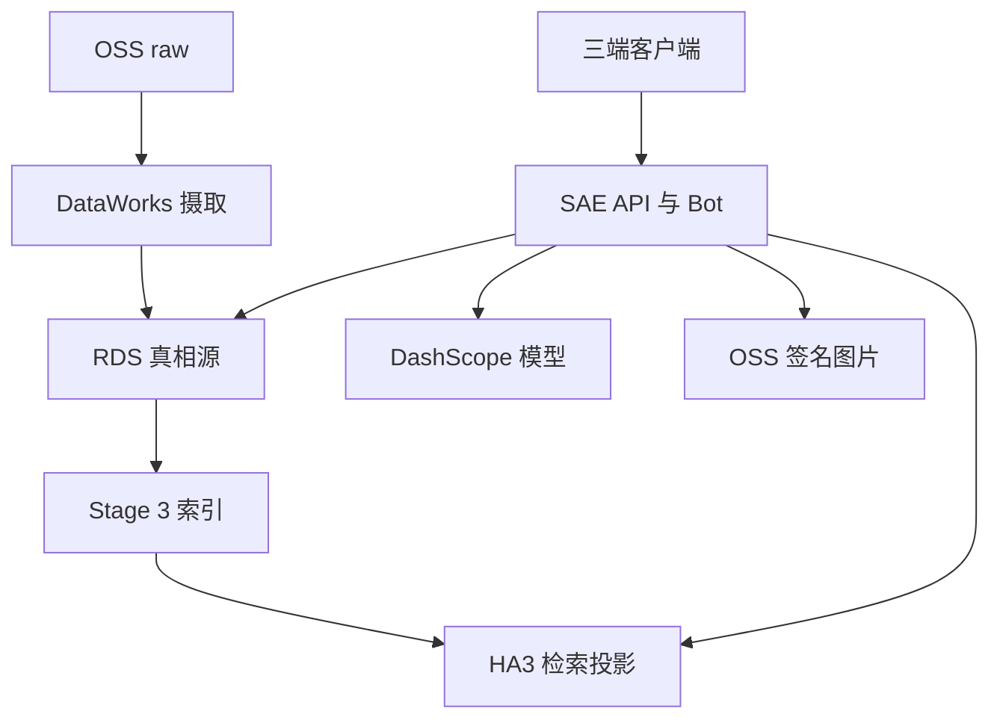

# opensearch-rag-pipeline 全维度代码与系统审查报告

审查日期：2026-07-10（America/Los_Angeles）  
审查对象：`l948931710/opensearch-rag-pipeline` 远端 `main`  
基线提交：[`9fa3e07e870e22c6e797d75d465892c259072fe5`](https://github.com/l948931710/opensearch-rag-pipeline/commit/9fa3e07e870e22c6e797d75d465892c259072fe5)  
审查方式：只读代码审查、架构/数据流/状态机分析、GitHub CI 证据核验、静态模式扫描、前端依赖审计；未修改仓库代码或生产系统。

## 1. 结论先行

这不是一个“只会做 Demo 的 RAG”。它已经具备相当扎实的企业知识库工程能力：多格式抽取、OCR/VLM、PII 隔离、步骤卡与图文绑定、三路混合检索、服务端 ACL、旧版本安全切换、HA3 推后校验、反馈/审计/评测和环境写保护都是真实实现，测试规模与故障复盘质量也明显高于同体量项目。

但当前远端 `main` 的生产结论仍是：**有条件 No-Go**。在扩大用户范围、继续暴露公网入口、启动 Agent 试点或开放任何写工具之前，必须先关闭 5 个 P0：

1. **公开 GitHub 仓库已包含内部金标题、组织结构、生产指标、事故材料与基础设施指纹。** 这不是“未来可能泄露”，而是匿名克隆即可获得的现实暴露。
2. **生产小程序后端地址是明文 HTTP 公网 IP；HA3 取证/评测路径明确使用公网 HTTP/80；项目 RDS 配置未提供 TLS 参数。** 端到端传输安全未闭环。
3. **五个知识读取接口允许匿名调用。** 匿名虽只命中 `permission_level=public`，但企业语义中的“全员公开”被实现成了“互联网公开”，且与既定的“知识检索端点必须认证”安全基线冲突。
4. **ACL 权威数据不可用时，主体组与主命中复核选择保留旧结果。** 这与严格 fail-closed 的权限目标相冲突，并给撤权/退役投影窗口留下残余暴露面。
5. **HA3 已发生“推后校验通过后又蒸发”的真实生产事件，而持续对账作业仍未可靠调度。** 入口 parity 很强，但无法覆盖索引在数小时后消失的故障。

综合判断：

| 视角 | 评分 | 判断 |
|---|---:|---|
| RAG 数据/检索工程成熟度 | 8.5 / 10 | 强，可作为企业 RAG 主干继续演进 |
| 代码内安全控制设计 | 8.0 / 10 | ACL、写保护、PII、上传链路有深度 |
| 当前生产安全与治理闭环 | 5.2 / 10 | 被公开仓库、HTTP、匿名边界和 fail-open 拉低 |
| 可靠性/可运维性 | 6.3 / 10 | 代码能力较强，调度、HA、发布闭环不足 |
| 测试与 CI | 8.6 / 10 | 2,331 测试、DB 集成与安全门；覆盖盲区仍明显 |
| 可维护性/可复制交付 | 6.1 / 10 | 超大模块、配置分散、依赖不锁、迁移/部署手工 |
| Agent 平台就绪度 | 4.0 / 10 | 设计文档厚，但运行时代码、持久状态与门禁尚不存在 |
| Ontology 就绪度 | 2.5 / 10 | 尚无对象/关系/动作/权威源实现，只处于构想阶段 |

建议不要用单一平均分掩盖风险：**核心 RAG 技术是 8 分以上，当前生产治理却只有 5 分左右。** 先补安全与运营地基，系统价值才能稳定释放。

## 2. 审查范围与证据边界

### 2.1 已覆盖

- 766 个跟踪文件；约 118,295 行 Python、14,118 行 TS/JS/Vue。
- 核心 Python 包 86 个文件、47,670 行、1,037 个函数。
- DataWorks 三阶段摄取、OSS/RDS/HA3 数据一致性、FastAPI 与钉钉入口。
- ACL、认证、上传/审批/贡献、PII、审计、留存与主体擦除。
- Vue3 控制台、钉钉小程序、SSE/Markdown/图片重签。
- GitHub Actions、依赖、迁移、部署、评测、可观测性和事故材料。
- Agent v2 设计、实施计划与现有架构评审；Ontology 代码存在性核验。

### 2.2 未覆盖或不能确认

- 没有进入 SAE、DataWorks、RDS、HA3、OSS、钉钉或 DashScope 控制台，故真实环境变量、网络 ACL、TLS 会话、探针配置、备份/PITR、调度状态和告警可达性均需现场验证。
- 没有对生产公网 IP 做主动扫描、漏洞利用、负载测试或真实数据查询。
- 没有审查未推送的本地分支/工作树。若你本地已有 Agent v2 代码，本报告不包含它。
- GitHub `main` 最后提交时间为 2026-07-07；报告只对远端提交 `9fa3e07` 负责。

### 2.3 证据标签

- `CONFIRMED`：可由当前提交代码、跟踪文件、GitHub 元数据或 CI 日志直接证明。
- `LIKELY`：多项证据一致，但缺生产平台/运行时实证。
- `UNVERIFIED`：必须进入云平台、网络、组织流程或真实运行环境确认。

## 3. 当前系统全景

架构上的关键事实：

- RDS 才是文档、版本、chunk 与授权的权威源；HA3 是服务投影。
- 在线服务被硬编码为单实例/单 worker 形态，依赖进程内会话、限流、去重和缓存。
- DataWorks 节点从 Archive zip 加载代码，并在运行时动态安装依赖。
- 评测体系很厚，但真实云依赖层与发布门仍是手工/待激活状态。
- 当前仓库是成熟 RAG 系统，不是已经实现的 Agent Runtime 或 Ontology 控制平面。

## 4. 做得好的地方

### 4.1 ACL 与写授权边界设计扎实

- `retriever._build_permission_filter()` 是 HA3 权限过滤的单一实现；组值先净化、再过白名单，空/非法输入退化为仅 `public`。
- `production` 伞组采用显式 owner taxonomy，不使用开放式 `startswith` 自动扩权；未知子线会 fail-closed 并告警。
- 读权限与写权限结构性隔离。`kb_authz.py` 明确禁止用宽松读映射推导管理写权，管理员角色和 owner 范围均由 DB 实时裁决。
- 公开投稿由部门管理员采纳时仍进入 `kb_admin` 审批，避免单部门管理员直接发布全公司内容。
- 图片重签按路径白名单、扩展名、`doc_id` 和文档可见性逐项复核；查询失败全拒。

关键证据：`opensearch_pipeline/retriever.py:314-473`、`kb_authz.py:1-32,216-275`、`routes/contribution.py:590-646`、`api.py:1157-1254`。

### 4.2 摄取与索引切换的不变量非常好

- 新 chunk 先写 RDS，再生成向量、推 HA3、回写状态、物理存在性校验和有界补推，最后才停用旧版本。
- `node_verify_and_repush` 位于不可逆停用之前；DROP/UNKNOWN 会持久化失败并中断，不让“假 INDEXED”触发旧版本删除。
- 同版本被批次 LIMIT 切断时，会查 RDS 是否仍有未索引尾部；有则推迟旧版本停用。
- 毒 chunk 有重试预算与 DEAD 终态，避免队头永久阻塞。

关键证据：`dag_definitions.py:143-201`、`pipeline_nodes.py:5572-5998,7171-7517`、`dataworks_nodes/stage3_node.py:42-48`。

### 4.3 文档工程能力强

- 支持 PDF、DOCX、XLSX、PPTX、扫描件、OCR 与 VLM 图片漏斗。
- 对嵌套 DOCX、合并单元格、隐藏 Sheet、双 OCR 去重、步骤卡、图片绑定、父子 chunk、图级引用均有专门代码和回归测试。
- PII 检测、隔离、衍生脱敏、残留复扫和图像 OCR 风险处理不是一条简单正则，而是分层安全链。
- `visual_summary`、QA 日志、跨用户问题/评论展示都考虑了 PII sink。

### 4.4 前端安全基本功好

- 控制台 Markdown 先转义 HTML，再套有限白名单；链接只允许 `http(s)`，代码块逐 token 转义。
- Bearer token 仅保存在内存，不落 `localStorage`；URL 透传 token 会尽早从地址栏清除。
- 本地会话历史带 `uid` 戳，不同用户登录共享设备时会清理旧用户答案。
- 互动卡片/小程序展示使用结构化块，而非直接信任 LLM HTML。

关键证据：`console-app/src/lib/markdown.ts`、`stores/session.ts`、`composables/useAuth.ts`、`composables/useAsk.ts:603-672`。

### 4.5 CI 与评测资产有厚度

- 当前 HEAD 的 GitHub CI 全绿：Python 3.10/3.11、Ruff、模拟全测、MySQL 8 集成、gitleaks、pip-audit。
- GitHub 日志显示 2,331 passed、31 skipped、30 warnings；生产版本腿行覆盖率约 78%。
- 前端有 Vue 类型检查、构建、135 个 Vitest 单测和小程序纯函数测试。
- 2026-07-10 对 `console-app/package-lock.json` 执行只读 `npm audit`：270 个依赖，0 个已知漏洞。
- `eval_harness` 已有 L0-L6、251 题金标、judge、冻结基线、图文/绑定/忠实度指标。

CI 证据：[`Actions run 28894857215`](https://github.com/l948931710/opensearch-rag-pipeline/actions/runs/28894857215)、`.github/workflows/ci.yml`、`.github/workflows/frontend.yml`。

## 5. P0：必须先处理的阻断项

### P0-01 公开仓库已泄露内部资产与基础设施情报

状态：`CONFIRMED`  
影响：机密性、知识产权、社会工程、攻击面枚举、合规与客户/员工信任。

仓库为 public，匿名 `git clone` 成功。当前版本未发现真实云密钥，且 gitleaks 全历史门通过；但“无密钥”不等于“无泄露”。跟踪内容包括：

- `eval_harness/goldset/golden_full.json`：251 条内部问题、答案要点、预期文档标题/ID、权限标签等；另有多个全量/扩展/人工校准文件。
- 已被新 `.gitignore` 忽略、但仍在历史和当前索引中的 `.bak_*` 金标备份。
- `tests/fixtures/dingtalk_org_snapshot_20260703.json`：完整部门树和部门 ID。
- `reports/富岭RAG周报_2026-06-08至06-12.md/pdf`：生产上线、文档规模、性能、业务域与部署现状。
- `docs/audits/**`、生产重灌/清理 manifest、真实事故与工单材料。
- 精确 RDS/HA3 实例指纹、公网 HA3 地址、生产公网 IP、桶名和拓扑信息。
- `pyproject.toml` 声明 MIT，但仓库无 LICENSE；若项目本意是企业私有，法律授权意图也发生歧义。

立即动作：

1. 将仓库设为 private，冻结公开发布；同时记录当前 forks、stars、clones、Actions artifacts 和可访问缓存。
2. 按“已经发生披露”做资产清单，不要把设 private 当作撤回历史副本。
3. 把金标、组织快照、事故数据、周报、生产 manifest 移到私有数据仓/对象存储；代码仓只保留合成样例。
4. 用 `git filter-repo` 或创建全新干净私有仓库重写历史；通知协作者重新 clone。
5. 轮换任何曾经出现在仓库、构建包、Actions artifact 或共享日志中的凭据；当前扫描未发现真实密钥，因此不应声称所有密钥已泄露。
6. 增加“内部数据/主机/IP/实例 ID/组织名”DLP 门，不只做 secret scan。
7. 明确许可：企业私有则移除 MIT 元数据并加入专有声明；真开源则彻底清除内部资产并补标准 LICENSE。

验收：匿名访问仓库失败；新建干净 clone 不含上述资产；历史扫描、GitHub 搜索和外部缓存检查完成；安全事件有 owner 与关闭记录。

### P0-02 生产链路存在明文/未强制加密传输

状态：小程序 `CONFIRMED`；HA3 评测路径 `CONFIRMED`、在线 SDK 实际协议 `LIKELY/需运行时确认`；RDS 客户端无 TLS 能力 `CONFIRMED`、实际网络加密 `UNVERIFIED`。

证据：

- `fuling-rag-miniapp/utils/config.js:11-15` 明确写着“HTTP 明文，测试期折衷”，生产地址为 `http://<公网IP>:8000`。
- `docs/ha3-doc-evaporation-incident-2026-07-06.md:7-10` 记录 HA3 公网 endpoint、HTTP/80。
- `eval_harness/ha3live.py:1-38` 显式 `protocol="HTTP"`，携带 HA3 用户名/密码并查询真实索引。
- 在线 `clients.py` 与 `retriever.py` 剥离 `http://`/`https://` 后创建 SDK Config，却没有生产环境 TLS/私网断言。
- `RDSConfig` 没有 CA、证书验证或 SSL 模式字段；`db.py:192-208` 与 `prod_access.py:67-76` 的 PyMySQL 连接均未传 `ssl`。

风险：小程序 Bearer token、问题、答案和反馈可在明文链路上被窃听/篡改；HA3 查询可能包含内部问题和文档片段，索引推送包含完整 chunk；RDS 链路包含身份、权限、日志与运营数据。是否在 VPC 内并不能自动证明加密，公网 HTTP 更不能接受。

整改：

1. 立即把小程序切到备案 HTTPS 域名/API Gateway/SLB，证书自动续期；关闭或安全组限制直连 EIP:8000。
2. 生产启动时拒绝 `http://` API 基址和非 TLS 外部依赖；加入安全配置单测。
3. HA3 优先使用同 VPC 私网 endpoint；若产品支持 HTTPS，显式 pin `protocol=HTTPS` 并验证证书。公共 HTTP 仅可用于无真实数据的隔离测试。
4. RDS 增加 `RAG_RDS_SSL_CA`、证书与 hostname 验证；production/staging 未启用验证时启动失败。
5. 检查 OSS SDK endpoint 是否强制 HTTPS；签名 URL 必须是 HTTPS。

验收：抓包/SDK debug 无明文业务载荷；MySQL `Ssl_cipher` 非空；HA3/OSS/SAE 均有协议证据；公网 8000 不再可直接访问。

### P0-03 企业知识读取接口允许匿名访问

状态：`CONFIRMED`。

以下端点都用 `Optional[Identity] = Depends(current_identity)`，无/无效 Bearer 返回 `None` 后继续执行：

- `/api/search`：`api.py:578-589`
- `/api/ask`：`api.py:660-677`
- `/api/ask/stream`：`api.py:833-857`
- `/api/resign-images`：`api.py:1207-1219`
- `/api/hot-questions`：`api.py:1622-1636`

匿名请求的 ACL 只允许 `permission_level=public`，所以这不是“匿名能直接读部门内部文档”；问题在于当前系统是企业内知识库，`public` 的产品语义是“公司全员可见”，代码却把它变成了“全互联网可调用”。匿名调用还会消耗 embedding、HA3、rerank 和 LLM 预算。

整改：

1. 新增强制认证依赖，对上述五个知识读取/资产端点统一返回 401；仅 `/api/health`、`/api/ready`（可考虑网关内网）、`/api/version`、钉钉免登入口按需公开。
2. 小程序 `resignImages` 与 `getHotQuestions`、控制台 hot questions 全部携带 `auth:true`。
3. 将 `public` 明确重命名/文档化为 `company_public`；若未来真的有互联网公开语料，应使用独立 corpus、域名、索引、预算和审计。
4. 在网关层再加 DingTalk/企业身份验证、WAF 和 IP/设备策略；应用限流不是认证替代品。

验收：无 token、伪造 token、过期 token 对五端点均为 401；合法员工仍能读公司公开与有权部门内容；匿名请求不再触发任何模型调用。

### P0-04 ACL 权威数据不可用时仍保留旧授权/旧投影

状态：`CONFIRMED`。按严格 fail-closed 安全基线定为 P0；若接受“短 TTL 可用性优先”，可降为 P1，但必须由业务负责人显式签字。

两个关键路径选择了可用性优先：

- `current_identity()` 默认实时重读用户组，但 DB 无记录或失败时保留 token 内嵌组，最多依赖默认 2 小时 TTL：`api.py:358-387`。
- `_revalidate_main_hits()` 在 RDS 查询异常或返回整体空集时保留 HA3 命中：`retriever.py:577-617`。这可能在退役、`public→dept_internal` 收紧或 ACL 投影滞后时继续投放旧 chunk。

已有跨部门 `allowed_depts` 撤权复核是 fail-closed，这是正确方向；但该逻辑只有 `RAG_ALLOWED_DEPTS_ACL` 打开时生效。`/api/ready` 能在 RDS 故障时返回 503，但 SAE 是否把它作为真实流量摘除探针尚未验证。

整改：

1. 知识读取要求认证后，主体 ACL 实时重读失败时返回 503；或使用有撤权 epoch/短 TTL 的权威 Redis/Tair 缓存，缓存失效仍拒绝。
2. 主命中 RDS 复核失败时，至少丢弃非公司公开内容；严格模式应整次检索 503，不能把 HA3 投影当权威。
3. 把安全姿态做成生产不可关闭的启动断言，而不是普通环境 flag。
4. 验证 SAE readiness 真正配置为 `/api/ready`，并做 RDS/HA3 故障注入测试。

验收：撤销部门、退役文档、收紧权限后即时不可读；RDS 断连时不会返回旧受限内容；Chaos 测试和审计日志能证明 fail-closed。

### P0-05 HA3 后写一致性故障已有实证，持续检测却未可靠运行

状态：`CONFIRMED`。

`docs/ha3-doc-evaporation-incident-2026-07-06.md` 记录：部分文档在推后 parity 与全表对账均确认存在后，数小时内无删除操作却从可检索索引消失；引擎 docCount 仍不变。现有 Stage 3 `04b` 能防“写入时静默丢失”，但不能防“之后蒸发”。

同时：

- `docs/ops_monitoring_schedule.md:21-24` 明确写着尚未调度。
- `opensearch_pipeline/ops_monitor.py:16-19` 仍写 DataWorks 资源组未部署、需要笔记本/cron。
- `dataworks_nodes/ops_health_monitor_node.py` 指向暂停节点。
- 告警 webhook 未配或发送失败会静默 no-op：`alerting.py:40-77`。

整改：

1. 24 小时内把 RDS↔HA3、OSS↔RDS、摄取漏斗、QA rollup 放到可靠常在线调度器；个人 Mac 不可作为生产保证。
2. 加外部 dead-man：`ops_monitor` heartbeat 超过 26 小时、指标新鲜度异常、webhook 定期自检都必须由独立通道报警。
3. 对 HA3 missing 做有预算、幂等、审计的自动重推；超阈值转人工并阻断相关发布。
4. 保持 RDS 为权威源，建立每日全量/高频增量对账和趋势图；供应商工单结论与版本修复要进入风险台账。
5. 定期做恢复演练：随机抽样 RDS active chunk 点查 HA3，验证重推后持久稳定。

验收：连续 14 天调度实例与 heartbeat 可查；人为删除/隐藏一个 HA3 PK 能在 SLA 内被发现、告警并恢复；调度停止本身也会报警。

## 6. P1：高优先级结构风险

| ID | 发现 | 证据与影响 | 建议 |
|---|---|---|---|
| P1-01 | 单实例/单 worker/进程内状态 | `Dockerfile:35-48` 钉死 `--workers 1`；会话、每用户限流、钉钉 msgId 去重、卡片 token、部分缓存均在内存。重启失忆，无法无状态水平扩展。 | Redis/Tair 外置会话、去重、限流、锁与热状态；双实例演练后再提高 worker。RDS 保持 durable run/audit 真相源。 |
| P1-02 | 依赖与 DataWorks 执行不可复现 | `stage1/2/3_node.py` 每次运行 `pip install` 未锁版本；`pyproject.toml`/`requirements.txt` 几乎全是 `>=`；无 Python lock/constraints/hash。上游发布或 PyPI 故障会改变每日摄取。 | 生成分环境 constraints/lock，依赖 wheelhouse 或烤入不可变镜像/Archive；记录 SBOM、hash、Python/SDK 版本。 |
| P1-03 | 生产迁移依赖 gitignored `scratch` 脚本 | `schema/README.md:9-16` 要求临时 `scratch/apply_migration_NNN.py`；仓库没有可复用生产 runner，且已有 002/003/006 编号冲突。 | 提交默认 dry-run 的迁移器，带环境/目标校验、schema_migrations、staging 先行、备份/回滚与并发锁。 |
| P1-04 | 发布门和 CD 未闭环 | `deploy/eval_release_gate.sh:2` 自标 DRAFT；CI 明确排除 live 层；无 deploy workflow。部署仍靠手工 zip、日期目录和人工 SHA 识别。 | 建 ACR 不可变镜像、制品签名、staging/canary、`/api/version` SHA 核对、自动回滚；发布前 251 全量门，PR 可跑小集。 |
| P1-05 | Prompt injection 防护未成为生产不变量 | 代码默认 `RAG_PROMPT_INJECTION_GUARD=false`，模板建议 true，但启动守卫不检查；现有防护主要是提示词声明。实际 SAE 值未知。 | 现网强制 true；摄取时检测/标记可疑指令。Agent 前增加 taint/provenance、工具参数来源约束与 policy enforcement，不能只靠 prompt。 |
| P1-06 | 旧 HTTP 卡片回调无来源签名，DB 失败还 fail-open | `dingtalk_bot.py:958-1026` 与 `dingtalk_card.py:119` 明确承认；仅靠不可枚举 message_id 与归属查询。 | 旧卡老化后关闭 HTTP 路由；过渡期验证 header token/HMAC、时间窗、重放指纹、调用者身份，查询失败全拒。Agent 审批回调必须五件套+approver scope。 |
| P1-07 | 覆盖率有明显生产盲区 | 总行覆盖约 78%，无分支覆盖/`fail-under`。`reranker` 15%、`run_simulation` 21%、`oss_url` 30%、图片漏斗 34%、卡片 40%、DataWorks orchestrator 43%、spot checker 48%。生产模板却启用 rerank。 | 先对安全/索引/重排/编排加分支门；整体阈值逐步升至 82%/85%，关键模块单独设阈值。 |
| P1-08 | 端到端与真实依赖门不足 | 前端工作流未跑 Playwright；小程序只测纯函数；CI live L1-L6 全部手工。 | 建 staging 真钉钉/真 Redis/隔离 HA3，覆盖登录→问答→图片→反馈→上传→审批；夜间运行云依赖合成探针。 |
| P1-09 | 模块与配置复杂度过高 | `pipeline_nodes.py` 7,799 行；最大函数 930/879/777/536 行；包内 545 个 broad exception handler；约 152 处直接读 env，模板仅声明 29 个 `RAG_` 变量。 | 按状态机/存储适配器/领域服务拆分；配置集中解析、类型化、启动打印安全摘要；禁止新业务继续堆入 `pipeline_nodes.py`/`api.py`。 |
| P1-10 | 小程序图片重签缺认证 | `fuling-rag-miniapp/utils/api.js:175-179` 未设 `auth:true`，部门内部图片 URL 过期后会按匿名身份重签失败；控制台同功能正确带 auth。 | 客户端补 auth；后端 P0-03 强制认证；加入 dept_internal 真机回归。 |
| P1-11 | 展示历史与 LLM 会话记忆断层 | 控制台恢复服务端会话时 `qaSession=''`，UI 能看到旧消息，但下一问从新内存 session 开始；进程重启也丢上下文。 | 将会话存储外置并可从 `qa_session_log` 安全重建最近 N 轮；明确 conversation/thread/session 三者身份。 |
| P1-12 | 留存与主体擦除“有代码、未证运行” | `retention.py` 有分层留存、dry-run 和 `purge_subject`；但 DataWorks 节点默认 `DRY_RUN=True`，离职钩子未接，实际调度未知。 | 由法务/安全确认窗口，staging 验证后启用生产日任务；离职/主体请求挂工单与双人复核；定期出删除证明。 |
| P1-13 | 巴士系数接近 1 | 433 个提交中 389 个同一作者，Claude 27、Dependabot 6；生产恢复、权限裁决和未来写 Agent 缺第二操作员。 | P2 写工具前必须有第二名可独立值守者、恢复/kill-switch runbook 和非作者演练；关键安全变更强制评审。 |
| P1-14 | 容量与成本基线不足 | 现有按请求数限流/日帽适合当前 RAG，但没有 token/RMB 部门预算；无 HEAD 容量曲线、并发/外部依赖排队模型。 | 建负载测试与容量表；按模型调用、token、部门和 run 计费。Agent 需要循环步数、工具数、token、金额四重预算。 |

## 7. P2：中优先级治理与质量项

| ID | 发现 | 建议 |
|---|---|---|
| P2-01 | 未配置 CORS 时允许任意来源；没有生产强制 origin、TrustedHost、CSP/HSTS 等应用层声明。 | 在 HTTPS 网关和应用双层设明确 origins/hosts/security headers；避免把 `*` 带入 production。 |
| P2-02 | GitHub Actions 使用 `actions/checkout@v7` 等 tag，而非 commit SHA。 | 对关键 Actions pin SHA，Dependabot 更新；生成 provenance/attestation。 |
| P2-03 | README 把 `CLAUDE.md` 称为开发权威，但该文件被忽略且远端不存在。 | 把不含敏感信息的工程不变量提交为 `CONTRIBUTING.md`/`ARCHITECTURE.md`；私有细节留内部文档。 |
| P2-04 | Python 项目元数据声明 MIT，但无 LICENSE；公开企业代码的授权边界不清。 | 与 P0-01 一并完成许可决策和版权声明。 |
| P2-05 | same-version HA3 orphan 清理默认 dry-run，若无人处理会长期残留。 | 保留安全默认，但必须有 SLA、告警、审批式 purge 与抽样复核。 |
| P2-06 | `annotation_parser.py:270` 有 invalid escape warning；CI 仍有 30 个 warning。 | 清理 warning 并把新 warning 视为失败，避免真正问题被噪声淹没。 |
| P2-07 | `zipfile.extractall('.')` 直接解压 DataWorks Archive，未验证成员路径和制品签名。 | 安全解压、防 Zip Slip；校验 Archive SHA/signature，记录制品来源。 |
| P2-08 | 控制台把最多 30 个会话答案持久化在 localStorage。已有 uid 隔离，但终端被接管/同账户共用时仍可读。 | 按数据分级决定是否只存标题/短期缓存；提供“退出即清”和管理员策略。 |
| P2-09 | GitHub branch protection、必需检查、CODEOWNERS、环境审批均无可见证据。 | 现场确认并启用 main 保护、必需 CI、安全 owner、部署环境人工审批。 |
| P2-10 | 删除会话等少量 API 的幂等/rowcount 响应不够精确；部分辅助写路径在 DB 故障时 fail-open。 | 统一状态码、实际 rowcount 和审计语义；安全相关辅助写一律 fail-closed。 |

## 8. 分维度审查

### 8.1 架构与边界

优点：批处理与在线服务分离，RDS 权威/HA3 投影的总体方向正确；`db.py`、`clients.py` 的拆分开始降低 serving 对 7,000 行管线模块的耦合；路由正在从 `api.py` 拆出。

问题：摄取领域仍由几个巨型函数承担抽取、状态推进、持久化和容错；在线服务把 FastAPI、钉钉 Stream、回调、会话和缓存放在一个单进程故障域。Agent 不应继续塞进现有热文件，应建立独立 `agent_runtime`、`agent_tools`、`ontology` 包和清晰反向依赖禁令。

### 8.2 数据摄取与质量

优点：格式覆盖、OCR/VLM、PII、步骤卡、图片绑定和安全切换都很成熟。对“空抽取”“假 INDEXED”“批次边界”“毒 chunk”“静默 drop”等真实故障有针对性补强。

问题：每日执行环境不可复现；DataWorks 调度与代码包/依赖分发状态不透明；HA3 供应商后写一致性问题需要持续对账，而非只在 ingress 验证。

### 8.3 检索、生成与答案可信度

优点：Dense/Sparse/BM25、可选文本/VL rerank、低置信护栏、邻居/步骤扩展、来源字段收口和 SSE 内部字段过滤均设计细致。`gen_meta` 记录 prompt hash、flag、模型和检索制度，能支持事后复现。

问题：生产 flag 真值不可见；rerank 低覆盖；prompt injection 只是条件性 prompt 防线；真实 release gate 未接发布流程。当前 RAG 不执行工具，风险主要是答案污染与上下文泄露；一旦 Agent 能调用工具，风险等级会显著上升。

### 8.4 安全、权限与隐私

优点：HMAC token、`typ` 区分、短 TTL、上传密钥可分离、特权角色 DB 现查、上传两段式、内容类型签入 URL、路径净化、环境写闸、只读会话、PII 日志默认脱敏和主体擦除代码均值得保留。

问题：外围暴露（公开仓库、HTTP、匿名）抵消了内部控制的价值；ACL 故障语义未统一 fail-closed；旧卡片回调无来源认证；生产 transport 与平台配置没有代码级强制证明。

### 8.5 可靠性、一致性与灾备

优点：DB 池获取有超时、503 映射、readiness 深探针、chunk 锁与 stale recovery、outbox、QA/索引对账、heartbeat 与队列老化检查代码都存在。

问题：单实例是明确单点；监控没有可靠执行场所；HA3 已有真实蒸发事故；备份恢复、RTO/RPO、跨可用区、RDS/OSS/HA3 灾备演练无仓库证据。`/api/ready` 是否接 SAE 流量摘除是关键未知数。

### 8.6 性能、容量与成本

优点：同步阻塞端点用 `def` 进入线程池；AnyIO token、DB 池、批量查询、SWR cache、并行 embedding/提取和 bounded retry 都有性能意识。

问题：单 worker 不是低并发等价物，但单实例和 20 左右 DB 连接仍限制容量；外部依赖同时抖动时没有完整排队/背压模型。仓库周报里的历史 p50/p95 不是当前 HEAD 的可重复容量证明。Agent 循环会让“每请求限额”失效，必须按 step/token/RMB 限制。

### 8.7 可观测性与运营

优点：request ID、结构化 QA 日志、检索/生成延迟、SLO rollup、拒绝计数、gen_meta、索引/OSS 对账和运营看板都已实现。

问题：代码存在不等于生产保证。调度、告警 webhook、dead-man、指标新鲜度与 on-call 流程未闭环；严重事件仍依赖作者本人发现和修复。

### 8.8 测试、CI、供应链与发布

优点：测试数量、MySQL 8 集成、schema 从零建库、Ruff、gitleaks、pip-audit、前端构建与单测均强。

问题：无 branch coverage/门槛、关键模块低覆盖、无前端 E2E、云端 live 门不阻塞、Python 依赖不锁、Actions 不 pin SHA、无制品签名/CD。当前 CI 更擅长“代码回归”，尚不能证明“部署就是已验证的那一份代码”。

### 8.9 前端与 API 契约

优点：XSS 防护、token 内存化、URL token 清除、会话 uid 隔离、SSE 收口、图片可见性复核、上传签名设计较好。

问题：生产 HTTP 是阻断项；小程序重签缺 auth；热门问题仍按匿名调用；恢复 UI 历史却不恢复 LLM 上下文；Playwright 未进入 CI。后端改成强制认证时，两端调用点必须同步调整。

### 8.10 团队、文档与变更治理

优点：事故文档、设计报告、审查记录和代码注释极其丰富，体现了强烈的复盘和自我校正习惯。

问题：文档数量很大且部分状态互相冲突；权威 `CLAUDE.md` 不在远端；大量设计锚定旧 commit/旧行号；单人高频提交造成评审和运维独立性不足。应把“状态真相”收敛为少量活文档、ADR 和自动生成清单。

## 9. Agent v2 与 Ontology 就绪度

### 9.1 当前真实状态

状态：`CONFIRMED`。

- 当前 `main` 没有 `opensearch_pipeline/agent_runtime/`、Agent loop、tool registry、run/checkpoint、tool invocation、approval engine 或 Agent API。
- `schema/` 已使用 017-021；`docs/agent-platform-v2/implementation-plan.md` 仍计划创建 `017_agent_runtime` 到 `020_agent_audit_log`，会直接撞号。
- 实施计划基线是旧提交 `7c704ce`，而本次 HEAD 为 `9fa3e07`；部分行号、现状描述和下一迁移号已经失效。
- release gate 仍 DRAFT；可靠 scheduler 和 staging 多实例环境尚未建立。
- 全仓没有 Ontology 的对象类型、关系、属性权威、动作模型、别名解析或治理工作流实现。

因此，设计资产可以继续利用，但不能把“文档已写”当成“平台已就绪”。

### 9.2 Agent 开工前的硬门

1. 完成全部 P0，尤其认证、TLS、ACL fail-closed 和仓库事件处置。
2. 重新基于 HEAD 编号迁移，所有 Agent 迁移用 022 之后的实时可用号或由迁移器自动分配。
3. 建 staging SAE、staging 钉钉、Redis/Tair、隔离 RDS/HA3 及可靠 scheduler。
4. 先外置现有会话/限流/去重状态，双实例零退化后再写 Agent loop。
5. 冻结执行模型：per-thread 串行、run owner、step 边界、checkpoint schema、崩溃恢复、幂等与 in-doubt 处置。
6. 工具结果必须带 provenance/taint；来自检索文档的自由文本不能直接变成高风险工具参数。
7. HIGH_WRITE 工具审计失败即执行失败；审批必须验证来源、点按人和 `approver_scope`，并有 outbox、过期与补偿。
8. 发布门先接好，再把 Agent 工具选择、参数、权限拒绝、E2E 完成率加入 L7。
9. 模型/数据地域、第三方处理条款和机密等级×provider 策略必须由安全/法务确认。
10. 找到第二操作员，能独立执行 kill switch、恢复、回滚和审批故障 runbook。

### 9.3 Ontology 应如何落位

不要把 Ontology 简化为更多 `chunk_meta.extra_json`。它应成为独立的治理控制平面：

- `ObjectType`：员工、部门、文档、SOP、设备、物料、订单、供应商等规范对象。
- `CanonicalIdentity/Alias`：跨 U8、钉钉、文档和业务库的主键映射与别名消歧。
- `RelationType`：组织、责任、适用、依赖、替代、版本、审批等有方向/基数/时效的关系。
- `AttributeAuthority`：每个属性由哪个系统/角色负责，冲突如何裁决。
- `ActionSpec`：可执行动作、输入 schema、风险等级、幂等键、审批策略和补偿动作。
- `PolicyBinding`：对象/关系/动作与 ACL、数据等级、provider、审计、保留策略绑定。
- `Provenance`：每条事实的来源系统、时间、版本、置信度和责任 owner。

推荐先做一个只读垂直切片：选择单一业务域，完成 3-5 个对象类型、2-3 个关系、一个只读查询工具和 50 条 golden；不要一开始建设全企业知识图谱。

## 10. Go / No-Go 矩阵

| 场景 | 当前判断 | 放行条件 |
|---|---|---|
| 继续现有内部 RAG 小范围运行 | 有条件运行 | 立即收紧公网/匿名，72 小时内解决 HTTPS 与持续对账；P0 有明确 owner |
| 扩大公司范围/新增外部入口 | No-Go | P0 全关、容量和告警验证通过 |
| 新生产部署/大版本发布 | No-Go | 不可变制品、迁移器、canary、release gate 与回滚闭环 |
| 只读 Agent 影子试点 | No-Go | P0 + 状态外置 + staging + Agent runtime/trace/policy/L7 |
| Agent LOW_WRITE/HIGH_WRITE | Hard No-Go | 只读阶段稳定后，再有 HITL、幂等、审计、补偿、第二操作员 |
| Ontology 领域建模/数据盘点 | Go | 可立即做设计和只读数据治理，不接真实写动作 |

## 11. 建议整改路线图

### 0-24 小时：暴露面止血

- 仓库转 private，冻结公开 push，启动披露清单与历史清理。
- API 公网入口前临时加网关认证/安全组；停用匿名 ask/search。
- 小程序切 HTTPS 域名；无法立即切换时先限制 EIP 只对必要来源可达，并明确这是临时缓解。
- 保存当前公开状态、Actions artifact、fork/cache 和密钥扫描证据，建立事件编号。

### 1-3 天：安全与可靠性 P0

- 五个知识端点强制认证，修两端 `auth:true`。
- RDS/HA3/OSS transport 逐项给出 TLS/私网运行证据并加启动断言。
- ACL 权威不可用改 fail-closed，完成撤权/退役故障注入。
- 可靠调度 `ops_monitor`，接独立 dead-man 与 HA3 自动重推。

### 第 1-2 周：可复制交付

- Python constraints/lock、DataWorks wheelhouse/镜像、SBOM 和制品 hash。
- 提交迁移 runner，staging 演练 022+ 新迁移。
- 建 ACR/SAE deploy workflow、canary、SHA 验证、自动回滚。
- 激活 release gate；补 reranker/orchestrator/image/card 分支覆盖和 Playwright 主路径。
- 关闭/加固旧卡片 HTTP callback。

### 第 3-6 周：高可用与运营地基

- Redis/Tair 外置会话、去重、限流和锁；双实例、杀实例、断 Redis、断 RDS 演练。
- 建完整容量曲线、成本看板、部门级预算与 SLO。
- 启用经确认的留存作业和主体擦除流程；做 RTO/RPO/PITR 恢复演练。
- 收敛配置中心和巨型函数，建立第二操作员与 CODEOWNERS。

### 之后：Agent/Ontology

- 先 HEAD re-baseline Agent 设计与迁移号。
- 只读 knowledge search shadow → 只读 SQL/计算工具 → HITL 模拟写 → 小范围真实写。
- Ontology 先做单域只读垂直切片，再将 `ActionSpec` 接入 Agent policy/approval。

## 12. 验收门清单

### 安全门

- [ ] 仓库及历史不再匿名暴露内部资产。
- [ ] 五个知识端点无 token 均 401，且不会触发模型/检索调用。
- [ ] SAE、HA3、RDS、OSS 全链 TLS/私网证据齐全。
- [ ] 撤权、退役、权限收紧、RDS 故障全部 fail-closed。
- [ ] 卡片回调来源、重放、调用者和 approver scope 验证通过。

### 可靠性门

- [ ] `ops_monitor` 连续 14 天有实例、heartbeat、告警投递记录。
- [ ] 人工制造 HA3 missing 能在 SLA 内发现并恢复。
- [ ] 双实例下会话、限流、去重一致；杀一实例无用户可见丢失。
- [ ] RDS/HA3/Redis 故障矩阵与恢复 runbook 经非作者演练。

### 发布门

- [ ] Python/DataWorks 依赖锁定并可离线复现。
- [ ] 生产迁移只由提交的 runner 执行，默认 dry-run，台账可追溯。
- [ ] 不可变镜像与 git SHA、SBOM、签名一致。
- [ ] canary、release gate、自动回滚和前端 E2E 阻塞发布。

### Agent/Ontology 门

- [ ] Durable run/step/checkpoint/tool invocation/audit 表和状态机完整。
- [ ] per-thread 串行、幂等、预算、超时、重试、补偿和 in-doubt 规则可测试。
- [ ] 越权工具调用拒绝率 100%，工具参数 provenance 可审计。
- [ ] HIGH_WRITE 必须 HITL；审计/审批不可用时不执行。
- [ ] Ontology 对象、关系、属性权威、动作和 owner 均有版本与治理流程。

## 13. 需要现场核实的关键未知数

1. SAE 当前是否仍直接暴露 `120.55.69.9:8000`，安全组和 WAF 规则是什么。
2. SAE 是否真正使用 `/api/ready` 摘流；当前实例数、CPU/内存和重启历史。
3. `RAG_PROMPT_INJECTION_GUARD`、`RAG_ALLOWED_DEPTS_ACL`、`RAG_CONVERSATION_HISTORY`、`RAG_RERANK_ENABLE` 的真实生产值。
4. HA3 serving/ingest 的实际 protocol、是否有私网 endpoint、供应商蒸发问题处理结论。
5. RDS `Ssl_cipher`、账号权限、网络路径、备份/PITR 和最近恢复演练。
6. DataWorks stage、ops monitor、retention 节点的真实 recurrence、最近实例和代码 Archive SHA。
7. 告警 webhook 是否配置、是否有独立 dead-man、谁 on-call。
8. GitHub branch protection、fork/clone 可见性、Actions artifact 保留和组织 DLP。
9. DashScope 数据地域、企业数据处理/不训练条款以及机密数据是否允许进入托管模型。
10. 未推送本地 Agent v2 工作树内容；应在下一次评审中单独给出 commit/PR。

## 14. 关键证据索引

| 主题 | 文件/位置 |
|---|---|
| 生产小程序 HTTP | `fuling-rag-miniapp/utils/config.js:7-17` |
| 匿名 search/ask/stream | `opensearch_pipeline/api.py:578-589,660-677,833-857` |
| 匿名图片重签/热门问题 | `opensearch_pipeline/api.py:1207-1219,1622-1636` |
| 主体 ACL DB 失败保留 token 组 | `opensearch_pipeline/api.py:358-387` |
| 主命中复核失败保留 HA3 | `opensearch_pipeline/retriever.py:577-617` |
| ACL filter/白名单 | `opensearch_pipeline/retriever.py:314-473` |
| RDS 无 TLS 参数 | `opensearch_pipeline/config.py:167-180`、`db.py:192-208`、`prod_access.py:67-76` |
| HA3 公网 HTTP | `eval_harness/ha3live.py:1-38`、`docs/ha3-doc-evaporation-incident-2026-07-06.md:7-10` |
| 安全索引切换 | `opensearch_pipeline/dag_definitions.py:143-201` |
| 监控未调度 | `docs/ops_monitoring_schedule.md:21-24`、`ops_monitor.py:16-19` |
| 单 worker | `Dockerfile:35-48` |
| 内存会话 | `opensearch_pipeline/session_store.py:1-24,51-102` |
| 运行时动态依赖 | `dataworks_nodes/stage1_node.py:72-83`、`stage2_node.py:67-77`、`stage3_node.py:18-26` |
| 手工迁移 | `schema/README.md:7-22` |
| DRAFT release gate | `deploy/eval_release_gate.sh:1-21` |
| 旧卡回调无签名 | `opensearch_pipeline/dingtalk_bot.py:958-1026`、`dingtalk_card.py:119` |
| Prompt injection flag | `config.py:481-485`、`llm_generator.py:662-669` |
| 前端 XSS 防护 | `console-app/src/lib/markdown.ts` |
| 小程序重签缺 auth | `fuling-rag-miniapp/utils/api.js:171-179` |
| Agent 计划迁移撞号 | `docs/agent-platform-v2/implementation-plan.md:66-71`、`schema/README.md:47-51` |

---

最终判断：**保留并继续投资这套 RAG 主干是正确的；但现在最重要的工作不是再加功能，而是把“代码里很强的安全/可靠性意图”变成“部署和运营层可证明、不可绕过的生产事实”。** 完成 P0 与前两周的交付地基后，再进入 Agent/Ontology，会显著降低返工和事故概率。
